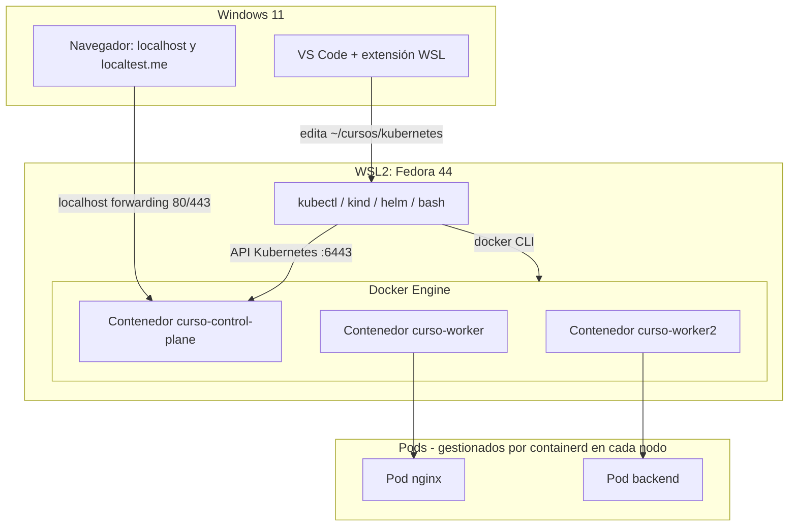

# Módulo 00 — Preparación del entorno (Windows 11 + WSL2 Fedora)

## Objetivos
- Verificar que tu Fedora 44 en WSL2 tiene recursos y ajustes suficientes para kind.
- Saber qué Docker estás usando (Engine nativo en Fedora o Docker Desktop) y que funciona.
- Comprobar `kubectl`, `kind`, `helm`, `jq` y dejar alias y autocompletado.
- Entender las capas: Windows → WSL2 → Docker → nodos kind → Pods.

## 📖 Definiciones clave

- **WSL2**: máquina virtual ligera de Windows con un kernel Linux real. Tu Fedora corre ahí.
- **Distro WSL**: el sistema Linux instalado en WSL2 (aquí, Fedora 44). Tiene su propio disco y sistema de archivos (`~`).
- **Docker Engine**: el demonio (`dockerd`) que crea contenedores. Puede vivir en Fedora (nativo) o en Docker Desktop.
- **Contexto de Docker**: a qué demonio Docker habla tu CLI `docker`. Se ve con `docker context ls`.
- **kind**: *Kubernetes IN Docker*. Crea un cluster donde cada nodo es un contenedor Docker.
- **kubectl**: la CLI que habla con la API de Kubernetes. Lee el cluster destino de `~/.kube/config`.
- **Helm**: gestor de paquetes de Kubernetes (charts). Lo usaremos desde el módulo 07.
- **cgroups v2**: mecanismo del kernel que limita CPU/memoria de procesos. Kubernetes lo usa para aplicar `requests`/`limits`.

## Recomendación: trabaja TODO dentro de Fedora

Clona y usa el curso en `~/cursos/kubernetes` **dentro de Fedora**. No en `/mnt/c/...` y sin instalar kind/kubectl en Windows.

Motivos:

1. **Los scripts y comandos del curso son bash.** En Fedora funcionan tal cual.
2. **Rendimiento.** El sistema de archivos de Linux (`~`) es mucho más rápido que `/mnt/c` para builds Maven/Docker y bind-mounts.
3. **Un solo Docker y un solo kubeconfig.** Si mezclas kind de Windows y de WSL acabas con dos `~/.kube/config` desincronizados y clusters "fantasma".
4. **Es lo que verás en servidores y CI:** Linux, bash, systemd.

Windows queda solo para dos cosas:

- **Navegador**: `http://localhost:8080`, `*.localtest.me`, Grafana, ArgoCD...
- **Editor**: VS Code con la extensión **WSL**. Desde Fedora: `cd ~/cursos/kubernetes && code .`

```bash
mkdir -p ~/cursos && cd ~/cursos
# git clone <url-del-curso> kubernetes   # o copia la carpeta aquí
cd kubernetes
code .
```

## Teoría: cómo encajan las capas

Vas a tener **cuatro niveles de "máquinas" anidadas**. WSL2 es una VM Linux dentro de Windows. Dentro de Fedora corre Docker. kind crea contenedores Docker que *se comportan como nodos* de Kubernetes. Y dentro de cada nodo, `containerd` arranca los contenedores de tus Pods.

Entender esto evita la mayoría de confusiones: una imagen hecha con `docker build` existe en Docker, **no** dentro de los nodos kind; un puerto abierto en un Pod no llega a Windows salvo que lo publiques capa a capa (port-forward o `extraPortMappings` + Ingress).

El puente Windows ↔ WSL lo hace WSL con **localhost forwarding**: un puerto escuchando en Fedora (por ejemplo el 80 que publica kind) aparece como `localhost:80` en Windows. Por eso el navegador de Windows puede abrir lo que corre en el cluster.



## 1. Checklist de verificación (empieza aquí)

Ya tienes Docker, kind, helm y kubectl. Comprueba que todo responde **desde Fedora**:

```bash
cat /etc/fedora-release              # Fedora release 44
which docker kubectl kind helm jq    # todo bajo /usr/bin o /usr/local/bin, nunca /mnt/c/...
docker info | head -5
docker run --rm hello-world
kubectl version --client
kind version
helm version
jq --version
pwd                                  # debe empezar por /home/<tu_usuario>, no /mnt/c
```

Todo debe responder sin errores.

> 🧠 **¿Qué acaba de pasar?** `which` confirma que usas los binarios Linux de Fedora y no los `.exe` de Windows que WSL añade al `PATH`. `hello-world` prueba la cadena completa: CLI → demonio Docker → descarga de imagen → contenedor. Si esto funciona, kind funcionará.

Si `which` devuelve algo bajo `/mnt/c/`, estás usando la herramienta de Windows. Instala la versión Linux (sección 4) o quita la ruta de Windows del `PATH`.

## 2. ¿Qué Docker estoy usando?

Hay dos formas válidas de tener Docker en WSL2. Averigua cuál es la tuya:

```bash
docker context ls
docker info --format '{{.OperatingSystem}} | cgroup v{{.CgroupVersion}} | {{.MemTotal}}'
docker info | grep -i 'operating system'
```

| `Operating System` dice... | Tienes | Quién arranca Docker |
|---|---|---|
| `Fedora Linux 44 ...` | **Docker Engine nativo en Fedora** | systemd de Fedora |
| `Docker Desktop` | **Docker Desktop** con integración WSL | La app de Windows |

> 🧠 **¿Qué acaba de pasar?** El CLI `docker` solo es un cliente: habla con un socket (`/var/run/docker.sock`). `docker info` pregunta al demonio que hay al otro lado y te dice dónde vive. Ambos sirven para kind; lo importante es no tener **los dos** activos a la vez.

### Opción A: Docker Engine nativo en Fedora (recomendada)

Más ligera y sin depender de la app de Windows. Necesita **systemd** en WSL.

1. Activa systemd en `/etc/wsl.conf` (dentro de Fedora):

```ini
[boot]
systemd=true
```

2. Desde PowerShell: `wsl --shutdown` y vuelve a abrir Fedora. Comprueba: `systemctl is-system-running` (vale `running` o `degraded`).

3. Instala Docker (elige una):

```bash
# Paquete de Fedora (moby-engine)
sudo dnf install -y moby-engine docker-compose

# o Docker CE del repositorio oficial
sudo dnf -y install dnf-plugins-core
sudo dnf config-manager addrepo --from-repofile=https://download.docker.com/linux/fedora/docker-ce.repo
sudo dnf install -y docker-ce docker-ce-cli containerd.io docker-buildx-plugin docker-compose-plugin
```

4. Arranca el servicio y usa Docker sin `sudo`:

```bash
sudo systemctl enable --now docker
sudo usermod -aG docker $USER
newgrp docker            # o cierra y abre la terminal
docker run --rm hello-world
```

> 🧠 **¿Qué acaba de pasar?** Con `systemd=true`, Fedora arranca como un Linux normal y systemd levanta `dockerd` en cada inicio de WSL. Al añadirte al grupo `docker` obtienes permiso sobre `/var/run/docker.sock`, así que ya no necesitas `sudo`.

### Opción B: Docker Desktop con integración WSL

1. *Settings → General*: activa **Use the WSL 2 based engine**.
2. *Settings → Resources → WSL Integration*: activa tu distro **Fedora**.
3. Dentro de Fedora: `docker version` y `docker run --rm hello-world`.

Docker Desktop tiene que estar abierto en Windows. Si además instalaste Docker en Fedora, desactiva uno de los dos (`sudo systemctl disable --now docker` o quita la integración WSL).

## 3. Ajustes de Fedora/WSL para kind

### Memoria y CPU: `.wslconfig` (en Windows)

Crea `C:\Users\<tu_usuario>\.wslconfig`. Un cluster de 3 nodos más MySQL, Keycloak y Prometheus pide **≥ 8 GB**:

```ini
[wsl2]
memory=8GB
processors=4
swap=2GB
```

Aplica: `wsl --shutdown` en PowerShell y vuelve a abrir Fedora. Comprueba con `free -h`.

### Límites de inotify (necesario para kind multi-nodo)

Cada nodo kind corre kubelet y muchos procesos que vigilan archivos. Con los valores por defecto verás Pods en error con `too many open files`.

```bash
sudo tee /etc/sysctl.d/99-kind.conf <<'EOF'
fs.inotify.max_user_watches = 524288
fs.inotify.max_user_instances = 512
EOF
sudo sysctl --system
sysctl fs.inotify.max_user_watches fs.inotify.max_user_instances
```

> 🧠 **¿Qué acaba de pasar?** Los contenedores comparten el kernel de WSL, así que los límites del kernel de Fedora son los de **todos** los nodos kind juntos. Subirlos evita que kubelet y los Pods se queden sin "vigilantes" de archivos. Con systemd activo, el archivo en `/etc/sysctl.d/` se aplica en cada arranque. Con Docker Desktop el límite que cuenta es el del kernel de WSL: aplícalo igual desde Fedora.

### cgroups v2

Kubernetes moderno espera cgroups v2. Comprueba:

```bash
stat -fc %T /sys/fs/cgroup       # cgroup2fs
docker info | grep -i cgroup     # Cgroup Version: 2
```

Si sale `tmpfs` o versión 1, actualiza WSL desde PowerShell (`wsl --update`) y reinicia con `wsl --shutdown`.

### SELinux

En WSL, el kernel de Microsoft no aplica SELinux como en un Fedora de servidor. No necesitas `:z` en volúmenes ni `setenforce`. Si `getenforce` dice `Disabled`, es lo normal.

### Localhost forwarding Windows ↔ WSL

Por defecto (modo NAT), WSL reenvía a Windows los puertos que escuchan en Fedora: `localhost:80` y `localhost:443` en el navegador llegan al Ingress de kind. Si no funciona, revisa en `.wslconfig`:

```ini
[wsl2]
localhostForwarding=true
# alternativa en Windows 11: red en espejo
# networkingMode=mirrored
```

## 4. Instalación de herramientas (solo referencia)

Ya las tienes. Úsalo solo si falta alguna o quieres actualizarla:

```bash
sudo dnf install -y curl jq git unzip bash-completion

# kubectl
curl -LO "https://dl.k8s.io/release/$(curl -L -s https://dl.k8s.io/release/stable.txt)/bin/linux/amd64/kubectl"
sudo install -o root -g root -m 0755 kubectl /usr/local/bin/kubectl && rm kubectl

# kind (revisa la última versión en https://kind.sigs.k8s.io/docs/user/quick-start/)
KIND_VERSION=v0.24.0
curl -Lo ./kind "https://kind.sigs.k8s.io/dl/${KIND_VERSION}/kind-linux-amd64"
sudo install -m 0755 kind /usr/local/bin/kind && rm kind

# helm
curl https://raw.githubusercontent.com/helm/helm/main/scripts/get-helm-3 | bash

# stern (logs multi-pod) - opcional pero muy útil, ver releases en GitHub
# https://github.com/stern/stern/releases
```

## 5. Quality of life (alias y autocompletado)

Añade a `~/.bashrc`:

```bash
source <(kubectl completion bash)
alias k=kubectl
complete -o default -F __start_kubectl k
source <(helm completion bash)
source <(kind completion bash)
export do="--dry-run=client -o yaml"   # uso: k run x --image=nginx $do
```

Luego `source ~/.bashrc`.

> 🧠 **¿Qué acaba de pasar?** `kubectl completion bash` genera funciones de autocompletado que bash carga al iniciar. `complete ... k` las asocia también al alias `k`. La variable `$do` es un atajo para generar YAML sin crear nada en el cluster (`--dry-run=client`).

## ✅ Lo que debes recordar

- Todo se hace **dentro de Fedora** en `~/cursos/kubernetes`; Windows solo es navegador y VS Code (`code .`).
- `docker info` te dice qué Docker usas; ten **uno solo** activo (nativo en Fedora o Docker Desktop).
- Antes de kind: RAM ≥ 8 GB en `.wslconfig`, inotify subido y cgroups v2.
- Capas: Windows → WSL2 Fedora → Docker → nodos kind (contenedores) → Pods. Cada capa aísla imágenes y puertos.

## Problemas típicos en Fedora + WSL2

| Síntoma | Causa / solución |
|---------|------------------|
| `Cannot connect to the Docker daemon` | Nativo: `sudo systemctl enable --now docker` (y `systemd=true` en `/etc/wsl.conf`). Desktop: app cerrada o integración WSL de Fedora desactivada |
| `permission denied ... docker.sock` | Falta el grupo: `sudo usermod -aG docker $USER` y abre otra terminal |
| `System has not been booted with systemd` | Falta `systemd=true` en `/etc/wsl.conf`; luego `wsl --shutdown` |
| Pods de kind con `too many open files` o kube-proxy en error | Sube `fs.inotify.max_user_watches/instances` (sección 3) |
| `which kubectl` apunta a `/mnt/c/...` | Estás usando el `.exe` de Windows. Instala la versión Linux en Fedora |
| `kubectl` ve otro cluster distinto al de kind | Tienes kubeconfig en Windows y en WSL. Usa solo `~/.kube/config` de Fedora y `kubectl config current-context` |
| Puerto 80/443 ocupado al crear el cluster | En Windows: IIS u otro servicio (`netstat -ano \| findstr :80` en PowerShell). En Fedora: `sudo ss -ltnp \| grep -E ':80\|:443'`. O cambia el `hostPort` en el módulo 01 |
| `localhost` de Windows no llega a WSL | Revisa `localhostForwarding=true` o prueba `networkingMode=mirrored` en `.wslconfig`; `wsl --shutdown` |
| Muy lento | Estás en `/mnt/c`. Trabaja en `~/` |
| WSL consume toda la RAM | Configura `.wslconfig` |
| `localtest.me` no resuelve | Algunos routers/DNS bloquean respuestas a 127.0.0.1 (DNS rebinding). Usa DNS 1.1.1.1/8.8.8.8 o edita hosts (ver anexos) |
| `dnf` falla con `config-manager addrepo` | En versiones antiguas de dnf la sintaxis es `--add-repo`. Fedora 44 usa dnf5: `addrepo --from-repofile=` |

## Ejercicios

1. Crea el alias `k` y verifica que `k version --client` funciona.
2. Genera un YAML de Pod sin crearlo: `k run web --image=nginx --dry-run=client -o yaml`. ¿Qué campos reconoces?
3. Ejecuta `docker run --rm -p 8080:80 nginx` y abre `http://localhost:8080` desde el navegador de Windows. ¿Funciona?

<details><summary>Pistas</summary>

El ejercicio 3 confirma que el port-forwarding Windows↔WSL↔Docker funciona, base de todo lo que haremos con Ingress.
</details>

➡️ Siguiente: [Módulo 01 — Cluster con kind](../01-cluster-kind/README.md)
