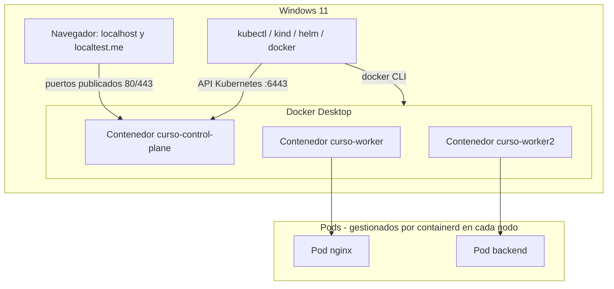

# Módulo 00 — Preparación del entorno (Windows 11 + Docker Desktop)

## Objetivos
- Verificar que Docker Desktop tiene recursos suficientes para kind.
- Comprobar `kubectl`, `kind`, `helm` y dejar alias y autocompletado.
- Elegir la terminal con la que vas a ejecutar los comandos del curso.
- Entender las capas: Windows → Docker → nodos kind → Pods.

## Definiciones clave

- **Docker Desktop**: aplicación de Windows que ejecuta el demonio Docker (`dockerd`) en una VM ligera y expone el CLI `docker` en tu terminal.
- **Contexto de Docker**: a qué demonio Docker habla tu CLI `docker`. Se ve con `docker context ls`.
- **kind**: *Kubernetes IN Docker*. Crea un cluster donde cada nodo es un contenedor Docker.
- **kubectl**: la CLI que habla con la API de Kubernetes. Lee el cluster destino de `~/.kube/config` (en Windows, `%USERPROFILE%\.kube\config`).
- **Helm**: gestor de paquetes de Kubernetes (charts). Lo usaremos desde el módulo 07.
- **cgroups v2**: mecanismo del kernel que limita CPU/memoria de procesos. Kubernetes lo usa para aplicar `requests`/`limits`.

## Requisitos

Instalados en Windows y disponibles en el `PATH`:

- Docker Desktop (con el motor en ejecución)
- `kubectl`, `kind`, `helm`
- Git for Windows (incluye **Git Bash**)

## Qué terminal usar

Los comandos del curso están escritos en sintaxis **bash** (tuberías, `$(...)`, heredocs, `export`) y los scripts de `scripts/` y `15-proyecto-final/` son `.sh`.

- **Git Bash** (recomendado): ejecuta tal cual los comandos y los scripts (`./scripts/up.sh`).
- **PowerShell**: sirve para los comandos simples de `kubectl`, `helm`, `kind` y `docker`. Cuando un bloque use sintaxis bash, ejecútalo en Git Bash.

```bash
git clone https://github.com/devbryan02/k8s-curso-practico.git
cd k8s-curso-practico
```

## Teoría: cómo encajan las capas

Vas a tener **tres niveles anidados**. Docker Desktop corre el demonio Docker. kind crea contenedores Docker que *se comportan como nodos* de Kubernetes. Y dentro de cada nodo, `containerd` arranca los contenedores de tus Pods.

Entender esto evita la mayoría de confusiones: una imagen hecha con `docker build` existe en Docker, **no** dentro de los nodos kind; un puerto abierto en un Pod no llega al navegador salvo que lo publiques capa a capa (port-forward o `extraPortMappings` + Ingress).

Docker Desktop publica en `localhost` de Windows los puertos que mapea un contenedor (por ejemplo el 80 que publica kind). Por eso el navegador puede abrir lo que corre en el cluster.



## 1. Checklist de verificación (empieza aquí)

Comprueba que todo responde:

```bash
docker info | head -5
docker run --rm hello-world
kubectl version --client
kind version
helm version
```

Todo debe responder sin errores.

> **¿Qué acaba de pasar?** `hello-world` prueba la cadena completa: CLI → demonio Docker → descarga de imagen → contenedor. Si esto funciona, kind funcionará.

## 2. Ajustes de Docker Desktop para kind

Un cluster de 3 nodos más MySQL, Keycloak y Prometheus pide **≥ 8 GB** de RAM para Docker.

En Docker Desktop (*Settings → Resources*) asigna al menos **8 GB** de memoria y 4 CPU. Si usas el motor WSL 2 (por defecto), el límite se fija en `C:\Users\<tu_usuario>\.wslconfig`:

```ini
[wsl2]
memory=8GB
processors=4
swap=2GB
```

Aplica los cambios reiniciando Docker Desktop (o ejecuta `wsl --shutdown` en PowerShell y vuelve a abrirlo).

Comprueba la memoria disponible y la versión de cgroups:

```bash
docker info --format '{{.OperatingSystem}} | cgroup v{{.CgroupVersion}} | {{.MemTotal}}'
```

Debe indicar `cgroup v2` y una memoria total de ~8 GB o más.

## 3. Alias y autocompletado

### Git Bash

Añade a `~/.bashrc`:

```bash
source <(kubectl completion bash)
alias k=kubectl
complete -o default -F __start_kubectl k
source <(helm completion bash)
source <(kind completion bash)
export do="--dry-run=client -o yaml"   # uso: k run x --image=nginx $do
```

Luego `source ~/.bashrc`.

### PowerShell

Añade a tu perfil (`notepad $PROFILE`):

```powershell
Set-Alias k kubectl
kubectl completion powershell | Out-String | Invoke-Expression
```

En PowerShell no existe `$do`: escribe `--dry-run=client -o yaml` completo.

> **¿Qué acaba de pasar?** `kubectl completion` genera funciones de autocompletado que tu terminal carga al iniciar. El alias `k` es un atajo. `--dry-run=client -o yaml` genera YAML sin crear nada en el cluster.

## Lo que debes recordar

- Docker Desktop debe estar abierto antes de usar `kind` o `docker`.
- Usa **Git Bash** para los comandos y scripts bash del curso.
- Antes de kind: Docker Desktop con ≥ 8 GB de RAM y cgroups v2.
- Capas: Windows → Docker Desktop → nodos kind (contenedores) → Pods. Cada capa aísla imágenes y puertos.

## Problemas típicos

| Síntoma | Causa / solución |
|---------|------------------|
| `Cannot connect to the Docker daemon` | Docker Desktop está cerrado o aún arrancando. Ábrelo y espera a que indique *Engine running* |
| `./scripts/up.sh` no se reconoce en PowerShell | Los scripts son bash: ejecútalos desde Git Bash |
| Un comando con `$(...)`, `<<EOF` o `\|` falla en PowerShell | Es sintaxis bash. Ejecútalo en Git Bash |
| `kubectl` ve otro cluster distinto al de kind | Revisa `kubectl config current-context`; debe ser `kind-curso` |
| Puerto 80/443 ocupado al crear el cluster | `netstat -ano \| findstr :80` en PowerShell (IIS u otro servicio). O cambia el `hostPort` en el módulo 01 |
| Docker va muy lento o consume toda la RAM | Ajusta memoria y CPU como en la sección 2 |
| `localtest.me` no resuelve | Algunos routers/DNS bloquean respuestas a 127.0.0.1 (DNS rebinding). Usa DNS 1.1.1.1/8.8.8.8 o edita hosts (ver anexos) |

## Ejercicios

1. Crea el alias `k` y verifica que `k version --client` funciona.
2. Genera un YAML de Pod sin crearlo: `k run web --image=nginx --dry-run=client -o yaml`. ¿Qué campos reconoces?
3. Ejecuta `docker run --rm -p 8080:80 nginx` y abre `http://localhost:8080` en el navegador. ¿Funciona?

<details><summary>Pistas</summary>

El ejercicio 3 confirma que la publicación de puertos de Docker hacia `localhost` funciona, base de todo lo que haremos con Ingress.
</details>

Siguiente: [Módulo 01 — Cluster con kind](../01-cluster-kind/README.md)
