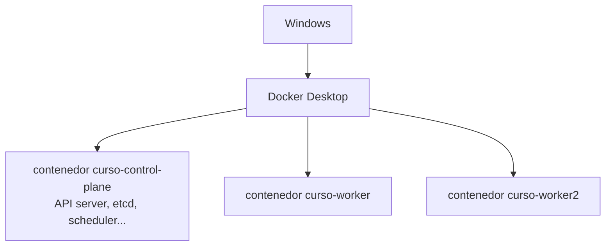
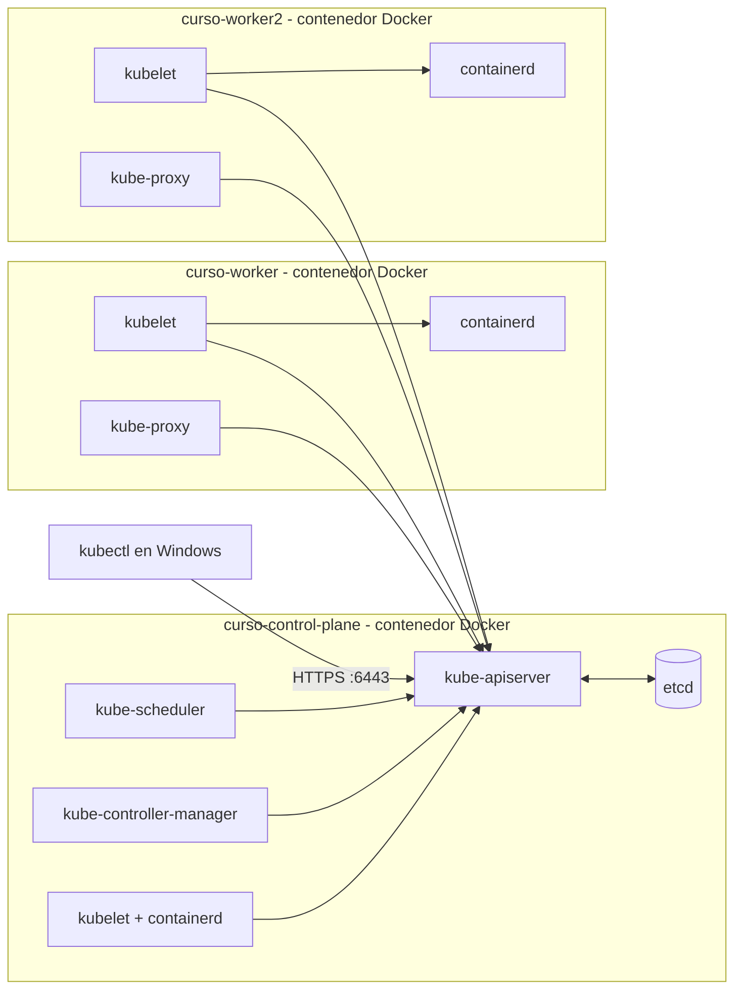
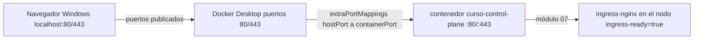
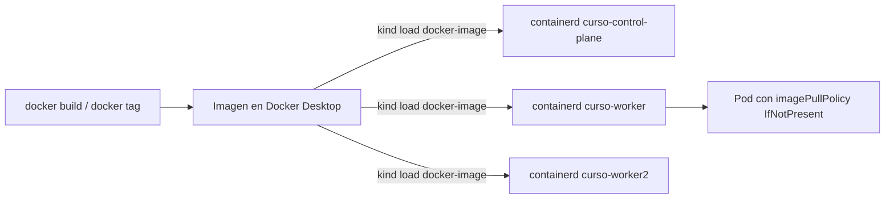

# Módulo 01 — Cluster con kind

## Objetivos
- Entender cómo kind simula un cluster usando contenedores Docker.
- Crear un cluster multi-nodo con puertos 80/443 expuestos (para Ingress).
- Cargar imágenes locales al cluster.

## Definiciones clave

- **Cluster**: conjunto de nodos gestionados por un control plane común. Para ti, una sola API a la que pides cosas.
- **Nodo**: máquina (aquí, contenedor Docker) donde corren Pods. Puede ser control-plane o worker.
- **Control plane**: el "cerebro": `kube-apiserver`, `etcd`, `kube-scheduler` y `kube-controller-manager`.
- **kube-apiserver**: única puerta de entrada. `kubectl`, kubelet y controladores hablan siempre con él.
- **etcd**: base de datos clave-valor con el estado deseado y real de todos los objetos.
- **kubelet**: agente en cada nodo. Recibe Pods asignados y le pide a `containerd` que arranque sus contenedores.
- **containerd / CRI**: el runtime de contenedores que usan los nodos. Por eso dentro del nodo se usa `crictl`, no `docker`.
- **Contexto (kubeconfig)**: combinación cluster + usuario + namespace guardada en `~/.kube/config`. kind crea `kind-curso`.

## Teoría ampliada

**kind** = *Kubernetes IN Docker*. Cada **nodo** del cluster es un **contenedor Docker** que a su vez corre `containerd` y los componentes de Kubernetes.



Kubernetes funciona por **estado deseado**. Tú no dices "arranca este contenedor"; guardas en la API un objeto que describe lo que quieres. El api-server lo persiste en etcd. El scheduler decide en qué nodo va cada Pod. Los controladores comparan deseado vs real y corrigen. El kubelet de cada nodo ejecuta lo que le toca.

En un cluster real cada nodo es una VM o servidor físico. kind los sustituye por contenedores para que tengas un cluster multi-nodo en tu portátil en ~1 minuto. Los componentes son los mismos (kind usa `kubeadm`), así que lo que aprendes aquí vale en EKS, AKS, GKE u on-premise.



Consecuencias importantes:

1. Las imágenes que construyes con `docker build` **no están** dentro de los nodos. Hay que cargarlas con `kind load` (en el curso, con `./scripts/kind-load.sh`).
2. Los puertos del cluster no se exponen solos: hay que mapearlos en la config (`extraPortMappings`).
3. El storage por defecto es `local-path` (`StorageClass standard`): los datos viven dentro del contenedor del nodo.
4. No hay LoadBalancer real (existe `cloud-provider-kind` / MetalLB, pero no los usaremos).
5. kind trae su propio CNI (kindnet), que **no aplica NetworkPolicies**. Por eso este curso lo desactiva e instala **Calico**, que sí las aplica (módulo 13).

## La configuración

Archivo [`kind-config.yaml`](kind-config.yaml):

- 1 control-plane + 2 workers.
- Label `ingress-ready=true` en el control-plane (lo usa el manifiesto de ingress-nginx para kind).
- Mapeo de puertos 80 y 443 del host hacia el nodo control-plane.

El mapeo de puertos es lo que luego permite abrir `http://algo.localtest.me` desde Windows:



## Práctica

```bash
cd 01-cluster-kind
kind create cluster --config kind-config.yaml

# Los nodos quedan NotReady hasta instalar un CNI (la config desactiva kindnet)
kubectl get nodes
kubectl apply -f https://raw.githubusercontent.com/projectcalico/calico/v3.28.2/manifests/calico.yaml
kubectl rollout status daemonset/calico-node -n kube-system --timeout=300s
kubectl wait --for=condition=Ready nodes --all --timeout=300s

kubectl cluster-info --context kind-curso
kubectl get nodes -o wide
kubectl get pods -A
```

> **¿Qué acaba de pasar?** kind lanzó 3 contenedores con la imagen `kindest/node`, ejecutó `kubeadm init` en el control-plane y `kubeadm join` en los workers. No instaló CNI porque `kind-config.yaml` pone `disableDefaultCNI: true`: por eso los nodos están `NotReady` y CoreDNS en `Pending` hasta que aplicas Calico, que crea la red de pods (192.168.0.0/16) y ejecuta las NetworkPolicies. Escribió el contexto `kind-curso` en tu `~/.kube/config`. Los Pods de `kube-system` que ves son el propio control plane corriendo como Pods.

Mira los contenedores que creó:

```bash
docker ps --format 'table {{.Names}}\t{{.Image}}\t{{.Ports}}'
```

> **¿Qué acaba de pasar?** Para Docker, tus "nodos" son contenedores normales. Solo `curso-control-plane` publica `0.0.0.0:80` y `:443` (por `extraPortMappings`) y un puerto aleatorio de `127.0.0.1` hacia `6443`, que es la API que usa `kubectl`.

Entra a un nodo y mira sus containers (containerd, no Docker):

```bash
docker exec -it curso-worker bash
crictl ps
exit
```

> **¿Qué acaba de pasar?** Dentro del nodo no hay Docker: kubelet habla con `containerd` por la interfaz CRI. `crictl` es el cliente de esa interfaz. Verás `kube-proxy` y `calico-node`, que corren en todos los nodos como DaemonSets.

### Contextos de kubectl

```bash
kubectl config get-contexts
kubectl config use-context kind-curso
kubectl config current-context
```

> En tu trabajo probablemente tengas varios contextos (dev/qa/prod). **Siempre verifica el contexto antes de aplicar nada.**

> **¿Qué acaba de pasar?** `kubectl` no "está conectado" a nada: en cada comando lee `~/.kube/config`, toma el contexto actual (URL del api-server + credenciales + namespace) y hace una petición HTTPS. Cambiar de contexto solo cambia ese puntero.

### Cargar una imagen local

```bash
docker pull nginx:1.27
docker tag nginx:1.27 mi-nginx:local
./scripts/kind-load.sh mi-nginx:local

# Verifica que esté en el nodo
docker exec curso-worker crictl images | grep mi-nginx
```

Regla de oro: usa un **tag explícito** (no `latest`) y `imagePullPolicy: IfNotPresent`, si no Kubernetes intentará bajarla de internet y fallará con `ErrImagePull`.

> **¿Qué acaba de pasar?** El script exporta la imagen de tu Docker a un `.tar` (`docker save`) y la importa en el `containerd` de **cada** nodo (`kind load image-archive`). Así, cuando el kubelet necesite `mi-nginx:local`, la encuentra en local y no intenta descargarla de un registry.

> **¿Por qué no `kind load docker-image`?** Es el comando habitual y funciona en muchos entornos, pero con Docker Desktop reciente (que guarda las imágenes con containerd) falla con `ctr: content digest sha256:... not found`. Docker exporta una imagen multiplataforma cuyas capas de otras arquitecturas no tiene, y el import de los nodos las exige. `docker save --platform linux/amd64` exporta solo la tuya. Para ver si te afecta: `docker info | grep -i driver-type` muestra `io.containerd.snapshotter.v1`.



### Script de atajo

Desde la raíz del curso:

```bash
./scripts/up.sh      # crea cluster + Calico + ingress-nginx
./scripts/down.sh    # elimina el cluster
```

## Lo que debes recordar

- Cada nodo kind es un contenedor Docker con kubelet + containerd dentro.
- Todo pasa por el **kube-apiserver**; el estado vive en **etcd**; scheduler y controladores reconcilian.
- Imágenes locales: `./scripts/kind-load.sh imagen:tag` con tag explícito, nunca `latest`.
- Puertos hacia Windows: solo los de `extraPortMappings` (80/443 en el control-plane).
- Antes de aplicar nada: `kubectl config current-context`.

## Ejercicios

1. Elimina el cluster y créalo de nuevo. ¿Cuánto tarda?
2. Crea un segundo cluster llamado `lab2` con un solo nodo (`kind create cluster --name lab2`). Cambia entre contextos y bórralo.
3. Para uno de los workers: `docker stop curso-worker2` y observa `kubectl get nodes`. Luego `docker start curso-worker2`. ¿Qué estado pasó cada nodo?
4. Averigua qué versión de Kubernetes usa tu kind y cómo crear un cluster con otra (pista: `--image kindest/node:<version>`).

<details><summary>Soluciones</summary>

1. `./scripts/down.sh && ./scripts/up.sh` (recrea el cluster e instala Calico e ingress-nginx)
2. `kind create cluster --name lab2`; `kubectl config use-context kind-lab2`; `kind delete cluster --name lab2`
3. El nodo pasa a `NotReady` tras ~40 s y vuelve a `Ready` al iniciarlo.
4. `kubectl version` y las tags de `kindest/node` en las releases de kind.
</details>

Siguiente: [Módulo 02 — Workloads](../02-workloads/README.md)
