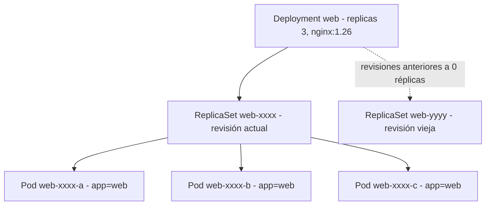
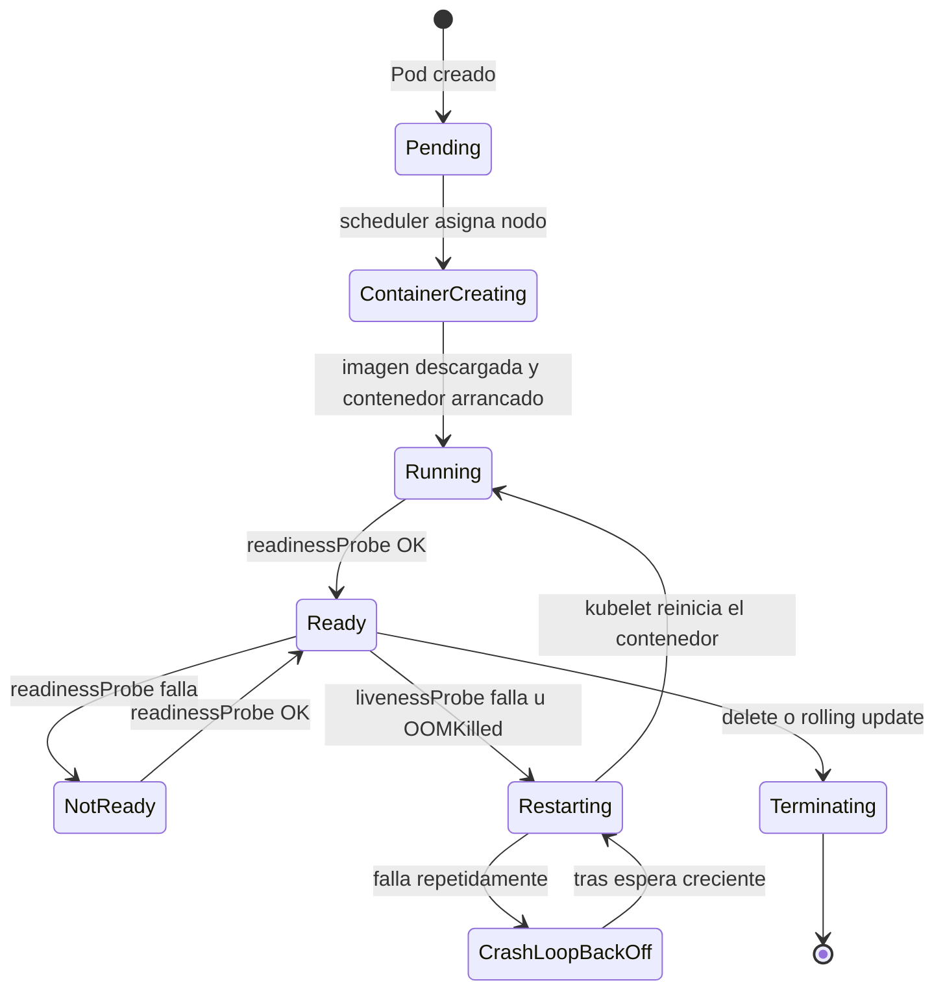
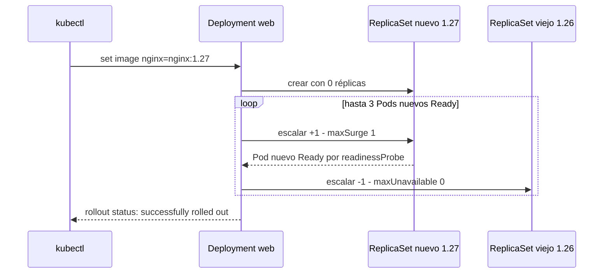

# Módulo 02 — Workloads: Pods y Deployments
> **Perfil developer:** Esencial — Pods, Deployments, probes y recursos son lo que defines en cada despliegue de tu servicio.

## Objetivos
- Entender Pod → ReplicaSet → Deployment.
- Hacer rolling updates y rollbacks.
- Configurar `resources`, `readinessProbe` y `livenessProbe`.

## Definiciones clave

- **Pod**: unidad mínima que se despliega. 1+ contenedores que comparten IP y volúmenes. Efímero: si muere, no vuelve solo.
- **ReplicaSet**: controlador que mantiene N Pods iguales vivos. Lo crea el Deployment; casi nunca lo tocas tú.
- **Deployment**: gestiona ReplicaSets para hacer actualizaciones graduales y rollbacks.
- **Labels y selector**: etiquetas clave=valor (`app: web`). El selector es cómo un controlador encuentra "sus" Pods.
- **Probe**: chequeo periódico que hace el kubelet (HTTP, TCP o comando). Hay startup, readiness y liveness.
- **requests / limits**: `requests` es lo que el scheduler reserva en el nodo; `limits` es el tope que aplica el kernel.
- **OOMKilled**: el kernel mató el contenedor por superar `limits.memory`.
- **Rolling update**: reemplazo gradual de Pods viejos por nuevos, controlado por `maxSurge` y `maxUnavailable`.

## Teoría ampliada

| Objeto | Para qué |
|--------|----------|
| **Pod** | Unidad mínima: 1+ contenedores que comparten red y volúmenes. Efímero. |
| **ReplicaSet** | Mantiene N réplicas de un Pod. |
| **Deployment** | Gestiona ReplicaSets: updates, rollbacks. Es lo que usarás para tus microservicios. |
| **StatefulSet** | Pods con identidad estable y storage propio (módulo 06). |

Un Pod suelto es frágil: si se borra o su nodo cae, nadie lo recrea. Por eso existen los **controladores**. Un controlador es un bucle que compara el estado deseado (`replicas: 3`) con el real (Pods con `app=web` que existen) y corrige la diferencia.

El Deployment añade una capa más: **versiones**. Cada cambio en el `template` (por ejemplo la imagen) crea un ReplicaSet nuevo. El Deployment sube el nuevo y baja el viejo poco a poco. Los ReplicaSets viejos se conservan a 0 réplicas (`revisionHistoryLimit: 5`), y eso es lo que permite el rollback.



Probes (clave para Spring Boot, que tarda en arrancar):

- **startupProbe**: "¿ya arrancó?" (protege a las otras mientras arranca).
- **readinessProbe**: "¿puede recibir tráfico?". Si falla, el Pod sale del Service.
- **livenessProbe**: "¿está vivo?". Si falla, se reinicia el contenedor.

`requests` = lo que el scheduler **reserva**; `limits` = tope. Si superas el límite de memoria → `OOMKilled`.

En `deployment.yaml` cada Pod pide `50m` de CPU y `64Mi` de memoria, con tope de `200m` y `128Mi`. Las probes hacen `GET /` al puerto 80: readiness cada 5 s (tras 3 s), liveness cada 10 s (tras 10 s). Si se supera el límite de CPU, el contenedor se **frena** (throttling); si se supera el de memoria, se **mata**.



> Nota: `Ready`, `NotReady` y `Restarting` del diagrama son condiciones del Pod/contenedor, no fases oficiales. Las fases reales son `Pending`, `Running`, `Succeeded`, `Failed` y `Unknown`.

## Práctica

```bash
kubectl create namespace demo
cd 02-workloads/manifests
```

> **¿Qué acaba de pasar?** Un namespace es una "carpeta" lógica dentro del cluster. Todos los manifiestos de este módulo declaran `namespace: demo`, así que borrarlo al final limpia todo de golpe.

### 1. Un Pod suelto

```bash
kubectl apply -f pod.yaml
kubectl get pods -n demo -o wide
kubectl describe pod web-pod -n demo
kubectl logs web-pod -n demo
kubectl exec -it web-pod -n demo -- bash
kubectl delete pod web-pod -n demo      # no vuelve: no hay controlador
```

> **¿Qué acaba de pasar?** `apply` guardó el Pod `web-pod` en etcd vía api-server. El scheduler eligió un worker (`-o wide` lo muestra) y el kubelet de ese nodo arrancó `nginx:1.27` con containerd. En `describe` ves esos pasos en *Events*. Al borrarlo, nadie lo recrea: ningún controlador es su "dueño".

### 2. Un Deployment

```bash
kubectl apply -f deployment.yaml
kubectl get deploy,rs,pods -n demo
```

Mata un pod y observa cómo se recrea:

```bash
kubectl delete pod -n demo -l app=web --wait=false | head -1
kubectl get pods -n demo -w
```

> **¿Qué acaba de pasar?** El Deployment `web` creó un ReplicaSet (`web-<hash>`) y este, 3 Pods. Al borrar Pods, el controlador de ReplicaSet vio "hay menos de 3 con `app=web`" y creó otros nuevos al instante, con nombres e IPs distintas. Esto es la **reconciliación**.

### 3. Rolling update y rollback

El deployment usa `nginx:1.26`. Actualiza a `1.27`:

```bash
kubectl set image deployment/web nginx=nginx:1.27 -n demo --record 2>/dev/null || \
kubectl set image deployment/web nginx=nginx:1.27 -n demo
kubectl rollout status deployment/web -n demo
kubectl rollout history deployment/web -n demo
```

> **¿Qué acaba de pasar?** Cambiar la imagen modificó el `template`, así que el Deployment creó un **ReplicaSet nuevo**. Con `maxSurge: 1` y `maxUnavailable: 0` subió 1 Pod nuevo, esperó a que estuviera *Ready* y solo entonces bajó 1 viejo. Repitió hasta tener 3 nuevos. El ReplicaSet viejo queda a 0 como revisión del historial.



Simula un mal despliegue (imagen inexistente):

```bash
kubectl set image deployment/web nginx=nginx:no-existe -n demo
kubectl get pods -n demo          # fíjate: los pods viejos siguen vivos (maxUnavailable: 0)
kubectl rollout undo deployment/web -n demo
```

> Esto es lo que te protege en producción: la readiness/imagen mala **nunca** reemplaza a los pods sanos.

> **¿Qué acaba de pasar?** El Pod nuevo se quedó en `ErrImagePull`/`ImagePullBackOff`, nunca llegó a *Ready* y el Deployment no bajó ningún Pod viejo. `rollout undo` volvió a escalar el ReplicaSet de la revisión anterior y bajó a 0 el roto.

### 4. Escalar

```bash
kubectl scale deployment web --replicas=5 -n demo
kubectl get pods -n demo -o wide     # ¿en qué nodos cayeron?
```

> **¿Qué acaba de pasar?** `scale` solo cambió `replicas` a 5. El ReplicaSet creó 2 Pods más y el scheduler los repartió entre `curso-worker` y `curso-worker2` según los `requests` y la carga. El control-plane no recibe Pods normales porque tiene un *taint*.

### 5. Resources y OOMKill (experimento)

```bash
kubectl run stress --image=polinux/stress -n demo \
  --overrides='{"spec":{"containers":[{"name":"stress","image":"polinux/stress","command":["stress","--vm","1","--vm-bytes","200M","--vm-hang","1"],"resources":{"limits":{"memory":"100Mi"}}}]}}'
kubectl get pod stress -n demo -w
kubectl describe pod stress -n demo | grep -A3 "Last State"
```

Verás `OOMKilled`. Esto te pasará con Java si no ajustas heap vs `limits.memory` (por eso usaremos `MaxRAMPercentage` en el módulo 09).

> **¿Qué acaba de pasar?** El kubelet configuró un cgroup con 100Mi de memoria máxima. El proceso intentó reservar 200M, el kernel lo mató (OOM killer) y el kubelet lo reinició una y otra vez hasta `CrashLoopBackOff`. Kubernetes no "avisa" antes: el límite de memoria es un muro.

## Limpieza

```bash
kubectl delete namespace demo
```

## Lo que debes recordar

- Nunca despliegues Pods sueltos: usa un **Deployment**, que crea ReplicaSets, que crean Pods.
- Cada cambio de `template` = ReplicaSet nuevo = una revisión a la que puedes volver con `rollout undo`.
- `maxUnavailable: 0` + readinessProbe = un despliegue roto no tumba los Pods sanos.
- Readiness fallida saca del tráfico; liveness fallida reinicia.
- `requests` decide dónde cabe el Pod; superar `limits.memory` = `OOMKilled`.

## Ejercicios

1. Crea un Deployment `api` con imagen `hashicorp/http-echo`, args `-text=v1`, 2 réplicas, usando **solo** `kubectl create deployment` y `--dry-run=client -o yaml`. Guárdalo en un archivo y aplícalo.
2. Cambia la estrategia para que actualice con `maxSurge: 100%` y `maxUnavailable: 0`. ¿Qué diferencia observas al actualizar?
3. Rompe la readinessProbe (path `/nope`) y observa `READY 0/1`. ¿El pod se reinicia? ¿Por qué no?
4. Rompe la livenessProbe en lugar de la readiness. ¿Qué ves en `RESTARTS`?
5. Pregunta de entrevista: ¿qué pasa con las conexiones activas cuando un pod se elimina? (busca `terminationGracePeriodSeconds` y `preStop`).

<details><summary>Soluciones</summary>

1. `kubectl create deployment api --image=hashicorp/http-echo --replicas=2 --dry-run=client -o yaml > api.yaml` y edita para añadir `args: ["-text=v1"]`.
3. Readiness fallida solo saca el pod del tráfico; **no** lo reinicia.
4. Liveness fallida reinicia el contenedor (`RESTARTS` sube y verás `CrashLoopBackOff` eventualmente).
5. K8s envía SIGTERM, espera `terminationGracePeriodSeconds` (30 s por defecto) y luego SIGKILL. Spring Boot soporta `server.shutdown=graceful`.
</details>

Siguiente: [Módulo 03 — Services y DNS](../03-services-dns/README.md)
