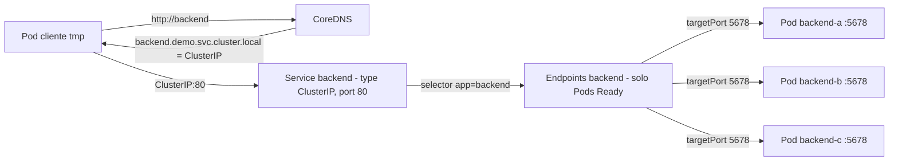
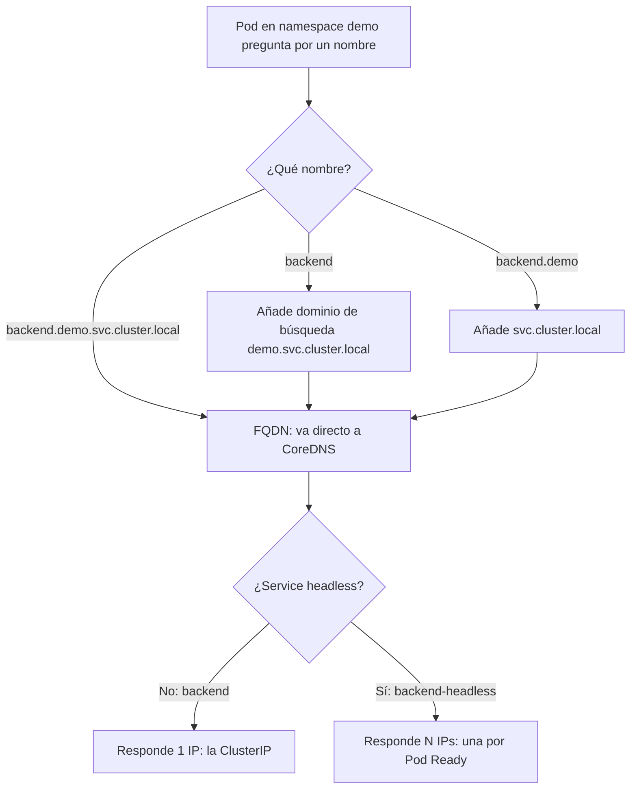
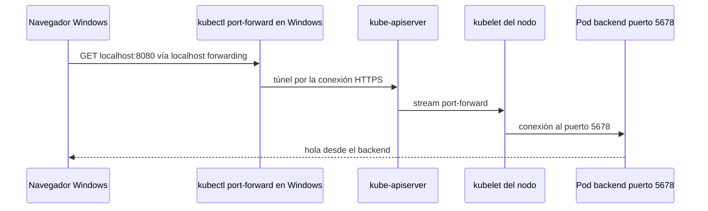

# Módulo 03 — Services y DNS
> **Perfil developer:** Esencial — cómo se encuentran tus servicios entre sí; la causa más frecuente de 'no conecta'.

## Objetivos
- Entender cómo se comunican los pods entre sí.
- Usar ClusterIP, headless y port-forward.
- Dominar el DNS interno (`servicio.namespace.svc.cluster.local`).

## Definiciones clave

- **Service**: nombre e IP virtual estables delante de un grupo de Pods elegidos por `selector`.
- **ClusterIP**: IP virtual del Service, solo alcanzable dentro del cluster.
- **Endpoints / EndpointSlice**: lista de `IP:puerto` de los Pods *Ready* que coinciden con el selector. Se actualiza sola.
- **port / targetPort**: `port` es el puerto del Service (80); `targetPort` el del contenedor (5678 en `backend`).
- **kube-proxy**: agente en cada nodo que programa reglas (iptables/IPVS) para que la ClusterIP reparta a los endpoints.
- **CoreDNS**: DNS interno del cluster. Traduce `backend.demo.svc.cluster.local` a la ClusterIP.
- **Headless Service**: Service con `clusterIP: None`. Sin IP virtual: el DNS devuelve directamente las IPs de los Pods.
- **port-forward**: túnel temporal de `kubectl` desde tu máquina a un Pod/Service. Solo para depurar.

## Teoría ampliada

Los pods son efímeros y su IP cambia. Un **Service** da una IP/DNS estable y balancea entre los pods que coinciden con su `selector`.

El Service no "contiene" Pods. Es una regla: "todo Pod con `app: backend` que esté *Ready* recibe tráfico". El controlador de endpoints vigila los Pods y mantiene la lista de IPs al día. Por eso un Pod nuevo entra solo en el balanceo y uno que falla la readiness sale solo.

La ClusterIP no pertenece a ninguna interfaz de red. **kube-proxy** escribe reglas en cada nodo que capturan el tráfico a `ClusterIP:80` y lo reenvían (DNAT) a uno de los Pods en `:5678`. Y **CoreDNS** crea un registro DNS por cada Service, así tus aplicaciones usan nombres en vez de IPs.



| Tipo | Uso |
|------|-----|
| `ClusterIP` (default) | Solo accesible dentro del cluster. **El que usarás el 90% del tiempo.** |
| `NodePort` | Abre un puerto en cada nodo. En kind solo funciona si lo mapeaste en `extraPortMappings`. |
| `LoadBalancer` | Pide un LB a la nube. En kind queda en `<pending>`. |
| Headless (`clusterIP: None`) | Sin IP virtual: el DNS devuelve las IPs de los pods. Esencial para StatefulSets. |

DNS dentro del cluster:

```
<servicio>                          # mismo namespace
<servicio>.<namespace>              # otro namespace
<servicio>.<namespace>.svc.cluster.local   # FQDN
```

Los nombres cortos funcionan porque cada Pod tiene en `/etc/resolv.conf` dominios de búsqueda (`demo.svc.cluster.local`, `svc.cluster.local`, `cluster.local`). Desde el namespace `demo`, `backend` se completa a `backend.demo.svc.cluster.local`.

En tu microservicio Spring la URL de MySQL será `jdbc:mysql://mysql:3306/...` justo por esto.



## Práctica

```bash
kubectl create namespace demo
cd 03-services-dns/manifests
kubectl apply -f backend.yaml
kubectl get svc,endpoints -n demo
```

`endpoints` te muestra las IPs de los pods detrás del Service. **Si está vacío, el selector no coincide o los pods no están Ready.** Es el error #1 en la vida real.

> **¿Qué acaba de pasar?** `backend.yaml` creó un Deployment de 3 Pods `http-echo` (puerto 5678, label `app: backend`) y un Service `backend` tipo ClusterIP en el puerto 80. Kubernetes asignó una ClusterIP, el controlador de endpoints añadió las IPs de los Pods en cuanto pasaron la readiness, y kube-proxy programó las reglas en cada nodo.

### Probar el DNS desde otro pod

```bash
kubectl run tmp --rm -it --image=curlimages/curl -n demo --restart=Never -- sh
# dentro:
curl http://backend
curl http://backend.demo.svc.cluster.local
nslookup backend
exit
```

> **¿Qué acaba de pasar?** `curl http://backend` preguntó a CoreDNS, que respondió la ClusterIP. La petición a `ClusterIP:80` la interceptaron las reglas de kube-proxy y la mandaron a un Pod en `:5678`, que respondió "hola desde el backend". `--rm` borra el Pod `tmp` al salir.

### Ver el balanceo

```bash
kubectl run tmp --rm -it --image=busybox -n demo --restart=Never -- sh -c 'nslookup backend; nslookup backend-headless || true'
```

Aplica el headless y compara el DNS:

```bash
kubectl apply -f headless.yaml
kubectl run tmp --rm -it --image=busybox:1.36 -n demo --restart=Never -- nslookup backend-headless
```

El ClusterIP devuelve **una** IP; el headless devuelve **las IPs de todos los pods**.

> **¿Qué acaba de pasar?** Antes de aplicar `headless.yaml`, `backend-headless` no existía y el `nslookup` falló (por eso el `|| true`). Después, como tiene `clusterIP: None`, kube-proxy no crea reglas para él y CoreDNS responde un registro por cada Pod. El balanceo lo hace entonces el cliente, no kube-proxy.

### Port-forward (para acceder desde Windows)

```bash
kubectl port-forward svc/backend 8080:80 -n demo
# en otra terminal (o navegador de Windows): http://localhost:8080
```

`port-forward` es tu herramienta de debug diaria, pero **no** es para exponer servicios: eso lo hará Ingress (módulo 07).

> **¿Qué acaba de pasar?** `kubectl` abrió el puerto 8080 en tu máquina y un túnel por el api-server hasta **un** Pod elegido detrás de `svc/backend` (puerto 80 → targetPort 5678). Por eso `localhost:8080` responde en tu navegador. Si cierras el comando o ese Pod muere, el túnel se corta: no hay balanceo.



## Limpieza

```bash
kubectl delete namespace demo
```

## Lo que debes recordar

- Nunca llames a un Pod por IP: usa el **nombre del Service**.
- Service → selector → Endpoints → Pods *Ready*. Endpoints vacío = selector mal o Pods no Ready.
- `port` es el del Service; `targetPort` el del contenedor (80 → 5678 aquí).
- ClusterIP devuelve 1 IP virtual; headless devuelve las IPs de los Pods.
- `port-forward` es para depurar; para exponer de verdad, Ingress (módulo 07).

## Ejercicios

1. Crea un Service `NodePort` para `backend`. ¿Puedes llegar a él desde tu navegador? ¿Por qué sí/no?
2. Cambia el label de un pod (`kubectl label pod <pod> app=otro --overwrite`) y mira `endpoints`. ¿Qué ocurre con el Deployment?
3. Crea un namespace `otro` y llama a `backend` desde allí usando el DNS correcto.
4. Escala el deployment a 0 y mira `endpoints`. Llama al Service. ¿Qué error obtienes?

<details><summary>Soluciones</summary>

1. No (a menos que mapees ese puerto en kind-config). Los nodos son contenedores Docker; los NodePorts no se publican en tu host.
2. El pod sale de endpoints y el Deployment crea uno nuevo para mantener 3 réplicas con `app=backend`.
3. `curl http://backend.demo` desde un pod en `otro`.
4. `Connection refused` / sin endpoints.
</details>

Siguiente: [Módulo 04 — ConfigMaps y Secrets](../04-configmaps-secrets/README.md)
