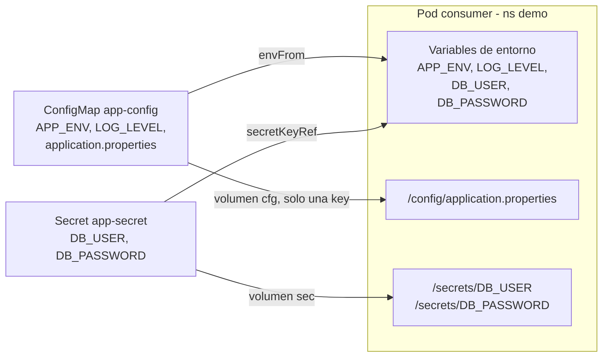
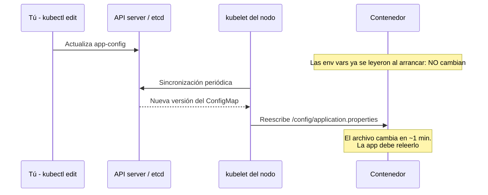

# Módulo 04 — ConfigMaps y Secrets

## Objetivos
- Separar configuración del código (12-factor).
- Inyectar config como variables de entorno y como archivos.
- Entender las limitaciones de seguridad de los Secrets.

## Definiciones clave

- **ConfigMap**: objeto que guarda pares clave/valor o archivos de configuración **no sensible**.
- **Secret**: objeto parecido al ConfigMap para datos sensibles. Se guarda en base64, que es codificación, no cifrado.
- **base64**: forma de representar bytes como texto. Cualquiera lo revierte con `base64 -d`.
- **`envFrom`**: carga **todas** las claves de un ConfigMap/Secret como variables de entorno del contenedor.
- **`secretKeyRef` / `configMapKeyRef`**: carga **una sola** clave como variable de entorno, con el nombre que elijas.
- **Volumen `configMap` / `secret`**: el kubelet escribe cada clave como un archivo dentro del contenedor.
- **`stringData`**: campo de un Secret donde escribes en texto plano; la API lo convierte a base64 en `data`.
- **`immutable`**: marca un ConfigMap/Secret como no editable. Evita cambios accidentales y ahorra *watches* al API server.

## Teoría

- **ConfigMap**: configuración no sensible (URLs, flags, `application.yml`).
- **Secret**: datos sensibles (passwords, tokens). Se almacenan en **base64** → **no es cifrado**. Cualquiera con permiso `get secrets` los lee. En producción se usa cifrado en etcd + RBAC + gestores externos (Vault, External Secrets, Sealed Secrets).

**¿Por qué existen?** Una imagen debe ser la misma en dev, QA y prod. Lo que cambia entre entornos (URL de la BD, nivel de log, credenciales) se saca fuera, a objetos de Kubernetes. Así no recompilas ni reconstruyes la imagen para cambiar un valor.

**¿Por qué separar ConfigMap y Secret si ambos son "texto"?** Para poder aplicar permisos distintos. Con RBAC (módulo 05) puedes dejar que un desarrollador lea ConfigMaps pero no Secrets. Además, los Secrets se pueden cifrar en etcd y el kubelet los monta en memoria (`tmpfs`), no en disco.

**¿Cómo llegan al contenedor?** El Pod los referencia por nombre. Al arrancar el Pod, el kubelet del nodo los lee del API server y los inyecta: como **variables de entorno** (se leen una vez, al arrancar el proceso) o como **archivos** en un volumen (el kubelet los refresca periódicamente). Si el ConfigMap/Secret no existe, el Pod se queda en `CreateContainerConfigError`.

Formas de consumirlos:

| Forma | Se actualiza al cambiar el ConfigMap/Secret? |
|-------|-----------------------------------------------|
| Variable de entorno (`env`, `envFrom`) | No: requiere reiniciar el pod |
| Archivo montado como volumen | Sí (con un retraso de ~1 min), pero tu app debe releerlo |

Para Spring Boot, lo más común: variables de entorno (`SPRING_DATASOURCE_URL`, etc.) o montar un `application.yml`.

Así consume el Pod `consumer` de esta práctica los dos objetos:



¿Qué pasa cuando editas el ConfigMap?



## Práctica

```bash
kubectl create namespace demo
cd 04-configmaps-secrets/manifests
kubectl apply -f configmap.yaml -f secret.yaml -f consumer.yaml
kubectl logs consumer -n demo
```

> **¿Qué acaba de pasar?** El API server guardó `app-config` y `app-secret` en etcd. El scheduler asignó el Pod `consumer` a un nodo y el kubelet, antes de arrancar el contenedor, leyó ambos objetos: los convirtió en variables de entorno y escribió los archivos en `/config` y `/secrets`. Los logs muestran `env | sort` y el contenido de `application.properties`.

### Crear desde la CLI

```bash
kubectl create configmap otro --from-literal=A=1 --from-file=application.properties -n demo --dry-run=client -o yaml
kubectl create secret generic db --from-literal=password=abc123 -n demo
```

> **¿Qué acaba de pasar?** Con `--dry-run=client -o yaml` kubectl solo **genera** el YAML, no crea nada: útil para obtener un manifiesto base. El segundo comando sí crea el Secret `db`; kubectl codifica el valor en base64 por ti.

### Los Secrets NO están cifrados

```bash
kubectl get secret app-secret -n demo -o yaml
kubectl get secret app-secret -n demo -o jsonpath='{.data.DB_PASSWORD}' | base64 -d; echo
```

> **¿Qué acaba de pasar?** Escribiste `stringData` en texto plano y la API lo guardó en `data` en base64. Con un simple `base64 -d` recuperas `s3cr3t-curso`. La protección real de un Secret es **quién puede hacer `get`** (RBAC), no la codificación.

### Cambiar config y reiniciar

```bash
kubectl edit configmap app-config -n demo      # cambia LOG_LEVEL a DEBUG
kubectl delete pod consumer -n demo && kubectl apply -f consumer.yaml
kubectl logs consumer -n demo | grep LOG_LEVEL
```

En un Deployment bastaría `kubectl rollout restart deployment/<nombre>`.

> **¿Qué acaba de pasar?** Al editar el ConfigMap, el Pod viejo seguía con `LOG_LEVEL=INFO`: las variables de entorno se fijan al crear el proceso. Al recrear el Pod, el kubelet volvió a leer el ConfigMap y el nuevo contenedor arrancó con `DEBUG`. `rollout restart` hace lo mismo en un Deployment, Pod a Pod y sin cortar el servicio.

## Limpieza

```bash
kubectl delete namespace demo
```

## Lo que debes recordar

- ConfigMap = config no sensible; Secret = datos sensibles con permisos aparte.
- base64 **no es cifrado**: protege los Secrets con RBAC, cifrado en etcd y gestores externos.
- Variables de entorno: solo cambian al reiniciar el Pod. Archivos montados: se actualizan solos en ~1 min.
- Nunca subas un `secret.yaml` real a Git.

## Ejercicios

1. Monta solo la key `DB_PASSWORD` del Secret como archivo `/secrets/password`.
2. Cambia el ConfigMap y comprueba cuánto tarda en reflejarse el archivo montado en `/config` (`kubectl exec consumer -n demo -- cat /config/application.properties`). ¿Y la variable de entorno?
3. Marca el ConfigMap como `immutable: true` e intenta editarlo. ¿Qué ocurre y cuándo es útil?
4. Reflexión: ¿por qué **no** debes commitear `secret.yaml` a Git? ¿Qué alternativas hay? (lo retomamos con Sealed Secrets en el módulo 13).

<details><summary>Soluciones</summary>

1. En el volumen `sec`, usa `items: [{key: DB_PASSWORD, path: password}]`.
2. El archivo se actualiza en ~30-90 s; la variable de entorno **nunca** hasta reiniciar.
3. K8s rechaza el cambio; hay que recrearlo. Útil para evitar cambios accidentales y reducir carga en el API server.
4. Alternativas: Sealed Secrets, External Secrets Operator + Vault/AWS Secrets Manager, SOPS.
</details>

Siguiente: [Módulo 05 — Namespaces, RBAC y seguridad](../05-rbac-seguridad/README.md)
