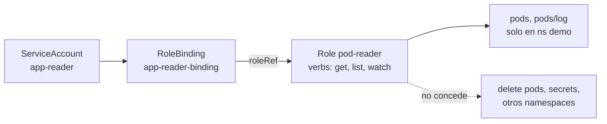
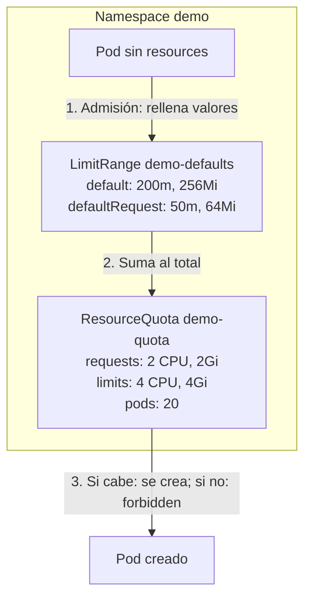

# Módulo 05 — Namespaces, RBAC y seguridad básica

## Objetivos
- Aislar equipos/apps con namespaces, quotas y limit ranges.
- Controlar permisos con ServiceAccount, Role y RoleBinding.
- Endurecer pods con `securityContext`.

## Definiciones clave

- **Namespace**: carpeta lógica del cluster. Agrupa recursos y es la unidad para permisos y cuotas.
- **ResourceQuota**: tope **total** de recursos (CPU, memoria, nº de pods...) que puede consumir un namespace.
- **LimitRange**: valores por defecto y mínimos/máximos **por contenedor** dentro de un namespace.
- **ServiceAccount**: identidad de un Pod (o de un proceso) frente al API server. Las personas usan *users*, los Pods usan ServiceAccounts.
- **Role / ClusterRole**: lista de permisos (*verbs* sobre *resources*). Role vale en un namespace; ClusterRole en todo el cluster.
- **RoleBinding / ClusterRoleBinding**: une un *subject* (user, group o ServiceAccount) con un Role/ClusterRole.
- **Verb**: acción sobre la API: `get`, `list`, `watch`, `create`, `update`, `patch`, `delete`.
- **securityContext**: ajustes de seguridad del Pod/contenedor: usuario, capabilities, FS de solo lectura, seccomp.

## Teoría

- **Namespace**: división lógica del cluster (no es aislamiento de red por sí solo).
- **ResourceQuota**: tope total de recursos en un namespace.
- **LimitRange**: valores por defecto/limites por contenedor.
- **RBAC**: *quién* (subject) puede hacer *qué* (verbs) sobre *qué recursos*.
  - `Role` / `RoleBinding`: dentro de un namespace.
  - `ClusterRole` / `ClusterRoleBinding`: todo el cluster.
- **ServiceAccount**: identidad de un **pod** frente al API server.
- **securityContext**: correr como no-root, FS de solo lectura, sin capabilities...

**¿Por qué namespaces + quotas?** En un cluster compartido, un equipo no debe poder agotar la CPU de los demás. El namespace marca el límite; la ResourceQuota fija el presupuesto total y el LimitRange pone valores por defecto a quien olvida declarar `resources`. Ojo: si hay una quota de CPU/memoria, **todo** Pod nuevo debe tener requests/limits; el LimitRange los rellena para que no sea rechazado.

**¿Por qué RBAC?** Toda acción en Kubernetes es una petición HTTP al API server. Antes de ejecutarla, el API server **autentica** (¿quién eres?) y **autoriza** (¿puedes hacerlo?). RBAC es el autorizador: por defecto todo está denegado y solo se permite lo que un Role concede explícitamente. Por eso `app-reader` puede listar pods pero no borrarlos.

**¿Por qué `securityContext`?** Si alguien explota tu app, el daño depende de los privilegios del contenedor. Corriendo como usuario no-root, sin capabilities y con FS de solo lectura, el atacante casi no puede hacer nada dentro. Es defensa en profundidad, gratis.

> Nota: el CNI de kind (kindnet) no aplica `NetworkPolicy`. Puedes crearlas pero **no tendrán efecto** a menos que instales Calico/Cilium.

Cómo se resuelve un permiso RBAC en esta práctica:



Lo que controla el namespace `demo`:



## Práctica

```bash
kubectl create namespace demo
cd 05-rbac-seguridad/manifests
```

### 1. Quota y LimitRange

```bash
kubectl apply -f quota-limits.yaml
kubectl run sinlimites --image=nginx:1.27 -n demo
kubectl get pod sinlimites -n demo -o jsonpath='{.spec.containers[0].resources}'; echo
kubectl describe resourcequota demo-quota -n demo
```

El pod recibió `requests/limits` por defecto gracias al LimitRange.

> **¿Qué acaba de pasar?** Al crear el Pod, el API server pasó la petición por los *admission controllers*. El de LimitRange inyectó `requests: 50m/64Mi` y `limits: 200m/256Mi` en el spec. Después el de ResourceQuota comprobó que cabía en el presupuesto y sumó su consumo: lo ves en la columna `Used` del `describe`.

### 2. RBAC

```bash
kubectl apply -f rbac.yaml

# ¿Puede esta ServiceAccount listar pods? ¿y borrarlos? ¿y ver secrets?
kubectl auth can-i list pods   -n demo --as=system:serviceaccount:demo:app-reader
kubectl auth can-i delete pods -n demo --as=system:serviceaccount:demo:app-reader
kubectl auth can-i get secrets -n demo --as=system:serviceaccount:demo:app-reader
kubectl auth can-i list pods   -n kube-system --as=system:serviceaccount:demo:app-reader
```

Resultado esperado: `yes`, `no`, `no`, `no`.

Resumen de todo lo que puede hacer:

```bash
kubectl auth can-i --list -n demo --as=system:serviceaccount:demo:app-reader
```

> **¿Qué acaba de pasar?** `--as` hace que el API server evalúe la petición **como si** viniera de la ServiceAccount (*impersonation*). El autorizador RBAC buscó RoleBindings que la incluyan: solo encontró `app-reader-binding` → `pod-reader`, que permite `get/list/watch` sobre pods en `demo`. Todo lo demás se deniega por defecto.

### 3. Pod endurecido

```bash
kubectl apply -f secure-pod.yaml
kubectl logs secure-pod -n demo      # uid=1001
kubectl exec secure-pod -n demo -- sh -c 'touch /x' # falla: FS de solo lectura
```

> Tu imagen Spring (módulo 09) corre con `USER 1001`, y por eso este contexto de seguridad encaja. Si necesitas escribir (`/tmp`), monta un `emptyDir`.

> **¿Qué acaba de pasar?** El kubelet pidió al runtime arrancar el proceso con UID/GID 1001, sin capabilities de Linux, con el perfil seccomp por defecto y el FS raíz montado en solo lectura. Por eso `id` muestra `uid=1001` y `touch /x` falla. Además, con `automountServiceAccountToken: false` el Pod no recibe token: no puede hablar con la API aunque tenga ServiceAccount.

## Limpieza

```bash
kubectl delete namespace demo
```

## Lo que debes recordar

- Namespace = unidad de organización, permisos y cuotas; **no** aísla la red por sí solo.
- ResourceQuota limita el total del namespace; LimitRange pone defaults por contenedor.
- RBAC: todo denegado por defecto. Subject → (Cluster)RoleBinding → (Cluster)Role → verbs sobre recursos.
- Usa `kubectl auth can-i ... --as=...` para comprobar permisos sin adivinar.
- Pods endurecidos: no-root, `drop: ["ALL"]`, `readOnlyRootFilesystem`, sin token si no hace falta.

## Ejercicios

1. Dale a `app-reader` permiso para listar `configmaps` en `demo`, sin tocar el Role existente (crea otro Role + RoleBinding).
2. Crea un `ClusterRole` que permita `get/list nodes` y asígnalo a la ServiceAccount con un `ClusterRoleBinding`. Verifica con `can-i`.
3. Despliega un pod con `serviceAccountName: app-reader` y `automountServiceAccountToken: true`, entra y usa el token para consultar la API:
   ```bash
   TOKEN=$(cat /var/run/secrets/kubernetes.io/serviceaccount/token)
   curl -sk -H "Authorization: Bearer $TOKEN" https://kubernetes.default.svc/api/v1/namespaces/demo/pods | head
   ```
4. Intenta crear más pods de los permitidos por la quota (`pods: "20"` → baja a 2). ¿Qué error ves?

<details><summary>Soluciones</summary>

1. `kubectl create role cm-reader --verb=get,list --resource=configmaps -n demo` y `kubectl create rolebinding cm-reader-b --role=cm-reader --serviceaccount=demo:app-reader -n demo`.
2. `kubectl create clusterrole node-reader --verb=get,list --resource=nodes` y `kubectl create clusterrolebinding node-reader-b --clusterrole=node-reader --serviceaccount=demo:app-reader`.
4. `forbidden: exceeded quota: demo-quota`.
</details>

Siguiente: [Módulo 06 — Persistencia y bases de datos](../06-persistencia-bases-de-datos/README.md)
