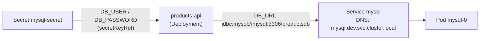
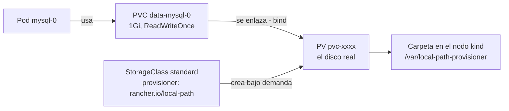
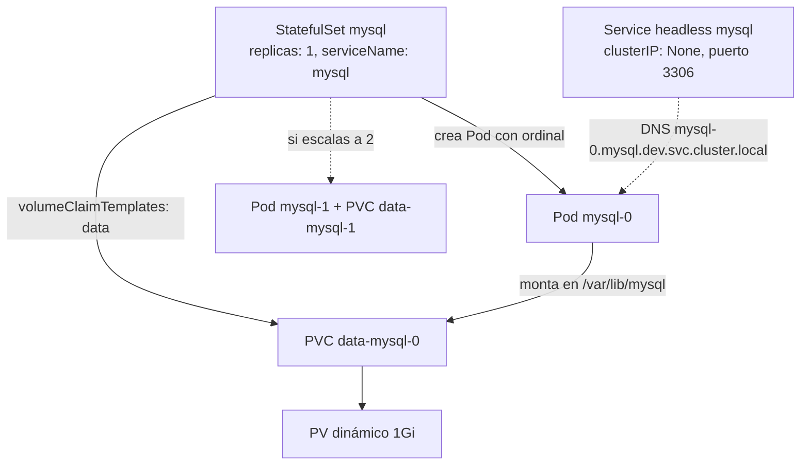
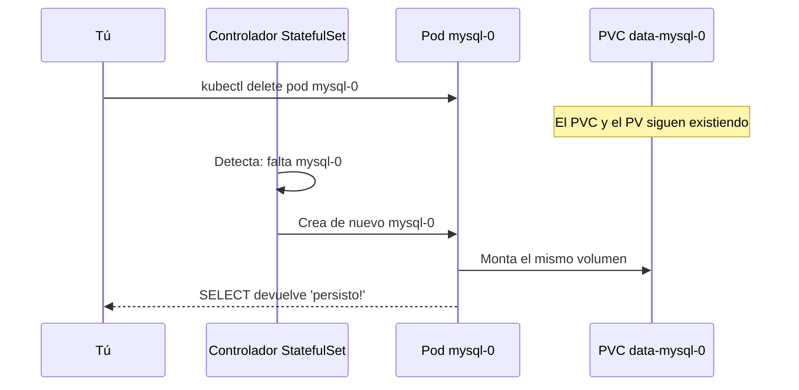

# Módulo 06 — Persistencia y bases de datos (MySQL + PostgreSQL)
> **Perfil developer:** Recomendado — lo esencial es cómo tu app se conecta a la BD (Service, Secret, DNS); PV y StatefulSet están plegados como lectura.

## Objetivos
- Entender PV, PVC y StorageClass.
- Desplegar MySQL (para tu microservicio) y PostgreSQL (para Keycloak) con **StatefulSet**.
- Comprobar que los datos sobreviven a la muerte del pod.

## Definiciones clave

- **PersistentVolume (PV)**: un trozo de almacenamiento real del cluster (disco, carpeta del nodo, volumen cloud). Vive fuera del ciclo de vida del Pod.
- **PersistentVolumeClaim (PVC)**: la petición de almacenamiento de una app: "quiero 1Gi, ReadWriteOnce". Kubernetes la enlaza (*bind*) con un PV.
- **StorageClass**: plantilla que dice **cómo** crear PVs bajo demanda (qué *provisioner*, qué parámetros).
- **Provisioner**: componente que crea el disco real. En kind: `rancher.io/local-path`, que usa una carpeta del nodo.
- **Access mode**: cómo se puede montar el volumen: `ReadWriteOnce` (un nodo), `ReadOnlyMany`, `ReadWriteMany`.
- **StatefulSet**: controlador para apps con estado. Da a cada Pod un nombre estable (`mysql-0`) y su propio PVC.
- **volumeClaimTemplates**: plantilla de PVC dentro del StatefulSet. Genera un PVC por réplica: `data-mysql-0`, `data-mysql-1`...
- **Headless Service**: Service con `clusterIP: None`. No balancea; da un DNS por Pod (`mysql-0.mysql.dev.svc.cluster.local`).

## Cómo se conecta tu app a la base de datos

Esto es lo que tocas en el día a día como developer. La BD es otro workload más en el cluster y tu app la encuentra por **nombre**, no por IP:



| Pieza | Qué hace por tu app |
|-------|---------------------|
| **Service `mysql`** | Da un nombre DNS estable. Desde el mismo namespace basta `mysql`; desde otro, `mysql.dev.svc.cluster.local`. Los pods cambian de IP, el nombre no. |
| **Secret `mysql-secret`** | Guarda usuario y contraseña. La app los lee como variables de entorno (`secretKeyRef`); nunca van en la imagen ni en el ConfigMap. |
| **`DB_URL`** | Variable de entorno con la URL JDBC. Es lo que cambia entre entornos (módulo 12). |

Qué verás cuando falla la conexión (ver también el [laboratorio de troubleshooting](../14-laboratorio-troubleshooting/README.md)):

| Síntoma en los logs de tu app | Causa habitual |
|-------------------------------|----------------|
| `UnknownHostException: mysql` | Nombre del Service mal escrito, o MySQL está en otro namespace |
| `Communications link failure` / `Connection refused` | MySQL aún no está `Ready`, o puerto incorrecto |
| `Access denied for user` | Secret con credenciales distintas a las del primer arranque de la BD |
| `CreateContainerConfigError` en el pod de la app | Falta el Secret `mysql-secret` en ese namespace |

Todo lo demás de este módulo (volúmenes, StorageClass, StatefulSet) explica **cómo la BD conserva sus datos**. Es contexto valioso para entender qué pasa al borrar un pod, pero normalmente lo gestiona el equipo de plataforma o un servicio gestionado.

## Teoría

<details>
<summary>Cómo se guardan los datos: PV, PVC, StorageClass y StatefulSet (contexto de plataforma)</summary>



- **PV** (PersistentVolume): el almacenamiento.
- **PVC** (PersistentVolumeClaim): la petición de un pod.
- **StorageClass**: provisión dinámica. En kind: `standard` (provisioner `rancher.io/local-path`) → guarda en el filesystem del nodo.
- **Access modes**: `ReadWriteOnce` (un nodo), `ReadOnlyMany`, `ReadWriteMany`.
- **StatefulSet** vs Deployment:
  - Pods con nombre estable (`mysql-0`), orden de arranque, y **un PVC por réplica** (`volumeClaimTemplates`).
  - Necesita un **headless Service** (`serviceName`).

**¿Por qué hace falta todo esto?** El sistema de archivos de un contenedor es efímero: si el Pod muere, lo escrito se pierde. Una base de datos necesita que sus archivos sobrevivan. La solución es montar un volumen que **no pertenece al Pod**, sino que existe por separado y se vuelve a enganchar al Pod nuevo.

**¿Por qué separar PVC y PV?** Para desacoplar a quien desarrolla de quien gestiona la infraestructura. Tu app solo pide "1Gi RWO" (PVC); no sabe si detrás hay un disco de AWS, un NFS o una carpeta local. La StorageClass decide eso y el provisioner crea el PV automáticamente. Cambias de cloud sin tocar el YAML de la app.

**¿Por qué StatefulSet y no Deployment?** Las réplicas de un Deployment son intercambiables y compartirían la misma plantilla de volumen. Una BD necesita identidad: `mysql-0` debe volver a montar **siempre** `data-mysql-0`, aunque se recree en otro momento. El StatefulSet garantiza nombre estable, PVC propio y arranque ordenado (`-0`, luego `-1`...). El headless Service da a cada réplica su DNS fijo.

> **Atención:** En producción NO se suele correr la BD dentro del cluster (se usa RDS/Cloud SQL/etc.) o se usa un operador (Percona, CloudNativePG, Zalando). Aquí lo hacemos para aprender persistencia.

Cómo el StatefulSet `mysql` genera sus piezas:



</details>

## Archivos

| Archivo | Contenido |
|---------|-----------|
| `k8s/00-namespace.yaml` | Namespace `dev` |
| `k8s/10-mysql-secret.yaml` | Credenciales de MySQL |
| `k8s/11-mysql-statefulset.yaml` | Service headless + StatefulSet MySQL 8.4 + PVC 1Gi |
| `k8s/20-postgres-secret.yaml` | Credenciales de PostgreSQL |
| `k8s/21-postgres-statefulset.yaml` | Service headless + StatefulSet PostgreSQL 16 + PVC 1Gi |

## Práctica

```bash
cd 06-persistencia-bases-de-datos
kubectl apply -f k8s/00-namespace.yaml
kubectl config set-context --current --namespace=dev     # ahora trabajas en dev por defecto

kubectl get storageclass
kubectl apply -f k8s/10-mysql-secret.yaml -f k8s/11-mysql-statefulset.yaml
kubectl get sts,pods,pvc,pv
kubectl rollout status sts/mysql
```

> **¿Qué acaba de pasar?** El controlador de StatefulSet creó el PVC `data-mysql-0` a partir de `volumeClaimTemplates` y luego el Pod `mysql-0`. La StorageClass `standard` espera a que el Pod tenga nodo asignado (*WaitForFirstConsumer*); entonces el provisioner local-path crea una carpeta en ese nodo, crea el PV y lo enlaza al PVC (`STATUS Bound`). Al primer arranque, MySQL inicializa `/var/lib/mysql` con los datos del Secret.

### Usar MySQL

```bash
kubectl exec -it mysql-0 -- mysql -uappuser -papppass productsdb
```
```sql
CREATE TABLE prueba (id INT PRIMARY KEY, txt VARCHAR(50));
INSERT INTO prueba VALUES (1, 'persisto!');
SELECT * FROM prueba;
EXIT;
```

### Prueba de persistencia 

```bash
kubectl delete pod mysql-0
kubectl get pods -w              # el StatefulSet recrea mysql-0
kubectl exec -it mysql-0 -- mysql -uappuser -papppass productsdb -e "SELECT * FROM prueba;"
```

Los datos siguen ahí porque el PVC `data-mysql-0` no se borra con el pod.

> **¿Qué acaba de pasar?** Borraste el Pod, pero no el PVC ni el PV. El StatefulSet detectó que faltaba `mysql-0` y lo recreó **con el mismo nombre**, así que volvió a montar el mismo `data-mysql-0`. MySQL encontró sus archivos y arrancó con la tabla `prueba` intacta.



### Postgres

```bash
kubectl apply -f k8s/20-postgres-secret.yaml -f k8s/21-postgres-statefulset.yaml
kubectl rollout status sts/postgres
kubectl exec -it postgres-0 -- psql -U keycloak -d keycloak -c '\conninfo'
```

> **¿Qué acaba de pasar?** Mismo patrón: StatefulSet `postgres`, PVC `data-postgres-0` y Service headless en el puerto 5432. `PGDATA` apunta a una subcarpeta porque Postgres exige un directorio vacío y algunos volúmenes traen `lost+found`. Esta BD la usará Keycloak más adelante.

### ¿Dónde están físicamente los datos?

```bash
kubectl get pv
docker exec curso-worker ls /var/local-path-provisioner 2>/dev/null || \
docker exec curso-worker2 ls /var/local-path-provisioner
```

(Dentro del contenedor del nodo kind; si recreas el cluster, **se pierden**.)

> **¿Qué acaba de pasar?** Los nodos de kind son contenedores Docker. El provisioner local-path guarda cada PV como una carpeta dentro de ese contenedor. Por eso el PV queda atado a un nodo concreto (`nodeAffinity`) y desaparece si borras el cluster.

### Backup y restore (esto sí lo harás en el trabajo)

```bash
# Backup de MySQL a tu máquina
kubectl exec mysql-0 -- sh -c 'mysqldump -uroot -p"$MYSQL_ROOT_PASSWORD" productsdb' > backup.sql
# Restore
kubectl exec -i mysql-0 -- sh -c 'mysql -uroot -p"$MYSQL_ROOT_PASSWORD" productsdb' < backup.sql
```

> **¿Qué acaba de pasar?** `kubectl exec` ejecuta `mysqldump` dentro del Pod y la salida viaja por la conexión de kubectl hasta tu archivo local. El restore hace el camino inverso con `-i` (stdin). Las comillas simples evitan que tu shell expanda `$MYSQL_ROOT_PASSWORD`: se expande dentro del contenedor.

## Cuidado con

- **Borrar un StatefulSet NO borra sus PVC** (por seguridad). Para limpiar: `kubectl delete pvc -l app=mysql`.
- Cambiar `MYSQL_ROOT_PASSWORD` en el Secret **no** cambia la contraseña real si el volumen ya se inicializó. Las variables solo aplican en el primer arranque.
- `replicas: 1` aquí. Replicar MySQL/Postgres de verdad requiere configurar replicación; **no** basta con subir `replicas`.

## Lo que debes recordar

- El Pod pide almacenamiento con un **PVC**; la **StorageClass** crea el **PV** real bajo demanda.
- Los datos viven en el PV, no en el Pod: borrar el Pod no borra los datos.
- StatefulSet = nombre estable + un PVC por réplica + headless Service para DNS por Pod.
- Borrar el StatefulSet tampoco borra los PVC: límpialos a mano.
- En kind, los PV son carpetas dentro del nodo: se pierden al borrar el cluster. Haz backups con `mysqldump`.

## Ejercicios

1. Escala `mysql` a 2 réplicas. ¿Qué PVCs aparecen? ¿Los datos de `mysql-0` están en `mysql-1`? ¿Por qué no?
2. Borra el StatefulSet de MySQL (`kubectl delete sts mysql`), vuelve a aplicarlo y comprueba que los datos de `prueba` siguen.
3. Crea un PVC manual y un pod `busybox` que escriba un archivo en él. Borra el pod, crea otro con el mismo PVC y lee el archivo.
4. Investiga `kubectl get pvc -o wide` y `kubectl describe pv` para ver el `nodeAffinity` del PV `local-path`. ¿Qué implica para el scheduling?
5. Reto: añade una `startupProbe` al StatefulSet de MySQL y quita la `initialDelaySeconds` de las otras.

<details><summary>Soluciones</summary>

1. `data-mysql-0` y `data-mysql-1`. Son dos MySQL independientes, sin replicación.
2. Los PVC siguen existiendo → se reutilizan (mismo nombre `data-mysql-0`).
4. El PV queda atado al nodo donde se creó; el pod solo puede programarse allí.
</details>

Siguiente: [Módulo 07 — Ingress](../07-ingress/README.md)
