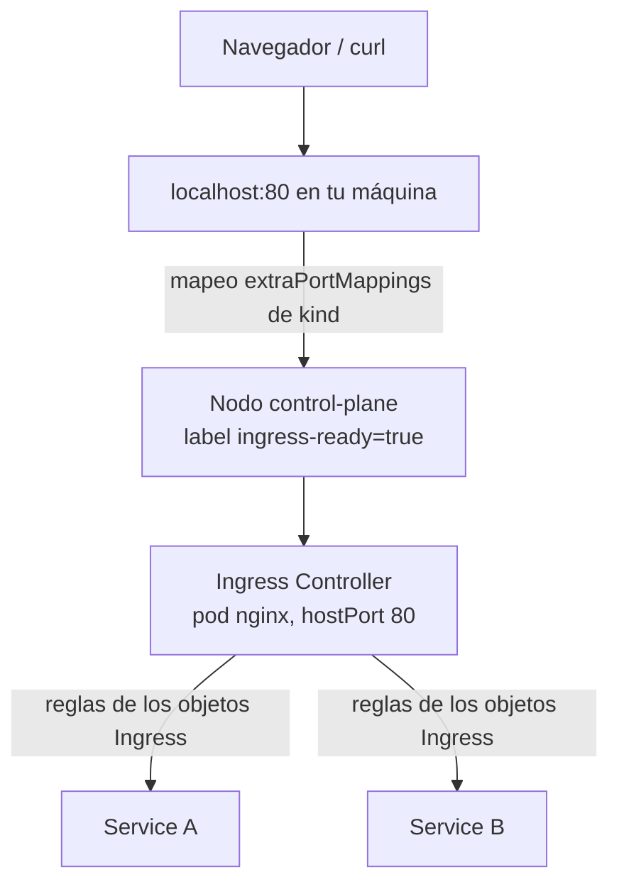
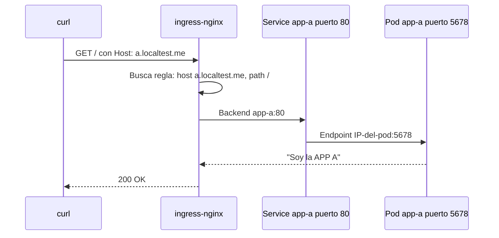
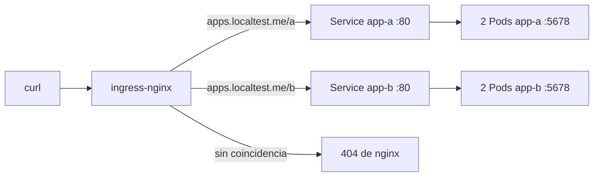

# Módulo 07 — Ingress y networking

## Objetivos
- Entender qué es un Ingress y un Ingress Controller.
- Exponer servicios por **host** y por **path** en kind.
- Usar anotaciones de ingress-nginx.

## 📖 Definiciones clave

- **Ingress**: objeto con reglas HTTP(S): "si el host es X y el path empieza por Y, envía a este Service". Solo es configuración.
- **Ingress Controller**: el proxy (aquí ingress-nginx) que lee los Ingress y enruta el tráfico de verdad. Sin él, los Ingress no hacen nada.
- **IngressClass**: identifica qué controller atiende un Ingress. Se elige con `ingressClassName: nginx`.
- **Regla por host**: enruta según la cabecera `Host` (`a.localtest.me` vs `b.localtest.me`).
- **Regla por path**: enruta según la ruta de la URL (`/a`, `/b`). `pathType: Prefix` compara por prefijo.
- **Anotación**: clave/valor en `metadata.annotations` que ajusta el comportamiento del controller (timeouts, rewrite, tamaño de body...).
- **hostPort**: expone un puerto del contenedor directamente en la IP del nodo. Así ingress-nginx escucha en el 80/443 del nodo kind.
- **TLS Secret**: Secret de tipo `kubernetes.io/tls` con certificado y clave; el controller lo usa para servir HTTPS.

## Teoría



- **Ingress** = objeto con *reglas* de enrutado HTTP(S). Por sí solo **no hace nada**.
- **Ingress Controller** (ingress-nginx, Traefik...) = el proceso que las implementa.
- `ingressClassName: nginx` indica qué controller atiende la regla.

En kind funciona porque:
1. `kind-config.yaml` mapea 80/443 → nodo con label `ingress-ready=true`.
2. El manifiesto de ingress-nginx para kind usa `hostPort` en ese nodo.

**¿Por qué Ingress y no un Service NodePort/LoadBalancer por app?** Con 10 microservicios tendrías 10 puertos o 10 balanceadores (caros en cloud). Ingress pone **una sola entrada** HTTP(S) y reparte por host o path. Además centraliza TLS, timeouts y límites.

**¿Cómo funciona por dentro?** El controller es un Pod con nginx que vigila (*watch*) los objetos Ingress, Services y Endpoints en el API server. Cuando algo cambia, regenera su configuración de nginx y la recarga. Para enviar el tráfico usa directamente las IPs de los Pods del Service (sus endpoints), por eso un Service sin Pods Ready da 503.

**¿Por qué esto es "L7"?** El controller entiende HTTP: lee la cabecera `Host` y la URL. Un Service (módulo 03) solo ve IP y puerto (L4). Esa diferencia permite compartir el puerto 80 entre muchas apps.

Petición completa en esta práctica:



## Práctica

Si aún no tienes el controller (lo instala `scripts/up.sh`):

```bash
kubectl apply -f https://kind.sigs.k8s.io/examples/ingress/deploy-ingress-nginx.yaml
kubectl wait -n ingress-nginx --for=condition=ready pod -l app.kubernetes.io/component=controller --timeout=180s
kubectl get pods -n ingress-nginx
kubectl get ingressclass
```

> 🧠 **¿Qué acaba de pasar?** Se creó el namespace `ingress-nginx` con un Deployment del controller (fijado al nodo con `ingress-ready=true`), su RBAC para leer Ingress/Services/Endpoints y la IngressClass `nginx`. Desde ahora nginx escucha en el puerto 80/443 del nodo, que kind enlaza a tu `localhost`.

### 1. Enrutado por host

```bash
kubectl create namespace demo
cd 07-ingress/manifests
kubectl apply -f apps.yaml -f ingress-host.yaml
kubectl get ingress -n demo

curl http://a.localtest.me
curl http://b.localtest.me
```

> `*.localtest.me` resuelve a `127.0.0.1`. Si no resuelve, usa: `curl -H "Host: a.localtest.me" http://localhost`.

> 🧠 **¿Qué acaba de pasar?** Se crearon dos Deployments (2 réplicas de `http-echo` en el puerto 5678) y sus Services en el puerto 80. El controller detectó el Ingress `por-host` y añadió dos *server blocks* a nginx, uno por host. Ambas peticiones llegan al mismo `localhost:80`; solo cambia la cabecera `Host`, y eso decide a qué app vas.

### 2. Enrutado por path

```bash
kubectl delete -f ingress-host.yaml
kubectl apply -f ingress-path.yaml
curl http://apps.localtest.me/a
curl http://apps.localtest.me/b
```

> 🧠 **¿Qué acaba de pasar?** Ahora hay un solo host, `apps.localtest.me`, y el path decide el destino. La anotación `rewrite-target: /` hace que nginx envíe `/` al backend en lugar de `/a`, porque la app no conoce ese prefijo.



### 3. Depuración

```bash
kubectl describe ingress por-path -n demo
kubectl logs -n ingress-nginx -l app.kubernetes.io/component=controller --tail=20
```

> 🧠 **¿Qué acaba de pasar?** `describe` muestra las reglas y los endpoints que el Ingress resolvió para cada backend: si salen vacíos, el problema está en el Service o los Pods. Los logs del controller muestran cada petición con host, path, código y a qué IP:puerto se envió.

Códigos típicos:

| Respuesta | Significado |
|-----------|-------------|
| `404 Not Found` (de nginx) | El host/path no coincide con ninguna regla |
| `503 Service Temporarily Unavailable` | El Service no tiene endpoints (pods no Ready / selector mal) |
| `502 Bad Gateway` | El pod respondió mal o cerró la conexión (puerto equivocado) |
| `413` | Body demasiado grande → anotación `proxy-body-size` |

### Anotaciones útiles de ingress-nginx

```yaml
nginx.ingress.kubernetes.io/proxy-body-size: "20m"
nginx.ingress.kubernetes.io/proxy-read-timeout: "120"
nginx.ingress.kubernetes.io/proxy-buffer-size: "128k"   # tokens JWT/cookies grandes (Keycloak)
nginx.ingress.kubernetes.io/ssl-redirect: "false"
nginx.ingress.kubernetes.io/rewrite-target: /$2
```

### TLS (opcional)

```bash
openssl req -x509 -nodes -days 365 -newkey rsa:2048 -keyout tls.key -out tls.crt -subj "/CN=a.localtest.me"
kubectl create secret tls a-tls --cert=tls.crt --key=tls.key -n demo
```
```yaml
spec:
  tls:
    - hosts: [a.localtest.me]
      secretName: a-tls
```
`curl -k https://a.localtest.me`. En producción se usa **cert-manager** + Let's Encrypt.

> 🧠 **¿Qué acaba de pasar?** Generaste un certificado autofirmado y lo guardaste en un Secret TLS. Al referenciarlo en `spec.tls`, el controller termina HTTPS en nginx y reenvía HTTP plano a los Pods. `-k` es necesario porque ninguna CA conocida firmó el certificado.

## Limpieza

```bash
kubectl delete namespace demo
```

## ✅ Lo que debes recordar

- Ingress = reglas; Ingress Controller = el proxy que las aplica. Sin controller no pasa nada.
- Una sola entrada HTTP(S) para muchas apps, enrutando por host o por path.
- El controller envía el tráfico a los endpoints del Service: sin Pods Ready → 503.
- 404 = ninguna regla coincide; 502 = puerto o app mal; 503 = sin endpoints.
- TLS se termina en el controller usando un Secret de tipo TLS.

## Ejercicios

1. Añade una tercera app `app-c` y exponla en `c.localtest.me`.
2. Combina: `apps.localtest.me/a` → app-a, y `/` → app-b (default).
3. Haz que `curl http://a.localtest.me` devuelva 503 a propósito y explica por qué (pista: escala `app-a` a 0).
4. Añade la anotación `nginx.ingress.kubernetes.io/whitelist-source-range: "10.0.0.0/8"` y comprueba qué pasa al llamar desde tu máquina.
5. Pregunta de diseño: en tu empresa, ¿qué diferencia hay entre Ingress, Gateway API y un API Gateway (Kong, Spring Cloud Gateway)?

<details><summary>Soluciones</summary>

2. Dos `paths` en la misma regla: `/a` (Prefix) y `/` (Prefix) apuntando a distintos servicios. El más específico gana.
3. Sin endpoints → 503 de nginx.
4. Te devolverá 403 (tu IP no está en el rango).
5. Ingress: L7 básico (HTTP routing, TLS). Gateway API: sucesor más expresivo y portable. API Gateway: añade lógica de negocio (auth, rate-limit, transformaciones) y puede ir *detrás* del Ingress.
</details>

➡️ Siguiente: [Módulo 08 — Keycloak](../08-keycloak/README.md)
