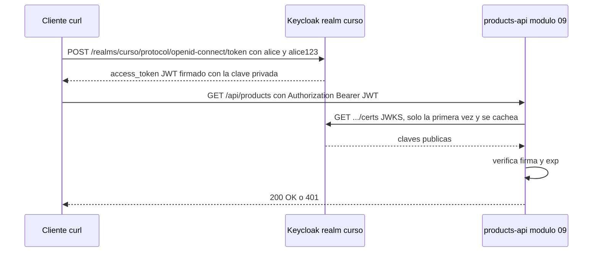
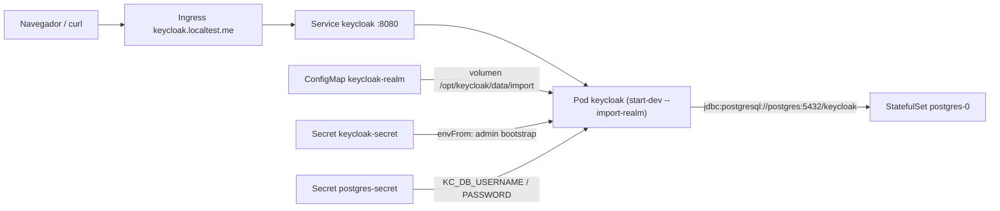

# Módulo 08 — Keycloak con PostgreSQL

## Objetivos
- Desplegar Keycloak apuntando al PostgreSQL del módulo 06.
- Importar un realm automáticamente desde un ConfigMap.
- Exponerlo con Ingress en `http://keycloak.localtest.me`.
- Obtener un token JWT con `curl`.

## Definiciones clave

- **IdP (Identity Provider)**: servidor que gestiona usuarios y emite credenciales de identidad. Aquí, Keycloak.
- **OAuth2**: estándar de **autorización**: define cómo un cliente obtiene un *access token* para llamar a una API.
- **OIDC (OpenID Connect)**: capa sobre OAuth2 que añade **identidad** (quién es el usuario): `id_token`, endpoint `.well-known`, claims estándar.
- **Realm**: espacio aislado dentro de Keycloak con sus propios usuarios, roles y clientes. Usamos `curso`.
- **Client**: aplicación registrada en el realm que pide tokens. Usamos `curso-client` (público, sin secreto).
- **JWT (JSON Web Token)**: token `header.payload.firma` en Base64URL. El payload lleva *claims* (`iss`, `exp`, `preferred_username`...).
- **Claim**: cada dato dentro del JWT. `iss` = emisor, `exp` = expiración, `realm_access.roles` = roles.
- **JWKS (JSON Web Key Set)**: lista de claves **públicas** del realm. Quien recibe un JWT la usa para verificar la firma.

## Teoría

**Keycloak** = servidor de identidad (OIDC/OAuth2/SAML). Tus microservicios Spring **no** guardan usuarios: validan **JWT** firmados por Keycloak.

¿Por qué separar la identidad? Si cada microservicio gestionara usuarios y contraseñas, tendrías N copias de la misma lógica, N bases de usuarios y N sitios donde puede haber fugas. Con un IdP central, el login ocurre **en un solo sitio** y los servicios solo comprueban un token.

La clave es la **firma asimétrica**: Keycloak firma el JWT con su clave **privada** y publica la **pública** en el endpoint JWKS. La API verifica la firma localmente, sin llamar a Keycloak en cada petición (solo descarga y cachea el JWKS). Por eso el sistema escala: Keycloak no es un cuello de botella en cada request.

En Kubernetes, Keycloak es una app *stateless* más (Deployment) que guarda su estado en PostgreSQL (StatefulSet del módulo 06). Su configuración inicial (realm) llega como ConfigMap montado en volumen, y el Ingress del módulo 07 lo expone hacia tu navegador de Windows.

Flujo que implementaremos:



Así quedan los objetos de este módulo en el namespace `dev`:



Decisiones de este módulo (¡solo para aprender!):

- `start-dev`: modo desarrollo (HTTP, sin cache distribuido, sin hardening). En producción usarías `start --optimized`, TLS y hostname fijo.
- `--import-realm`: al arrancar importa `/opt/keycloak/data/import/*.json` **solo si el realm no existe**.
- Realm `curso` con cliente público `curso-client` (password grant habilitado para probar con curl; en la vida real prefiere *Authorization Code + PKCE*) y usuario `alice / alice123`.
- Keycloak 26 usa `KC_BOOTSTRAP_ADMIN_USERNAME/PASSWORD` para el admin inicial.

## Archivos (`k8s/`)

| Archivo | Contenido |
|---------|-----------|
| `10-realm-configmap.yaml` | JSON del realm `curso` |
| `11-keycloak-secret.yaml` | Admin bootstrap |
| `12-keycloak-deployment.yaml` | Deployment + Service (usa `postgres-secret` del módulo 06) |
| `13-keycloak-ingress.yaml` | Ingress `keycloak.localtest.me` |

## Prerrequisitos

- Cluster con ingress-nginx (módulo 07).
- Namespace `dev` con **PostgreSQL corriendo** (módulo 06):
  ```bash
  kubectl get pods -n dev    # postgres-0 debe estar Running 1/1
  ```

## Práctica

```bash
cd 08-keycloak
kubectl apply -f k8s/
kubectl rollout status deploy/keycloak -n dev --timeout=300s
kubectl logs -f deploy/keycloak -n dev      # espera "Keycloak ... started"
```

> **¿Qué acaba de pasar?** Se crearon ConfigMap, Secret, Deployment, Service e Ingress. El Pod tarda porque Keycloak arranca, conecta a `postgres:5432` (DNS del Service) y crea su esquema; mientras, la `startupProbe` sobre `/realms/master` le da hasta 5 min (60 × 5 s) antes de que la liveness pueda matarlo. Al terminar, importa `curso-realm.json` desde el volumen del ConfigMap.

Abre en el navegador de Windows: **http://keycloak.localtest.me** → *Administration Console* → `admin / admin`. Cambia al realm **curso** (menú arriba a la izquierda) y revisa *Clients* y *Users*.

### Obtener un token

```bash
curl -s -X POST http://keycloak.localtest.me/realms/curso/protocol/openid-connect/token \
  -d grant_type=password -d client_id=curso-client \
  -d username=alice -d password=alice123 | jq

# Solo el access token:
TOKEN=$(curl -s -X POST http://keycloak.localtest.me/realms/curso/protocol/openid-connect/token \
  -d grant_type=password -d client_id=curso-client \
  -d username=alice -d password=alice123 | jq -r .access_token)
echo $TOKEN | cut -d. -f2 | base64 -d 2>/dev/null | jq     # payload del JWT
```

Fíjate en `iss`, `exp`, `preferred_username`, `realm_access.roles`.

> **¿Qué acaba de pasar?** Usaste el *password grant*: enviaste usuario y contraseña al *token endpoint* del realm `curso` y Keycloak devolvió un `access_token` (y un `refresh_token`). El JWT tiene 3 partes separadas por `.`; con `cut -f2` tomas el payload y lo decodificas. No está cifrado, solo **firmado**: cualquiera puede leerlo, nadie puede modificarlo sin invalidar la firma.

### Endpoints OIDC útiles

```bash
curl -s http://keycloak.localtest.me/realms/curso/.well-known/openid-configuration | jq '{issuer, jwks_uri, token_endpoint}'
```

> **¿Qué acaba de pasar?** El documento *discovery* de OIDC describe el realm: quién emite (`issuer`), dónde pedir tokens y dónde están las claves públicas (`jwks_uri`). Spring Boot lo usa para autoconfigurarse; en el módulo 09 apuntaremos directamente al `jwks_uri` interno (`http://keycloak:8080/...`).

### Verificar que usa PostgreSQL

```bash
kubectl exec -it postgres-0 -n dev -- psql -U keycloak -d keycloak -c '\dt' | head -20
```

Verás las tablas de Keycloak (`realm`, `user_entity`, ...).

### Persistencia

```bash
kubectl rollout restart deploy/keycloak -n dev
```

Al reiniciar, tus cambios hechos en la consola (nuevos usuarios, etc.) **persisten** gracias a PostgreSQL.

> **¿Qué acaba de pasar?** `rollout restart` cambia una anotación del template, así que el Deployment crea un Pod nuevo y borra el viejo. El Pod no guarda nada en disco: todo el estado (realms, usuarios, sesiones persistentes) vive en PostgreSQL, cuyo PVC sobrevive. El realm no se reimporta porque ya existe en la BD.

## Problemas frecuentes

| Síntoma | Causa |
|---------|-------|
| Keycloak en `CrashLoopBackOff` con error de conexión a BD | Postgres no está listo, o `KC_DB_URL`/credenciales incorrectas |
| `OOMKilled` | Sube `limits.memory` (Keycloak necesita ~1 GB) |
| `502`/`upstream sent too big header` en login | Falta anotación `proxy-buffer-size` |
| El realm no se importó | Ya existía en la BD (el import no sobreescribe). Bórralo desde la consola o recrea la BD |
| `Invalid user credentials` | Realm distinto o contraseña mal; comprueba `/realms/curso` |

## Lo que debes recordar

- Keycloak centraliza el login; tus APIs solo **validan** JWT, no gestionan usuarios.
- El JWT va firmado con la clave privada del realm; la API lo verifica con la pública (JWKS), sin llamar a Keycloak en cada request.
- Keycloak es stateless en K8s: su estado está en PostgreSQL, por eso sobrevive a reinicios.
- `--import-realm` solo importa realms **nuevos**; los cambios posteriores al JSON no se aplican solos.
- `start-dev` y el *password grant* son atajos de aprendizaje; en producción: `start --optimized`, TLS y *Authorization Code + PKCE*.

## Ejercicios

1. Entra a la consola y crea un usuario `bob` con contraseña no temporal. Obtén un token para él.
2. Crea un **realm role** `admin` y asígnalo a `alice`. Obtén un nuevo token y comprueba el claim `realm_access.roles`.
3. Reduce la vida del access token a 1 minuto (*Realm settings → Tokens*). Obtén el token, espera y cópialo en <https://jwt.io>. ¿Qué dice `exp`?
4. Haz `kubectl delete pod -l app=postgres -n dev` mientras Keycloak corre. ¿Qué pasa? ¿Se recupera solo?
5. Reto: añade el realm role y el usuario `bob` al JSON del ConfigMap, y explica por qué ese cambio **no** se aplica si el realm ya existe.

<details><summary>Soluciones</summary>

4. Keycloak devuelve errores 500 mientras Postgres está caído y se recupera cuando vuelve (el pool reconecta). Si no, `rollout restart`.
5. `--import-realm` omite realms que ya existen. Habría que borrar el realm o usar la Admin REST API / `keycloak-config-cli` para cambios incrementales.
</details>

Siguiente: [Módulo 09 — Microservicio Spring Boot](../09-microservicio-spring/README.md)
