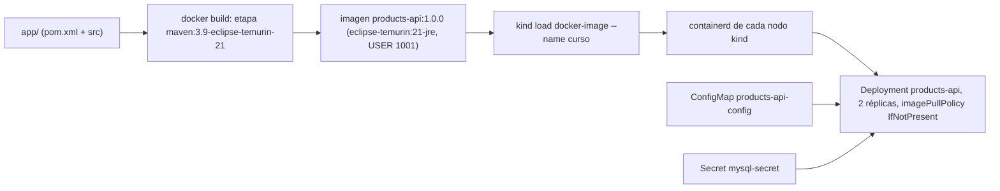
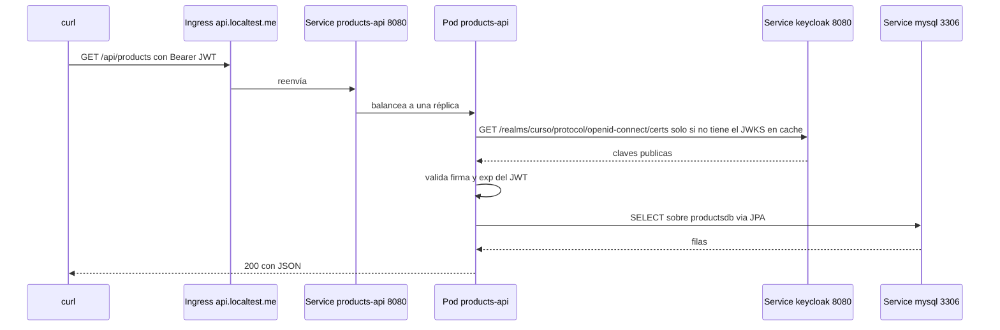

# Módulo 09 — Microservicio Spring Boot (MySQL + Keycloak)

Aquí se junta todo: tu stack real (**Java + Spring Boot + JPA + MySQL**) corriendo en kind, protegido con JWT de Keycloak.

## Objetivos
- Construir la imagen Docker del microservicio y cargarla en kind.
- Configurarlo por ConfigMap/Secret (sin tocar el código).
- Usar las probes de Actuator.
- Llamar a la API con un token de Keycloak.

## Definiciones clave

- **Multi-stage build**: Dockerfile con varias etapas; la etapa `build` (Maven + JDK) compila y la `runtime` (solo JRE) copia el JAR. La imagen final es más pequeña y sin herramientas de compilación.
- **`kind load docker-image`**: copia una imagen de tu Docker local a los nodos de kind. Sustituye al registry en el curso.
- **Resource Server**: en Spring Security, una API que no hace login; solo acepta peticiones con un *Bearer token* válido.
- **`jwk-set-uri`**: URL del JWKS desde donde Spring descarga las claves públicas para verificar la firma del JWT.
- **Actuator health groups**: endpoints `/actuator/health/liveness` y `/readiness` que Spring expone para las probes de Kubernetes.
- **Graceful shutdown**: al recibir `SIGTERM`, Spring deja de aceptar peticiones nuevas y termina las que están en curso (hasta 20 s aquí).
- **`MaxRAMPercentage`**: flag de la JVM que dimensiona el heap como % del límite de memoria del contenedor, no de la RAM del nodo.

## El microservicio (`app/`)

API de productos mínima:

| Endpoint | Seguridad | Descripción |
|----------|-----------|-------------|
| `GET /api/public/ping` | pública | Devuelve el nombre del pod (para ver balanceo) |
| `GET /api/whoami` | JWT | Datos del token |
| `GET /api/products` | JWT | Lista productos (MySQL) |
| `POST /api/products` | JWT | Crea producto |
| `/actuator/health/{liveness,readiness}` | pública | Probes |
| `/actuator/prometheus` | pública | Métricas (módulo 11) |

### Teoría: por qué así

Una app "lista para Kubernetes" sigue la idea de *12-factor*: **la misma imagen** sirve para todos los entornos y lo que cambia (URL de BD, credenciales, URL de Keycloak) entra por variables de entorno. Por eso `application.yml` usa `${DB_URL:...}`, `${JWK_SET_URI:...}`: el valor por defecto sirve en local y Kubernetes lo sobrescribe con el ConfigMap `products-api-config` y el Secret `mysql-secret`.

La seguridad es *stateless*: `SecurityConfig` desactiva sesiones y configura `oauth2ResourceServer().jwt()`. Cada petición trae su JWT; cualquier réplica puede atenderla sin compartir sesión. Eso es lo que permite escalar a 2, 4 o 10 pods sin *sticky sessions*.

Kubernetes necesita saber cuándo el pod está vivo y cuándo puede recibir tráfico. Spring Boot lo expone vía Actuator, y el Deployment lo consume con `startupProbe` (JVM + Hibernate tardan), `readinessProbe` y `livenessProbe`. Junto con `maxUnavailable: 0` y graceful shutdown, consigues despliegues sin cortes.

Puntos importantes de diseño para Kubernetes:

1. **Config externa** (`DB_URL`, `DB_USER`, `DB_PASSWORD`, `JWK_SET_URI`) con valores por defecto para desarrollo local.
2. **`jwk-set-uri` interno** (`http://keycloak:8080/...`) en vez de `issuer-uri`: desde el pod, `keycloak.localtest.me` resolvería a `127.0.0.1` (el propio pod). Con `jwk-set-uri` la app valida firma y expiración sin depender del hostname público.
3. **Probes** de Spring (`/actuator/health/liveness|readiness`) y `startupProbe` generosa (JVM + Hibernate).
4. **`-XX:MaxRAMPercentage=75`** para que la JVM respete el límite de memoria del contenedor.
5. **`USER 1001`** numérico → compatible con `runAsNonRoot`.
6. **Graceful shutdown** (`server.shutdown=graceful`).
7. `ddl-auto: update` solo para el curso. En tu empresa seguramente uses Flyway/Liquibase.

Del código a un Pod corriendo:



Una petición autenticada dentro del cluster:



## Prerrequisitos

Namespace `dev` con **MySQL** (módulo 06) y **Keycloak** (módulo 08) corriendo:

```bash
kubectl get pods -n dev
# mysql-0, postgres-0, keycloak-xxxx → Running/Ready
```

## Práctica

### 1. Construir y cargar la imagen

```bash
cd 09-microservicio-spring/app
docker build -t products-api:1.0.0 .
kind load docker-image products-api:1.0.0 --name curso
```

(La primera build tarda: descarga Maven y dependencias.)

> **¿Qué acaba de pasar?** Docker ejecutó las dos etapas: Maven compiló el JAR (la capa de `dependency:go-offline` queda en cache mientras no cambie `pom.xml`) y la etapa final solo copió `app.jar` sobre un JRE. Después, `kind load` metió la imagen en el containerd de cada nodo kind: los nodos no ven tu Docker local, por eso este paso es obligatorio.

### 2. Desplegar

```bash
cd ..
kubectl apply -f k8s/
kubectl rollout status deploy/products-api -n dev --timeout=300s
kubectl get pods,svc,ingress -n dev
```

> **¿Qué acaba de pasar?** Se crearon ConfigMap, Deployment (2 réplicas), Service e Ingress `api.localtest.me`. Con `imagePullPolicy: IfNotPresent` el kubelet usa la imagen ya cargada y no intenta descargarla. Cada pod arranca la JVM, Hibernate crea la tabla `products` en MySQL (`ddl-auto: update`) y, cuando `/actuator/health/readiness` responde UP, el pod entra en los Endpoints del Service.

### 3. Probar

```bash
curl http://api.localtest.me/api/public/ping
# repite varias veces: ¿cambia "pod"? → balanceo entre las 2 réplicas

curl -i http://api.localtest.me/api/products      # 401 sin token

TOKEN=$(curl -s -X POST http://keycloak.localtest.me/realms/curso/protocol/openid-connect/token \
  -d grant_type=password -d client_id=curso-client \
  -d username=alice -d password=alice123 | jq -r .access_token)

curl -s -H "Authorization: Bearer $TOKEN" http://api.localtest.me/api/whoami | jq

curl -s -X POST http://api.localtest.me/api/products \
  -H "Authorization: Bearer $TOKEN" -H "Content-Type: application/json" \
  -d '{"name":"Teclado","price":49.90}' | jq

curl -s -H "Authorization: Bearer $TOKEN" http://api.localtest.me/api/products | jq
```

> **¿Qué acaba de pasar?** `/api/public/**` está en `permitAll()`, por eso responde sin token y muestra el `HOSTNAME` del pod que atendió. Sin token, el filtro de Resource Server devuelve `401`. Con token, Spring descargó el JWKS desde `http://keycloak:8080/...` (DNS interno), verificó firma y `exp`, y `whoami` te muestra los claims. Observa que `issuer` es `keycloak.localtest.me`: la URL pública con la que pediste el token.

### 4. Verificar en MySQL

```bash
kubectl exec -it mysql-0 -n dev -- mysql -uappuser -papppass productsdb -e "SELECT * FROM products;"
```

> **¿Qué acaba de pasar?** Entraste al contenedor de MySQL y consultaste la tabla que creó Hibernate. Los datos están en el PVC del StatefulSet, no en los pods de la API: puedes borrar o escalar `products-api` sin perder nada.

### 5. Ciclo de desarrollo: nueva versión

Modifica algo (ej. mensaje del ping) y:

```bash
cd app
docker build -t products-api:1.0.1 .
kind load docker-image products-api:1.0.1 --name curso
kubectl set image deploy/products-api products-api=products-api:1.0.1 -n dev
kubectl rollout status deploy/products-api -n dev
```

**Siempre cambia el tag.** Con `latest` o el mismo tag, K8s no sabe que la imagen cambió.

> **¿Qué acaba de pasar?** `set image` cambió el template del Deployment, lo que creó un ReplicaSet nuevo. Con `maxSurge: 1` y `maxUnavailable: 0` se levanta un pod 1.0.1, se espera a que esté *ready* y solo entonces se elimina uno 1.0.0 (que termina con graceful shutdown). Se repite hasta reemplazar las 2 réplicas.

### 6. Depuración típica

```bash
kubectl logs deploy/products-api -n dev --tail=100
kubectl describe pod -l app=products-api -n dev | tail -30
kubectl exec -it deploy/products-api -n dev -- sh -c 'env | grep -E "DB_|JWK"'
```

| Síntoma | Causa |
|---------|-------|
| `ErrImagePull` / `ImagePullBackOff` | No hiciste `kind load` o el tag no coincide |
| `CrashLoopBackOff` + `Communications link failure` | MySQL no listo / `DB_URL` mal |
| `Access denied for user 'appuser'` | Password del Secret no coincide con el inicializado en el volumen |
| `401` con token válido | `JWK_SET_URI` mal o token expirado (5 min por defecto) |
| `OOMKilled` | Sube `limits.memory` |

## Lo que debes recordar

- Una sola imagen para todos los entornos; la config entra por ConfigMap/Secret como variables de entorno.
- En kind, `docker build` + `kind load` + tag nuevo en cada versión (nunca reutilices el tag).
- La API es Resource Server stateless: valida el JWT con el JWKS **interno** (`http://keycloak:8080`), no con el host público.
- Probes de Actuator + `maxUnavailable: 0` + graceful shutdown = despliegues sin errores.
- La JVM debe respetar el límite del contenedor (`MaxRAMPercentage`); si no, `OOMKilled`.

## Ejercicios

1. Escala a 4 réplicas y haz 20 llamadas a `/api/public/ping`. Cuenta cuántas respuestas da cada pod.
2. Mata `mysql-0` durante una llamada a `/api/products`. ¿Qué respuesta da la API? ¿Se recupera? ¿Cambia el estado de readiness? (Pista: Spring marca readiness solo por su estado interno, no por la BD, salvo que lo configures con `management.endpoint.health.group.readiness.include=readinessState,db`).
3. Añade un endpoint `GET /api/products/{id}` y despliega la versión `1.0.2` con rolling update. Mientras actualizas, ejecuta en bucle `while true; do curl -s -o /dev/null -w "%{http_code}\n" http://api.localtest.me/api/public/ping; sleep 0.5; done`. ¿Hay algún error? ¿Por qué no?
4. Configura la contraseña de BD **incorrecta** en el Secret y observa el pod. Corrígela y reinicia. ¿Hace falta recrear algo más?
5. Protege `POST /api/products` para que solo permita usuarios con el realm role `admin` (crea el rol en Keycloak, asígnalo a alice, y usa un `JwtAuthenticationConverter` que mapee `realm_access.roles`).

<details><summary>Pistas y soluciones</summary>

1. `for i in {1..20}; do curl -s http://api.localtest.me/api/public/ping; echo; done | sort | uniq -c`
3. No hay errores porque `maxUnavailable: 0` + readinessProbe: los pods nuevos reciben tráfico solo cuando están listos y los viejos se eliminan después (+ graceful shutdown).
4. Basta `kubectl rollout restart deploy/products-api -n dev` (las env vars se leen al arrancar el pod).
5. Usa `@EnableMethodSecurity` y `@PreAuthorize("hasRole('admin')")`; el converter debe añadir autoridades `ROLE_<rol>` desde `realm_access.roles`.
</details>

Siguiente: [Módulo 10 — Helm](../10-helm/README.md)
