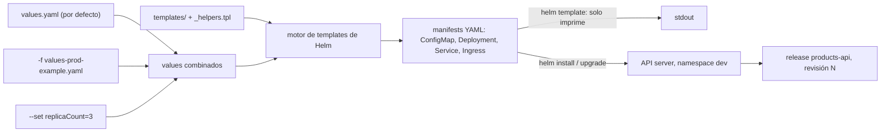
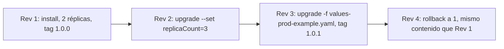

# Módulo 10 — Helm: empaqueta tu microservicio

## Objetivos
- Entender la estructura de un chart y cómo funcionan los templates.
- Instalar, actualizar, hacer rollback y desinstalar releases.
- Sobrescribir valores por entorno.

## Definiciones clave

- **Chart**: paquete de Helm: carpeta con `Chart.yaml`, `values.yaml` y `templates/`. Aquí, `charts/products-api`.
- **Template**: YAML de Kubernetes con huecos en sintaxis Go template (`{{ .Values.x }}`) que Helm rellena.
- **Values**: parámetros que rellenan los templates. Vienen de `values.yaml`, de `-f archivo.yaml` y de `--set`, en ese orden de prioridad creciente.
- **Release**: una instalación concreta de un chart con un nombre (`products-api`) en un namespace (`dev`).
- **Revision**: cada `install`, `upgrade` o `rollback` crea una revisión numerada del release; permite volver atrás.
- **Render**: convertir templates + values en manifests YAML finales (`helm template`).
- **`_helpers.tpl`**: archivo de funciones con nombre (`define`) que se reutilizan con `include`; no genera ningún objeto.
- **`appVersion` vs `version`**: `version` es la versión del chart; `appVersion`, la de la app que empaqueta.

## Teoría

Helm = gestor de paquetes de Kubernetes.

En el módulo 09 desplegaste 4 YAMLs con valores fijos (`replicas: 2`, `image: products-api:1.0.0`, host `api.localtest.me`). Para QA o producción tendrías que copiarlos y editarlos a mano: duplicación y errores. Helm separa **la forma** (templates) de **los datos** (values): un solo chart, un archivo de values por entorno.

Además, Helm trata el conjunto como una unidad: el **release**. Sabe qué objetos creó, guarda cada versión aplicada como **revisión** (en un Secret `sh.helm.release.v1.<release>.v<N>` del namespace) y puede volver a cualquiera con `rollback` o borrarlo todo con `uninstall`. Con `kubectl apply` tú tendrías que llevar ese control.

Helm no es un controlador que viva en el cluster: es un cliente (como `kubectl`) que renderiza YAML y lo envía a la API. Si alguien edita un objeto con `kubectl` por fuera, Helm no lo corrige; eso lo hará ArgoCD en el módulo 12.

| Concepto | Qué es |
|----------|--------|
| **Chart** | Paquete: templates + `values.yaml` + metadata |
| **Release** | Una instalación concreta de un chart en el cluster |
| **Values** | Parámetros que rellenan los templates |
| **Revision** | Cada `install`/`upgrade` crea una revisión (permite rollback) |



Estructura del chart de este módulo (`charts/products-api`):

```
Chart.yaml                 # metadata (name, version, appVersion)
values.yaml                # valores por defecto
values-prod-example.yaml   # ejemplo de override
templates/
  _helpers.tpl             # funciones reutilizables
  configmap.yaml
  deployment.yaml
  service.yaml
  ingress.yaml             # condicional: ingress.enabled
  servicemonitor.yaml      # condicional: serviceMonitor.enabled
  NOTES.txt                # mensaje post-instalación
```

Cosas que verás en los templates:

- `{{ .Values.x }}`: valores. `{{ .Release.Name }}`, `{{ .Chart.Name }}`: metadata.
- `{{ include "..." . | nindent 4 }}`: reutilizar bloques con la indentación correcta.
- `{{- if ... }}` / `{{- range ... }}`: condicionales y bucles.
- **`checksum/config`**: truco para reiniciar pods cuando cambia el ConfigMap.

En este chart, `products-api.fullname` devuelve el **nombre del release**, así que los objetos se llaman como el release (`products-api`, `products-api-config`). Las credenciales **no** están en el chart: el Deployment referencia el Secret existente `mysql-secret` (`db.secretName`).

## Práctica

### 0. Prerrequisitos y limpieza del módulo 09

El chart reemplaza los YAMLs sueltos del módulo 09. Para evitar conflictos, bórralos (**deja MySQL y Keycloak**):

```bash
kubectl delete -f 09-microservicio-spring/k8s/ --ignore-not-found
```

> **¿Qué acaba de pasar?** Borraste los objetos creados con `kubectl apply`. Helm se niega a instalar sobre objetos que no son suyos (no tienen la etiqueta `app.kubernetes.io/managed-by: Helm` ni sus anotaciones), por eso hay que limpiarlos antes.

### 1. Revisar antes de instalar

```bash
cd 10-helm
helm lint charts/products-api
helm template products-api charts/products-api -n dev | less      # renderiza sin instalar
helm install products-api charts/products-api -n dev --dry-run --debug | head -80
```

> **¿Qué acaba de pasar?** `lint` revisó estructura y sintaxis. `template` renderizó en local sin tocar el cluster: ves exactamente el YAML que se aplicaría. `--dry-run --debug` además valida contra la API y muestra los values calculados. Ningún comando creó objetos.

### 2. Instalar

```bash
helm install products-api charts/products-api -n dev
helm list -n dev
kubectl get pods -n dev
curl http://api.localtest.me/api/public/ping
```

> **¿Qué acaba de pasar?** Helm renderizó el chart, aplicó ConfigMap, Deployment, Service e Ingress en `dev` y guardó la **revisión 1** como Secret (`kubectl get secrets -n dev -l owner=helm`). Luego imprimió `NOTES.txt`. Los pods usan la imagen `products-api:1.0.0` que ya cargaste en kind.

### 3. Upgrade con `--set` y con archivo de valores

```bash
helm upgrade products-api charts/products-api -n dev --set replicaCount=3
kubectl get pods -n dev -l app=products-api

helm upgrade products-api charts/products-api -n dev -f charts/products-api/values-prod-example.yaml
```

> El ejemplo `values-prod-example.yaml` usa `image.tag: 1.0.1`. Constrúyela primero (módulo 09, paso 5) o dará `ErrImagePull`... ¡buena oportunidad para practicar rollback!

> **¿Qué acaba de pasar?** Cada `upgrade` volvió a renderizar con los nuevos values, Helm comparó con la revisión anterior y aplicó solo las diferencias: revisión 2 (3 réplicas) y revisión 3 (tag `1.0.1`, más recursos, host `api.prod.localtest.me`). Ojo: el segundo upgrade **no** conserva el `--set replicaCount=3`; cada upgrade parte de `values.yaml` más lo que pases en ese comando (aunque el prod-example también pone 3).

### 4. Historial y rollback

```bash
helm history products-api -n dev
helm rollback products-api 1 -n dev
helm get values products-api -n dev
helm get manifest products-api -n dev | head -50
```



> **¿Qué acaba de pasar?** `rollback` no borra el historial: crea una **revisión nueva** (4) con los manifests guardados de la revisión 1 y los aplica. El Deployment vuelve a `1.0.0` con un rolling update normal. `get values` muestra solo los values que pasaste tú; `get manifest`, el YAML final aplicado.

### 5. Demostrar el `checksum/config`

```bash
helm upgrade products-api charts/products-api -n dev \
  --set config.JWK_SET_URI=http://keycloak:8080/realms/curso/protocol/openid-connect/certs
# mismo valor → no hay cambios, no reinicia

helm upgrade products-api charts/products-api -n dev --set config.EXTRA_FLAG=true
kubectl get pods -n dev -w      # los pods se renuevan porque cambió el ConfigMap
```

> **¿Qué acaba de pasar?** Kubernetes no reinicia pods cuando cambia un ConfigMap leído con `envFrom`. El template pone en el Pod la anotación `checksum/config` con el SHA-256 del ConfigMap renderizado: si el contenido cambia, cambia la anotación, cambia el template del Deployment y se dispara un rolling update. Mismo contenido = mismo hash = nada que hacer.

### 6. Desinstalar

```bash
helm uninstall products-api -n dev
```

(Para el módulo 12 volverás a desplegarlo, pero con ArgoCD.)

> **¿Qué acaba de pasar?** Helm borró todos los objetos del release y sus Secrets de historial. `mysql-secret`, MySQL y Keycloak siguen ahí porque no pertenecen al chart.

## Helm en el trabajo: buenas prácticas

- Un chart por microservicio (o un chart "genérico" de la empresa, con `values` por servicio).
- Un `values-<entorno>.yaml` por entorno.
- No metas secretos en `values.yaml`: referencia Secrets existentes (como aquí) o usa External Secrets.
- Versiona `Chart.yaml` (`version` = del chart, `appVersion` = de la app).
- `helm lint`, `helm template` y `kubeconform` en CI.
- Prefiere `helm upgrade --install --atomic --timeout 5m` en pipelines: si falla, hace rollback automático.

## Lo que debes recordar

- Chart = templates + values; release = chart instalado con nombre en un namespace.
- Prioridad de values: `values.yaml` < `-f archivo` < `--set`. Revisa siempre con `helm template` antes de instalar.
- Cada install/upgrade/rollback es una revisión guardada como Secret; `rollback` crea una revisión nueva.
- `checksum/config` fuerza el reinicio de pods cuando cambia el ConfigMap.
- Helm es solo un cliente: no corrige cambios manuales en el cluster (eso es GitOps, módulo 12).

## Ejercicios

1. Añade un valor `javaOpts` (por defecto `-XX:MaxRAMPercentage=75`) y úsalo como variable de entorno `JAVA_TOOL_OPTIONS` en el Deployment.
2. Añade un `HorizontalPodAutoscaler` opcional (`autoscaling.enabled`, `minReplicas`, `maxReplicas`, `targetCPU`) y, cuando esté activo, **omite** `replicas` en el Deployment.
3. Instala el mismo chart dos veces con distinto release name y host (`api2.localtest.me`). ¿Qué problemas aparecen? (Pista: `fullname`, nombres de Secrets compartidos).
4. Provoca un upgrade fallido (`--set image.tag=no-existe --atomic --timeout 60s`). ¿Qué hace Helm?
5. Descarga un chart público: `helm repo add bitnami https://charts.bitnami.com/bitnami && helm show values bitnami/mysql | head -100`. ¿Qué parámetros usarías en lugar del StatefulSet manual del módulo 06? (No lo instales: ya tienes MySQL).

<details><summary>Soluciones</summary>

1. En `values.yaml`: `javaOpts: "-XX:MaxRAMPercentage=75"`; en el deployment: `- name: JAVA_TOOL_OPTIONS` / `value: {{ .Values.javaOpts | quote }}`.
2. `{{- if not .Values.autoscaling.enabled }} replicas: ... {{- end }}` y un template `hpa.yaml` con `{{- if .Values.autoscaling.enabled }}`.
3. `fullname` = release name → no colisionan. Ambos usan el mismo Secret/DB (esperado).
4. `--atomic` revierte automáticamente al estado anterior al agotarse el timeout.
</details>

Siguiente: [Módulo 11 — Observabilidad](../11-observabilidad/README.md)
