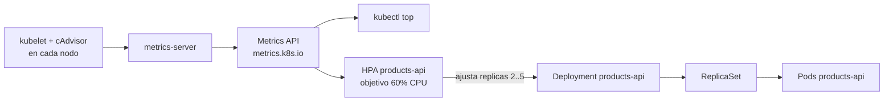
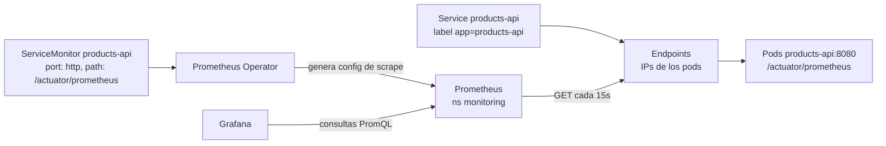

# Módulo 11 — Observabilidad: logs, métricas y autoscaling

## Objetivos
- Dominar logs con `kubectl logs` y `stern`.
- Instalar `metrics-server` y usar `kubectl top`.
- Configurar un HPA.
- Desplegar Prometheus + Grafana (kube-prometheus-stack) y ver métricas JVM de tu microservicio.

## Definiciones clave

- **Observabilidad**: capacidad de saber qué pasa dentro del sistema mirando sus salidas: logs, métricas y trazas.
- **metrics-server**: componente que recoge CPU/RAM de los kubelets y los expone en la Metrics API. Lo usan `kubectl top` y el HPA. No guarda histórico.
- **HPA (HorizontalPodAutoscaler)**: controlador que ajusta `replicas` de un Deployment según una métrica (aquí, CPU media respecto a `requests.cpu`).
- **Prometheus**: base de datos de series temporales que **hace scrape** (pide por HTTP) las métricas de cada target cada X segundos.
- **Prometheus Operator / CRD**: operador que gestiona Prometheus con objetos Kubernetes propios (`ServiceMonitor`, `PrometheusRule`...).
- **ServiceMonitor**: CRD que dice "haz scrape de los Services con este label, en este puerto y path".
- **Grafana**: interfaz de dashboards que consulta Prometheus (PromQL) y dibuja gráficas.
- **Micrometer / Actuator**: librerías de Spring Boot que exponen métricas JVM y HTTP en `/actuator/prometheus`.

## Teoría

| Pilar | Herramienta del curso |
|-------|-----------------------|
| Logs | `kubectl logs`, `stern` (opcional: Loki) |
| Métricas | metrics-server (CPU/RAM básicas), Prometheus + Grafana |
| Trazas | (fuera de alcance: OpenTelemetry/Tempo/Jaeger) |

En un cluster los pods son efímeros: se mueven, se reinician y se escalan. No puedes entrar a "mirar el servidor". Por eso necesitas que la información salga sola: los **logs** van a stdout y los recoge el nodo; las **métricas** se exponen por HTTP y alguien las recolecta.

Hay dos caminos de métricas distintos. **metrics-server** es mínimo: solo CPU/RAM actuales, sin histórico. Sirve para `kubectl top` y para que el **HPA** decida cuántas réplicas poner. **Prometheus** es el sistema completo: guarda histórico, entiende métricas de tu app (heap, peticiones HTTP) y permite alertas y dashboards.

El HPA es un bucle de control más, como el de los Deployments. Cada ~15 s lee la CPU media de los pods, la compara con el objetivo (60 % de `requests.cpu` en `hpa.yaml`) y cambia `spec.replicas` del Deployment entre 2 y 5. Sin `requests.cpu` no puede calcular el porcentaje.

Tu app ya expone `/actuator/prometheus` (Micrometer). Prometheus la descubre mediante un **ServiceMonitor** (CRD del Prometheus Operator): el operador lee el ServiceMonitor, busca el Service con label `app: products-api`, obtiene sus Endpoints (las IPs de los pods) y configura Prometheus para hacer scrape de cada pod en el puerto `http` cada 15 s.





> **Atención:** kube-prometheus-stack consume ~1.5–2 GB RAM extra. Si Docker Desktop va justo, borra Keycloak/otros mientras practicas o sube la memoria en *Settings → Resources* (o `memory` en `.wslconfig`).

Prerrequisito: `products-api` corriendo en `dev` (módulo 09 o 10).

## 1. Logs

```bash
kubectl logs deploy/products-api -n dev --tail=50
kubectl logs -f -l app=products-api -n dev --max-log-requests=10      # todos los pods
kubectl logs <pod> -n dev --previous                                    # contenedor anterior (tras un crash)
kubectl logs <pod> -n dev --since=10m
kubectl get events -n dev --sort-by=.lastTimestamp | tail -20
```

Con **stern** (mucho más cómodo):

```bash
stern products-api -n dev
stern -n dev "mysql|products" --since 5m
```

> Buena práctica: logs a **stdout/stderr** y en JSON en producción. K8s/agentes (Fluent Bit, Promtail) los recogen del nodo.

> **¿Qué acaba de pasar?** El runtime del contenedor guarda lo que tu app escribe en stdout en un archivo del nodo. `kubectl logs` pide ese archivo al kubelet a través del api-server. `--previous` lee el archivo del contenedor que murió; por eso solo existe tras un reinicio. Los events son otra cosa: los escriben los controladores (scheduler, kubelet), no tu app.

## 2. metrics-server y `kubectl top`

En kind hay que permitir TLS inseguro hacia los kubelets:

```bash
kubectl apply -f https://github.com/kubernetes-sigs/metrics-server/releases/latest/download/components.yaml
kubectl patch -n kube-system deployment metrics-server --type=json \
  -p '[{"op":"add","path":"/spec/template/spec/containers/0/args/-","value":"--kubelet-insecure-tls"}]'
kubectl rollout status -n kube-system deploy/metrics-server

kubectl top nodes
kubectl top pods -n dev
```

> **¿Qué acaba de pasar?** metrics-server se registró como una API extra (`metrics.k8s.io`) en el api-server. Cada pocos segundos pregunta a cada kubelet cuánta CPU/RAM usan los contenedores. En kind los kubelets usan certificados autofirmados; el flag `--kubelet-insecure-tls` evita que falle la verificación. Si `kubectl top` dice "metrics not available", espera un minuto: aún no hay primera lectura.

## 3. HPA (autoscaling horizontal)

```bash
kubectl apply -f 11-observabilidad/manifests/hpa.yaml
kubectl get hpa -n dev -w
```

El HPA calcula % **respecto a `requests.cpu`** (por eso es crítico definirlos: tu Deployment pide `200m`).

Generar carga (en otra terminal):

```bash
kubectl run load -n dev --rm -it --image=busybox:1.36 --restart=Never -- \
  sh -c 'while true; do wget -q -O- http://products-api:8080/api/public/ping >/dev/null; done'
```

Observa cómo suben las réplicas; al parar la carga bajan tras ~5 min (ventana de estabilización).

> **¿Qué acaba de pasar?** El controlador HPA calcula `réplicas deseadas = réplicas actuales × (CPU actual / 60 %)`. Con carga, la CPU media supera 60 % de 200m (= 120m) y sube `spec.replicas` del Deployment. El Deployment crea pods nuevos y el Service los añade a sus Endpoints, así que la carga se reparte. Para bajar espera 5 min para no oscilar (*flapping*).

> Si usas Helm (módulo 10) y el chart define `replicas`, un HPA y Helm se "pelean". Por eso el ejercicio 2 del módulo 10 omite `replicas` cuando el HPA está activo.

## 4. Prometheus + Grafana

```bash
helm repo add prometheus-community https://prometheus-community.github.io/helm-charts
helm repo update
helm install monitoring prometheus-community/kube-prometheus-stack \
  -n monitoring --create-namespace \
  --set prometheus.prometheusSpec.serviceMonitorSelectorNilUsesHelmValues=false \
  --set prometheus.prometheusSpec.podMonitorSelectorNilUsesHelmValues=false \
  --set alertmanager.enabled=false

kubectl get pods -n monitoring -w
```

(`serviceMonitorSelectorNilUsesHelmValues=false` hace que Prometheus recoja **cualquier** ServiceMonitor, no solo los de su release.)

> **¿Qué acaba de pasar?** El chart instaló varias piezas: los CRDs (`ServiceMonitor`, `PrometheusRule`...), el Prometheus Operator, Prometheus, Grafana, node-exporter (métricas del nodo) y kube-state-metrics (estado de los objetos K8s, p. ej. reinicios). El operador vigila los CRDs y reescribe la configuración de Prometheus cuando cambian.

### Registrar tu microservicio

```bash
kubectl apply -f 11-observabilidad/manifests/servicemonitor.yaml
```

> El Service de `products-api` debe tener el label `app: products-api` y un puerto **llamado** `http` (ya lo tiene en ambos módulos 09 y 10).

> **¿Qué acaba de pasar?** Creaste un objeto que no hace nada por sí mismo. El operador lo detecta, busca Services con `app: products-api` en `dev` y añade a Prometheus un *job* que pide `/actuator/prometheus` a cada pod cada 15 s. El ServiceMonitor apunta al **nombre** del puerto (`http`), no al número: si el puerto no tiene nombre, no hay target.

### Prometheus

```bash
kubectl port-forward -n monitoring svc/monitoring-kube-prometheus-prometheus 9090:9090
```

Abre <http://localhost:9090> → *Status → Targets*: busca `products-api` en estado **UP**. Prueba queries:

```
jvm_memory_used_bytes{area="heap", namespace="dev"}
rate(http_server_requests_seconds_count{namespace="dev"}[1m])
sum by (pod) (container_memory_working_set_bytes{namespace="dev", container="products-api"})
```

> **¿Qué acaba de pasar?** Las dos primeras métricas vienen de tu app (Micrometer). La tercera viene de cAdvisor, en el kubelet: es la memoria que ve el kernel, la que se compara con `limits.memory` para un OOMKill. `rate(...[1m])` convierte un contador que solo sube en "peticiones por segundo".

### Grafana

```bash
kubectl port-forward -n monitoring svc/monitoring-grafana 3000:80
```

<http://localhost:3000> — usuario `admin`, password `prom-operator` (valor por defecto del chart).

- Dashboards ya incluidos: *Kubernetes / Compute Resources / Namespace (Pods)*, *Node Exporter*...
- Importa el dashboard de JVM (Micrometer): *Dashboards → New → Import* → ID **4701**.

> **¿Qué acaba de pasar?** Grafana no guarda métricas: el chart lo configuró con Prometheus como *datasource*. Cada panel es una consulta PromQL que se ejecuta al abrir el dashboard.

## 5. Logs centralizados (opcional)

Puedes instalar Loki + Promtail con el chart de Grafana (`grafana/loki-stack`; revisa la documentación actual porque Grafana cambia los charts recomendados con frecuencia) y añadir Loki como datasource en Grafana.

## Limpieza

```bash
helm uninstall monitoring -n monitoring
kubectl delete namespace monitoring
kubectl delete -f 11-observabilidad/manifests/hpa.yaml
```

## Lo que debes recordar

- Logs a stdout; `kubectl logs --previous` para ver por qué murió un contenedor.
- metrics-server = CPU/RAM actuales para `kubectl top` y HPA. Prometheus = histórico, métricas de app y alertas.
- El HPA escala según % de `requests.cpu`: sin requests no hay autoscaling.
- Un ServiceMonitor selecciona Services por label y puerto **con nombre**; el operador configura el scrape.
- Grafana solo dibuja: los datos están en Prometheus.

## Ejercicios

1. Con `kubectl top pods -n dev --containers`, ¿cuánta memoria usa cada contenedor? ¿Cercana al límite de 768Mi?
2. Provoca un `OOMKilled` en `products-api` bajando `limits.memory` a `200Mi` y mira `kubectl describe pod` + la métrica de reinicios en Prometheus (`kube_pod_container_status_restarts_total`). Restaura el valor.
3. Crea un panel en Grafana con las peticiones por segundo del microservicio (`http_server_requests_seconds_count`).
4. Genera tráfico con `hey` o un bucle de `curl` y observa cómo cambia el panel.
5. Reto: escribe una `PrometheusRule` que dispare una alerta si `up{job="products-api"} == 0` durante 1 minuto.

<details><summary>Pistas</summary>

2. `kubectl set resources deploy/products-api -n dev --limits=memory=200Mi`
5. CRD `PrometheusRule` con `groups[].rules[].alert`, `expr`, `for: 1m`. El `job` suele ser el nombre del Service (`products-api`).
</details>

Siguiente: [Módulo 12 — GitOps con ArgoCD](../12-gitops-argocd/README.md)
