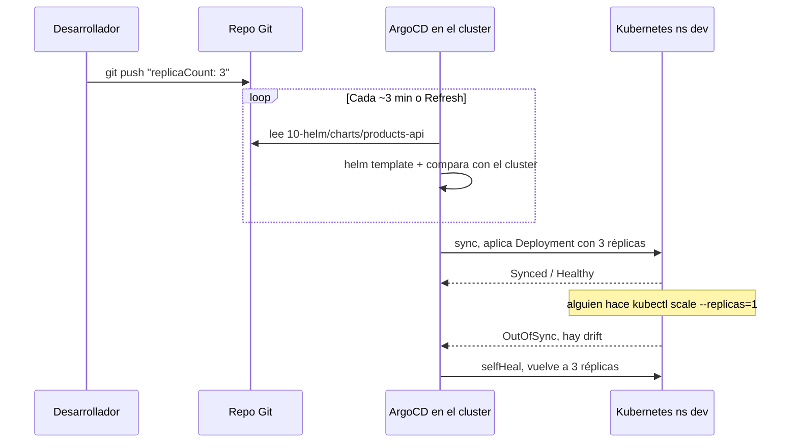
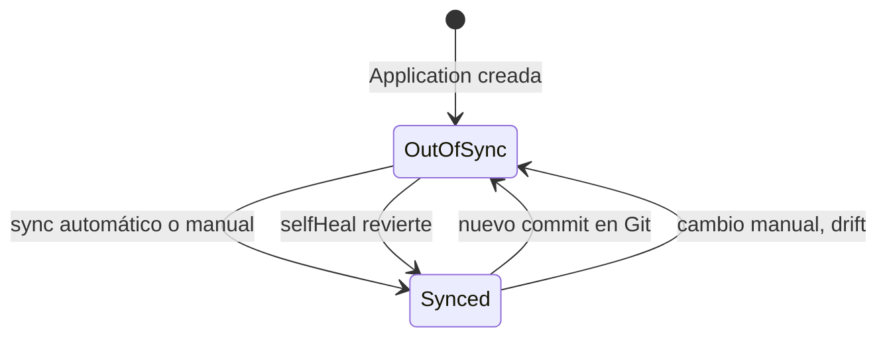

# Módulo 12 — GitOps con ArgoCD

## Objetivos
- Instalar ArgoCD en kind.
- Desplegar el chart del microservicio **desde Git**.
- Ver *sync*, *drift* y *self-heal* en acción.

## 📖 Definiciones clave

- **GitOps**: forma de operar donde Git guarda el estado deseado y un agente en el cluster lo aplica y lo vigila.
- **ArgoCD**: herramienta GitOps que corre dentro del cluster, lee repos Git y reconcilia los recursos.
- **Application**: CRD de ArgoCD que une un origen (repo + path + revisión) con un destino (cluster + namespace).
- **Sync**: acción de aplicar lo que hay en Git al cluster.
- **Drift**: diferencia entre Git y el cluster, normalmente por un cambio manual con `kubectl`.
- **Self-heal**: ArgoCD revierte el drift automáticamente para que el cluster vuelva a coincidir con Git.
- **Prune**: ArgoCD borra del cluster los recursos que ya no existen en Git.
- **Pull vs push**: en GitOps el cluster *tira* de Git (pull); en un CI clásico el pipeline *empuja* con `kubectl`/`helm` (push).

## 📚 Teoría

**GitOps**: Git es la **única fuente de verdad** del estado deseado. Un agente dentro del cluster (ArgoCD) compara continuamente Git ↔ cluster y los reconcilia.

Es la misma idea que ya conoces de Kubernetes (estado deseado vs estado real, bucle de reconciliación), pero un nivel más arriba. Antes el estado deseado era lo que hacías con `kubectl apply`. Ahora es un commit. Nadie aplica a mano: ArgoCD lo hace.

¿Por qué? Porque `kubectl apply` desde un portátil no deja rastro y no se puede revisar. Con GitOps cada cambio es un PR revisable, el historial de Git es el historial del cluster, y volver atrás es `git revert`.

En este módulo ArgoCD renderiza el **mismo chart de Helm** del módulo 10 (`10-helm/charts/products-api`) con su `values.yaml` y aplica el resultado en `dev`. Ojo: ArgoCD no usa `helm install`; hace el equivalente a `helm template` + `kubectl apply`. Por eso `helm list` no mostrará el release.



<details><summary>Versión texto</summary>

```
dev ──push──▶ Git repo ◀──pull/compara── ArgoCD (en el cluster) ──aplica──▶ Kubernetes
```
</details>

Ventajas: auditoría (cada cambio es un commit/PR), rollback = `git revert`, el CI no necesita credenciales del cluster, detección de *drift* (alguien tocó algo a mano).

Vocabulario ArgoCD:

| Término | Significado |
|---------|-------------|
| **Application** | CRD: "despliega *este path* de *este repo* en *este namespace*" |
| **Sync** | Aplicar Git al cluster |
| **Synced / OutOfSync** | El cluster coincide / no con Git |
| **Healthy / Degraded** | Estado de salud de los recursos |
| **prune** | Borra del cluster lo que ya no está en Git |
| **selfHeal** | Revierte cambios manuales hechos en el cluster |



## Prerrequisitos

1. Un repositorio Git remoto (GitHub/GitLab) con **este curso** subido (o al menos `10-helm/charts/products-api`). Repo público = lo más simple.
2. MySQL, Keycloak y el Secret `mysql-secret` en `dev`.
3. La imagen `products-api:1.0.0` cargada en kind.
4. **Sin** el release de Helm manual instalado: `helm uninstall products-api -n dev` (ArgoCD debe ser el único dueño).

Subir el curso a GitHub:

```bash
cd kubernetes-kind-curso
git init -b main && git add . && git commit -m "curso k8s"
git remote add origin https://github.com/TU_USUARIO/kubernetes-kind-curso.git
git push -u origin main
```

## 1. Instalar ArgoCD

```bash
kubectl create namespace argocd
kubectl apply -n argocd --server-side --force-conflicts \
  -f https://raw.githubusercontent.com/argoproj/argo-cd/stable/manifests/install.yaml
kubectl rollout status deploy/argocd-server -n argocd --timeout=300s
kubectl get pods -n argocd
```

> 🧠 **¿Qué acaba de pasar?** Instalaste los CRDs de ArgoCD (`Application`, `AppProject`...) y sus componentes: `argocd-repo-server` (clona Git y renderiza Helm), `argocd-application-controller` (compara y aplica) y `argocd-server` (UI/API). Se usa `--server-side` porque algunos CRDs son demasiado grandes para el `apply` clásico (annotation `last-applied-configuration`).

### Acceder a la UI

```bash
kubectl port-forward svc/argocd-server -n argocd 8443:443
```

Abre <https://localhost:8443> (acepta el certificado autofirmado). Usuario `admin`; contraseña:

```bash
kubectl -n argocd get secret argocd-initial-admin-secret -o jsonpath="{.data.password}" | base64 -d; echo
```

## 2. Crear la Application

Edita `application.yaml` (campo `repoURL`) y aplica:

```bash
kubectl apply -f 12-gitops-argocd/application.yaml
kubectl get applications -n argocd
```

En la UI verás el árbol de recursos (Deployment → ReplicaSet → Pods, Service, Ingress...). Prueba:

```bash
curl http://api.localtest.me/api/public/ping
```

> 🧠 **¿Qué acaba de pasar?** La Application dice: rama `main`, path `10-helm/charts/products-api`, release `products-api`, destino namespace `dev`. El repo-server clonó el repo y renderizó el chart; el controller aplicó los manifests. Como `syncPolicy.automated` tiene `prune: true` y `selfHeal: true`, a partir de ahora ArgoCD es el dueño de esos recursos.

## 3. Flujo GitOps

### a) Cambio vía Git

En `10-helm/charts/products-api/values.yaml` cambia `replicaCount: 2` → `3`:

```bash
git commit -am "scale a 3" && git push
```

ArgoCD sincroniza solo (por defecto detecta cada ~3 min; pulsa **Refresh** en la UI para acelerarlo).

> 🧠 **¿Qué acaba de pasar?** No tocaste el cluster. ArgoCD vio un commit nuevo, renderizó el chart con `replicaCount: 3`, detectó diferencia (OutOfSync) y aplicó el Deployment. Después actuó el controlador de Deployments de siempre: creó un pod más.

### b) Drift y self-heal

```bash
kubectl scale deploy/products-api -n dev --replicas=1
kubectl get pods -n dev -w          # ArgoCD lo revierte a lo que dice Git
```

> 🧠 **¿Qué acaba de pasar?** Tu `kubectl scale` cambió el estado real. ArgoCD vigila los recursos que gestiona; vio que `replicas` ya no coincidía con Git (drift) y, con `selfHeal: true`, volvió a aplicar el valor de Git. Por eso verás pods que se crean, se borran y se vuelven a crear.

### c) Rollback

```bash
git revert HEAD && git push
```

> 🧠 **¿Qué acaba de pasar?** `git revert` crea un commit nuevo que deshace el anterior. Para ArgoCD es un cambio más: lo sincroniza igual. El rollback queda auditado en Git, no en el historial de un `helm rollback`.

### d) Sync manual

Cambia `syncPolicy.automated` por nada, vuelve a aplicar y usa el botón **Sync**: es el modo típico en producción (aprobación manual).

## Secretos en GitOps

Nunca subas Secrets en claro a Git. Opciones:

- **Sealed Secrets** (cifras con una clave pública; solo el cluster puede descifrar).
- **External Secrets Operator** + Vault/AWS Secrets Manager/Azure Key Vault.
- **SOPS** + age/KMS.

En este curso los Secrets se crean a mano con `kubectl apply` (módulo 06) y el chart solo los **referencia**.

## Problemas frecuentes

| Síntoma | Causa |
|---------|-------|
| `ComparisonError`/`repository not found` | URL mal o repo privado sin credenciales |
| `OutOfSync` permanente | Un campo lo muta otro controlador (HPA vs `replicas`) → `ignoreDifferences` |
| `Degraded` con `ImagePullBackOff` | Falta `kind load` de la imagen |
| `resource already exists and is not managed by ArgoCD` | Quedó el release de Helm o YAMLs previos: bórralos |

## Limpieza

```bash
kubectl delete -f 12-gitops-argocd/application.yaml
kubectl delete namespace argocd
```

## ✅ Lo que debes recordar

- En GitOps el estado deseado vive en Git; ArgoCD lo aplica desde dentro del cluster (pull).
- Una Application = repo + path + revisión → cluster + namespace.
- `selfHeal` revierte cambios manuales; `prune` borra lo que ya no está en Git.
- Rollback = `git revert`. Cada cambio queda auditado.
- Los Secrets no van en claro a Git: Sealed Secrets, External Secrets o SOPS.

## Ejercicios

1. Cambia `image.tag` a una versión inexistente en Git. ¿Qué estado muestra ArgoCD? Haz `git revert` y comprueba la recuperación.
2. Desactiva `selfHeal` y repite el `kubectl scale`. ¿Qué ves en la UI (OutOfSync)?
3. Crea una segunda Application `products-api-staging` (namespace `staging`, host `api-staging.localtest.me`) usando `helm.parameters` o un `values-staging.yaml`. (Necesitará su propio MySQL/Secret: ¿cómo lo resolverías?)
4. Investiga **ApplicationSet** y explica cómo generarías una Application por entorno automáticamente.
5. Reto: usa el patrón *app of apps* para que una sola Application despliegue MySQL, Keycloak y products-api.

<details><summary>Pistas</summary>

3. Para staging: apunta `db.secretName`/`DB_URL` a otro MySQL, o despliega MySQL también en `staging`.
4. ApplicationSet + generador `list` o `git directories`.
</details>

➡️ Siguiente: [Módulo 13 — Proyecto final](../13-proyecto-final/README.md)
