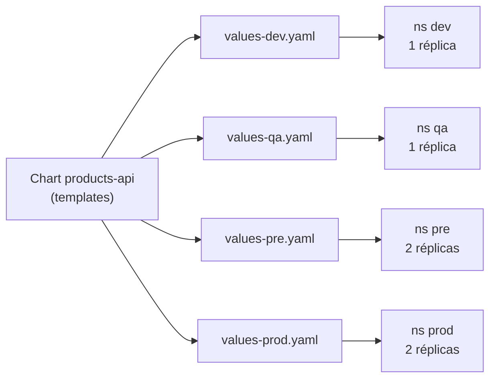
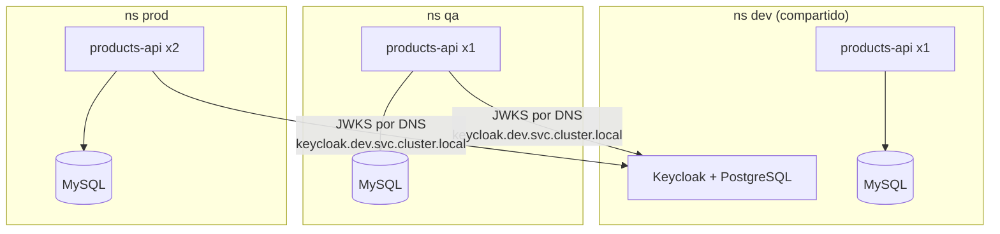

# Módulo 12 — Multi-entorno: dev, qa, pre y prod
> **Perfil developer:** Recomendado — los `values-<env>` y la promoción entre entornos son esenciales; el baseline de quota y RBAC por namespace es opcional.

## Objetivos
- Desplegar el **mismo chart** en cuatro entornos distintos cambiando solo los *values*.
- Aislar cada entorno en su namespace con quota, LimitRange y permisos propios.
- Entender por qué producción es más restrictiva que desarrollo.

## Definiciones clave

- **Entorno**: copia independiente del sistema con un propósito: `dev` (desarrollo), `qa` (pruebas), `pre` (ensayo idéntico a producción) y `prod` (usuarios reales).
- **Promoción**: llevar una versión probada de un entorno al siguiente (dev → qa → pre → prod) sin reconstruirla: se despliega el mismo artefacto con otros valores.
- **Values por entorno**: un archivo `values-<env>.yaml` con solo lo que cambia (réplicas, host, URLs). El resto sale de `values.yaml`.
- **Baseline del entorno**: lo que debe existir en un namespace antes de desplegar apps: quota, LimitRange y RBAC.
- **ClusterRole `view` / `edit`**: roles que Kubernetes trae de serie (solo lectura / modificar workloads). Un `RoleBinding` los limita a un solo namespace.
- **Servicio compartido**: una pieza que usan varios entornos. En este módulo, Keycloak vive solo en `dev` y los demás entornos lo consultan.

## Teoría

Un error típico es tratar cada entorno como un proyecto distinto con sus propios YAMLs copiados. Con el tiempo divergen y "en qa funcionaba" deja de significar nada. La regla es: **un artefacto, varias configuraciones**. La imagen y el chart son los mismos; solo cambian los valores.



Cada namespace recibe además un **baseline**, que aquí es un segundo chart (`charts/env-baseline`) con tres piezas que ya conoces del módulo 05:

| Pieza | Para qué | Diferencia por entorno |
|-------|----------|------------------------|
| `ResourceQuota` | Tope de CPU, memoria y pods del entorno | `dev` más holgado; `prod` con la memoria justa |
| `LimitRange` | Rellena `requests/limits` si un pod no los declara | Igual en todos |
| `ServiceAccount deployer` + `RoleBinding` | Identidad con la que se despliega | `edit` en dev/qa/pre; **`view` en prod** |

Por qué `prod` solo tiene `view`: en producción nadie debería cambiar cosas a mano con una cuenta de uso diario. Los cambios entran por un pipeline o por un administrador, y queda registro de quién los hizo.



Cada entorno tiene **su propia base de datos** (nunca compartas datos entre qa y prod). Keycloak se comparte solo por limitaciones de tu portátil; en una empresa cada entorno suele tener su propio proveedor de identidad.

## Prerrequisitos

1. Cluster `curso` arrancado y la imagen `products-api:1.0.0` cargada en kind (módulo 09).
2. Keycloak y el Secret de MySQL de `dev` funcionando (módulos 06 y 08).
3. Memoria: cada entorno extra suma un MySQL y los pods de la API. Con 8 GB en Docker Desktop, levanta `dev`, `qa` y `prod`, y deja `pre` como ejercicio.

## 1. Los values de cada entorno

Compara lo que cambia entre entornos:

```bash
cd 10-helm/charts/products-api
diff values-dev.yaml values-prod.yaml
cd ../../..
```

Y comprueba que el render es distinto con el mismo chart:

```bash
helm template x 10-helm/charts/products-api -n qa   -f 10-helm/charts/products-api/values-qa.yaml   | grep -E "host:|replicas:|JWK_SET_URI"
helm template x 10-helm/charts/products-api -n prod -f 10-helm/charts/products-api/values-prod.yaml | grep -E "host:|replicas:|JWK_SET_URI"
```

> **¿Qué acaba de pasar?** `helm template` renderiza sin tocar el cluster. Helm combinó `values.yaml` con el archivo del entorno (las claves del segundo ganan) y generó YAML distinto con la misma plantilla. En `dev` la URL de Keycloak es `http://keycloak:8080`, que solo resuelve dentro de `dev`; en los demás es `keycloak.dev.svc.cluster.local`, el nombre DNS completo que funciona entre namespaces.

## 2. Levantar los entornos

Desinstala antes el release de `dev` si ya lo tienes del módulo 10 con otro host, o deja que el script lo actualice:

```bash
./12-multi-entorno/env.sh dev
./12-multi-entorno/env.sh qa
./12-multi-entorno/env.sh prod
```

El script, para cada entorno: crea el namespace y lo etiqueta, instala el baseline, crea un MySQL propio (salvo en `dev`, que ya lo tiene) y despliega `products-api` con `--atomic`.

```bash
kubectl get ns -L entorno
helm list -A
curl http://api.dev.localtest.me/api/public/ping
curl http://api.qa.localtest.me/api/public/ping
curl http://api.prod.localtest.me/api/public/ping
```

> **¿Qué acaba de pasar?** Tres namespaces con la misma aplicación pero configuración distinta. Para los MySQL de `qa` y `prod` el script reutilizó los YAMLs del módulo 06 cambiando `namespace: dev` por el del entorno con `sed`. Es una solución de aprendizaje; en el trabajo lo normal es un chart o un servicio gestionado.

## 3. Quota y LimitRange en acción

```bash
kubectl describe resourcequota env-quota -n prod
kubectl get limitrange env-defaults -n prod -o yaml | grep -A4 default
```

Mira la columna `Used` frente a `Hard`. Ahora intenta sobrepasar el presupuesto de `prod`:

```bash
kubectl scale deploy/products-api -n prod --replicas=10
kubectl get events -n prod --sort-by=.lastTimestamp | tail -5
kubectl scale deploy/products-api -n prod --replicas=2
```

> **¿Qué acaba de pasar?** El Deployment pidió 10 réplicas, pero la quota de memoria (`requests.memory: 3Gi`) solo permite unas cuantas. El ReplicaSet crea los pods que caben y para los demás aparece el evento `exceeded quota`. Un entorno no puede quitarle recursos a otro aunque alguien se equivoque.

## 4. Permisos distintos por entorno

```bash
for ns in dev qa prod; do
  echo "== $ns =="
  kubectl auth can-i create deployments -n $ns --as=system:serviceaccount:$ns:deployer
  kubectl auth can-i list pods          -n $ns --as=system:serviceaccount:$ns:deployer
  kubectl auth can-i list pods          -n dev --as=system:serviceaccount:$ns:deployer
done
```

Las tres preguntas son: ¿crear deployments en su namespace?, ¿listar pods en su namespace? y ¿listar pods en `dev`? Resultado esperado: `dev` → `yes yes yes`; `qa` → `yes yes no`; `prod` → `no yes no` (puede mirar su namespace, pero no crear nada ni mirar `dev`).

> **¿Qué acaba de pasar?** Cada `deployer` tiene un `RoleBinding` en **su** namespace hacia `edit` o `view`. El `RoleBinding` limita un ClusterRole a un solo namespace, así que `deployer` de `qa` no puede tocar `dev`. Sin binding, todo se deniega por defecto.

## 5. Promoción de una versión

Simula llevar una versión nueva de `dev` a `qa`, la parte central de trabajar con entornos:

```bash
# 1. Construye una versión nueva (módulo 09, paso 5) y cárgala en kind
docker tag products-api:1.0.0 products-api:1.0.1
./scripts/kind-load.sh products-api:1.0.1

# 2. Despliégala solo en dev
helm upgrade products-api 10-helm/charts/products-api -n dev \
  -f 10-helm/charts/products-api/values-dev.yaml --set image.tag=1.0.1 --atomic

# 3. Si va bien, promociónala a qa: misma imagen, valores de qa
helm upgrade products-api 10-helm/charts/products-api -n qa \
  -f 10-helm/charts/products-api/values-qa.yaml --set image.tag=1.0.1 --atomic

helm list -A
```

> **¿Qué acaba de pasar?** Lo que se promociona es el **tag de la imagen**, no el código. La versión que probó QA es exactamente la misma que irá a `pre` y `prod`; solo cambian los valores del entorno. En un equipo real ese `--set image.tag` queda escrito en el `values-<env>.yaml` y revisado en un merge request.

## Problemas frecuentes

| Síntoma | Causa |
|---------|-------|
| `exceeded quota` al crear pods | El namespace agotó su `ResourceQuota`; baja réplicas o sube la quota en `values-<env>.yaml` del baseline |
| API de `qa` en `CrashLoopBackOff` | MySQL de `qa` aún no está listo, o falta el Secret `mysql-secret` en ese namespace |
| `401` con un token válido en `qa` | `JWK_SET_URI` apunta a `keycloak:8080` (solo existe en `dev`); usa el DNS completo |
| Pods `Pending` en `prod` | Memoria de Docker Desktop agotada; apaga entornos que no uses |
| `cannot re-use a name that is still in use` | El release ya existe en otro namespace o está fallido: `helm list -A` |

## Limpieza

```bash
helm uninstall products-api -n prod && kubectl delete namespace prod
helm uninstall products-api -n qa   && kubectl delete namespace qa
```

(`dev` se conserva: los módulos siguientes lo usan.)

## Lo que debes recordar

- Un artefacto (imagen + chart), varias configuraciones: lo único que cambia entre entornos es el `values-<env>.yaml`.
- Cada entorno es un namespace con su baseline: quota, LimitRange y RBAC.
- `prod` es más restrictivo: permisos `view` para la cuenta de uso diario y recursos acotados.
- Entre namespaces se usa el DNS completo: `servicio.namespace.svc.cluster.local`.
- Promocionar = desplegar la misma imagen en el siguiente entorno, no volver a construirla.
- Cada entorno tiene su propia base de datos.

## Ejercicios

1. Levanta `pre` con `./12-multi-entorno/env.sh pre` y compara `kubectl get all -n pre` con `-n qa`.
2. Baja la quota de `qa` a `pods: "3"` en `charts/env-baseline/values-qa.yaml`, reaplica el baseline y escala la API a 5. ¿Qué ves?
3. Da a `deployer` de `prod` permiso temporal de `edit` y comprueba con `can-i`. ¿Por qué es mala idea dejarlo así?
4. Haz que `qa` use un host extra `qa.api.localtest.me` añadiendo una segunda regla al Ingress del chart.
5. Reto: haz un script `promote.sh <origen> <destino>` que lea el `image.tag` del release de origen con `helm get values` y lo despliegue en el destino.

<details><summary>Pistas</summary>

2. `helm upgrade baseline 12-multi-entorno/charts/env-baseline -n qa -f 12-multi-entorno/charts/env-baseline/values-qa.yaml`. Verás `forbidden: exceeded quota` en los eventos del ReplicaSet.
3. Cambia `deployerClusterRole: edit` en `values-prod.yaml` del baseline. Con `edit` cualquiera con ese token puede borrar la app.
5. `helm get values products-api -n dev -o json | jq -r .image.tag`.
</details>

Siguiente: [Módulo 13 — Seguridad avanzada](../13-seguridad-avanzada/README.md)
