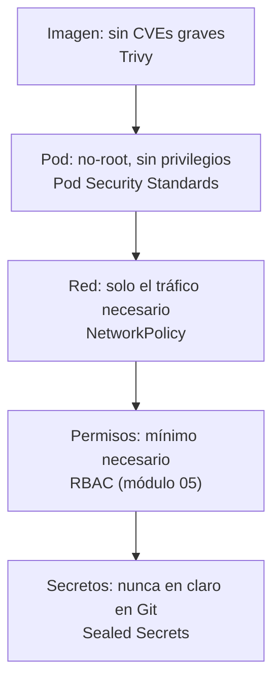
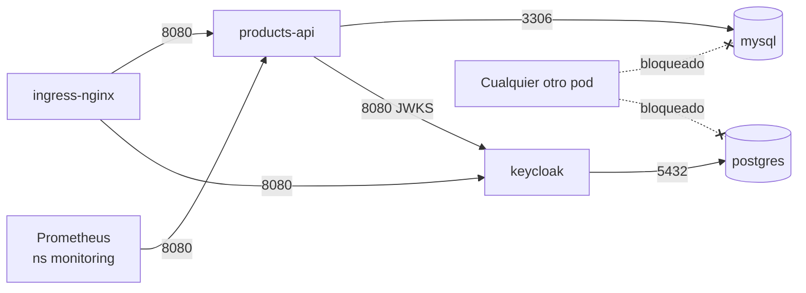

# Módulo 13 — Seguridad avanzada
> **Perfil developer:** Opcional — para saber qué controles puede aplicarte la plataforma y cómo se ve el error cuando bloquean tu despliegue; requiere crear el cluster con Calico.

## Objetivos
- Aislar la red entre pods con **NetworkPolicies** (default deny + reglas mínimas).
- Hacer cumplir buenas prácticas de pods con **Pod Security Standards**.
- Escanear la imagen y los manifiestos con **Trivy**.
- Guardar secretos en Git de forma segura con **Sealed Secrets**.

## Definiciones clave

- **NetworkPolicy**: regla de firewall entre pods, expresada con labels. Si ninguna política selecciona a un pod, ese pod acepta todo el tráfico.
- **Default deny**: política que selecciona todos los pods y no permite nada; las demás políticas abren excepciones concretas.
- **CNI**: plugin que da red a los pods. Solo si implementa NetworkPolicy las reglas tienen efecto. En este curso es **Calico** (kindnet no las aplica).
- **Pod Security Standards (PSS)**: tres perfiles de seguridad para pods: `privileged` (sin límites), `baseline` (bloquea lo más peligroso) y `restricted` (buenas prácticas estrictas).
- **Pod Security Admission**: controlador de admisión integrado que aplica un perfil según las **labels del namespace**, en tres modos: `enforce` (rechaza), `warn` (avisa al usuario) y `audit` (anota en el log).
- **CVE**: vulnerabilidad pública con identificador (por ejemplo `CVE-2024-12345`) y una severidad (LOW a CRITICAL).
- **Trivy**: escáner que busca CVEs en imágenes y errores de configuración en YAML/Helm.
- **Sealed Secrets**: controlador que descifra un `SealedSecret` (cifrado con clave pública) y crea el `Secret` real solo dentro del cluster.
- **Cadena de suministro (supply chain)**: todo lo que entra en tu imagen sin que lo hayas escrito tú: imagen base, librerías, dependencias.

## Teoría

### Cómo se ve cada control desde el lado developer

En el trabajo normalmente no configuras estos controles: te los impone la plataforma. Lo que sí te toca es reconocerlos cuando tu despliegue falla:

| Control | Qué ves | Qué significa |
|---------|---------|---------------|
| **NetworkPolicy** | `timeout` (no `connection refused`) al llamar de un pod a otro; el Service tiene endpoints y los pods están sanos | Un paquete descartado por una política. Pide al equipo de plataforma que abra el origen y puerto concretos |
| **Pod Security** | `Error from server (Forbidden): ... violates PodSecurity "baseline:latest"` (o `restricted`) al hacer `apply`, con la lista de campos que incumples | Tu pod pide algo no permitido: `privileged`, `hostNetwork`, ejecutarse como root, falta `seccompProfile`... Se corrige en el `securityContext` del chart |
| **Sealed Secrets** | `no key could decrypt secret` en los logs del controlador; el `Secret` nunca aparece | Sellaste el secreto para otro cluster, otro namespace u otro nombre |

Cada uno se reproduce más abajo, así que cuando lo veas en el trabajo ya lo habrás visto aquí.

### Las capas de seguridad

La seguridad en Kubernetes funciona por capas; cada una cubre una amenaza distinta:



**Por qué NetworkPolicy.** Por defecto cualquier pod habla con cualquier otro, incluso de otro namespace. Si alguien compromete un pod cualquiera, puede llegar directo a MySQL. Una política dice: "a MySQL solo entra la API, por el puerto 3306". El resto de intentos se descarta en silencio.



Una política puede seleccionar de dos formas el origen del tráfico y se combinan distinto:

- Varios elementos en `from` (cada uno con `-`) → **OR** (cualquiera de ellos).
- `namespaceSelector` y `podSelector` dentro del **mismo** elemento → **AND** (pod con esa label *en* ese namespace).

**Por qué Pod Security Standards.** RBAC controla quién crea pods, pero no *qué* pods. Sin límites, un usuario con permiso de crear pods puede lanzar uno `privileged` con `hostNetwork` y salir del contenedor. PSS lo rechaza en la admisión.

**Por qué escanear.** La imagen de tu microservicio contiene el JRE y las librerías de Spring. Las vulnerabilidades se descubren después de que construyes la imagen; reescanear con frecuencia es parte de mantenerla.

**Por qué Sealed Secrets.** En el módulo 04 viste que un Secret solo está en base64, no cifrado. Si subes ese YAML a Git, cualquiera con acceso al repo ve la contraseña. Con Sealed Secrets cifras con la clave **pública** del cluster; solo el controlador, que guarda la clave **privada**, puede descifrar.

## Prerrequisitos

1. Cluster `curso` creado **con Calico**. kindnet, el CNI por defecto, no aplica NetworkPolicies, así que recrea el cluster: `./scripts/down.sh && CNI=calico ./scripts/up.sh` (después tendrás que volver a desplegar `dev`: módulos 06 a 10).
2. Namespace `dev` con MySQL, Keycloak y `products-api` desplegados (módulos 06 a 10).
3. Docker Desktop abierto y `jq` instalado (para algunos filtros).

Comprueba que Calico está activo:

```bash
kubectl get pods -n kube-system -l k8s-app=calico-node
```

## 1. NetworkPolicies

Primero comprueba el estado inicial, sin políticas. Un pod cualquiera de otro namespace llega a MySQL:

```bash
kubectl create namespace intruso
kubectl run probe -n intruso --rm -it --restart=Never --image=busybox:1.36 -- \
  nc -zv -w 3 mysql.dev.svc.cluster.local 3306
```

Responde `open`. Ahora aplica `default deny` y las reglas permitidas:

```bash
cd 13-seguridad-avanzada/manifests
kubectl apply -f 00-netpol-default-deny.yaml
kubectl run probe -n intruso --rm -it --restart=Never --image=busybox:1.36 -- \
  nc -zv -w 3 mysql.dev.svc.cluster.local 3306   # ahora: timeout
curl -s -o /dev/null -w "%{http_code}\n" http://api.dev.localtest.me/api/public/ping   # también falla
```

> **¿Qué acaba de pasar?** Con `default-deny-ingress` todos los pods de `dev` rechazan entradas. Tu `curl` fallaría porque ingress-nginx tampoco tiene permiso. Es la prueba de que las reglas funcionan; sin Calico seguirían respondiendo.

```bash
kubectl apply -f 10-netpol-allow.yaml
curl http://api.dev.localtest.me/api/public/ping       # vuelve a responder
kubectl run probe -n intruso --rm -it --restart=Never --image=busybox:1.36 -- \
  nc -zv -w 3 mysql.dev.svc.cluster.local 3306         # sigue bloqueado
kubectl get networkpolicy -n dev
```

> **¿Qué acaba de pasar?** Las políticas son **aditivas**: cada una abre una puerta; no existen reglas "deny" explícitas. La API recibe del Ingress y de Prometheus, MySQL solo de la API, PostgreSQL solo de Keycloak, y Keycloak del Ingress y de la API (incluidas las APIs de `qa`, `pre` y `prod` del módulo 12, identificadas por la label `entorno` del namespace). El pod `probe` de `intruso` no encaja en ninguna regla de MySQL, así que se descarta.

Comprueba que la cadena completa sigue funcionando:

```bash
TOKEN=$(curl -fsS -X POST http://keycloak.localtest.me/realms/curso/protocol/openid-connect/token \
  -d grant_type=password -d client_id=curso-client -d username=alice -d password=alice123 | jq -r .access_token)
curl -fsS -H "Authorization: Bearer $TOKEN" http://api.dev.localtest.me/api/whoami
```

> Estas políticas controlan solo la **entrada**. Para controlar también qué puede *llamar* cada pod hay que añadir `Egress`, y entonces hay que permitir explícitamente el DNS (puerto 53 hacia `kube-system`). Es el ejercicio 3.

## 2. Pod Security Standards

Los perfiles se aplican con labels en el namespace. Empieza en modo `warn` para ver qué incumpliría tu `dev` actual sin romper nada:

```bash
kubectl label namespace dev pod-security.kubernetes.io/warn=restricted --overwrite
kubectl rollout restart deploy/products-api -n dev
kubectl rollout restart sts/mysql -n dev
```

Verás avisos del tipo `would violate PodSecurity "restricted:latest"` indicando qué falta (por ejemplo `allowPrivilegeEscalation != false`, `runAsNonRoot`, `seccompProfile`).

> **¿Qué acaba de pasar?** El modo `warn` no bloquea, solo informa al cliente. `products-api` ya cumple `restricted` porque su chart declara usuario no-root, `drop: ALL`, sin escalada de privilegios y `seccompProfile: RuntimeDefault`. MySQL no cumple (corre como root y no declara esos ajustes). Es un caso real: las imágenes de terceros suelen necesitar el perfil `baseline`.

Aplica `baseline` en modo `enforce` en `dev` y comprueba que bloquea lo peligroso:

```bash
kubectl label namespace dev pod-security.kubernetes.io/enforce=baseline --overwrite
kubectl apply -f pss-privileged.yaml
```

Esperado: `Error from server (Forbidden): ... violates PodSecurity "baseline:latest": host namespaces (hostNetwork=true), privileged (container "app" must not set securityContext.privileged=true)`.

Ahora un namespace con el perfil más estricto:

```bash
kubectl create namespace seguro
kubectl label namespace seguro pod-security.kubernetes.io/enforce=restricted
kubectl run nginx -n seguro --image=nginx:1.27          # rechazado, con la lista de incumplimientos
kubectl apply -f pss-restricted-ok.yaml                 # aceptado
kubectl logs restricted-ok -n seguro
```

> **¿Qué acaba de pasar?** El admission controller evaluó cada pod contra el perfil del namespace. `nginx` corre como root y no declara `seccompProfile`, así que `restricted` lo rechaza. `restricted-ok` declara todo lo que se exige. Los workloads que ya estaban corriendo no se tocan: la validación ocurre al crear o recrear pods.

## 3. Escanear con Trivy

Trivy se ejecuta desde su imagen de Docker; no hay que instalar nada. En Git Bash, `MSYS_NO_PATHCONV=1` evita que convierta las rutas de Linux a rutas de Windows.

Escanear la imagen del microservicio (solo vulnerabilidades altas y críticas):

```bash
MSYS_NO_PATHCONV=1 docker run --rm \
  -v /var/run/docker.sock:/var/run/docker.sock \
  -v trivy-cache:/root/.cache \
  aquasec/trivy:latest image --severity HIGH,CRITICAL products-api:1.0.0
```

Escanear la configuración de los manifiestos y del chart:

```bash
MSYS_NO_PATHCONV=1 docker run --rm \
  -v "$(pwd -W):/work" -v trivy-cache:/root/.cache \
  aquasec/trivy:latest config --severity HIGH,CRITICAL /work/09-microservicio-spring/k8s

MSYS_NO_PATHCONV=1 docker run --rm \
  -v "$(pwd -W):/work" -v trivy-cache:/root/.cache \
  aquasec/trivy:latest config /work/10-helm/charts/products-api
```

> **¿Qué acaba de pasar?** `image` descomprimió las capas de la imagen y comparó cada paquete del sistema operativo y cada `.jar` con una base de datos de CVEs. `config` no mira la imagen: analiza los YAML buscando malas prácticas (contenedores root, sin límites, FS escribible...). Los resultados dependen del día, porque la base de datos de CVEs se actualiza a diario.

Cómo leer el resultado:

| Columna | Qué significa |
|---------|---------------|
| `Library` | Paquete o `.jar` afectado |
| `Vulnerability` | Identificador del CVE |
| `Installed Version` / `Fixed Version` | Versión que tienes / versión que lo corrige |
| `Severity` | Prioridad. Empieza por las que tienen `Fixed Version` |

Para usarlo en un pipeline, `--exit-code 1` hace que el comando falle si encuentra algo de la severidad indicada.

## 4. Secretos con Sealed Secrets

Instala el controlador y el cliente `kubeseal`:

```bash
helm repo add sealed-secrets https://bitnami-labs.github.io/sealed-secrets
helm repo update
helm install sealed-secrets sealed-secrets/sealed-secrets -n kube-system \
  --set fullnameOverride=sealed-secrets-controller
kubectl rollout status deploy/sealed-secrets-controller -n kube-system

scoop install kubeseal     # o descarga el binario de la página de releases del proyecto
```

Cifra un secreto. El YAML del Secret original **nunca** se guarda en el repo:

```bash
kubectl create secret generic api-key -n dev \
  --from-literal=API_KEY=supersecreto --dry-run=client -o yaml \
  | kubeseal --format yaml > sealed-api-key.yaml

cat sealed-api-key.yaml                      # encryptedData ilegible: seguro para Git
kubectl apply -f sealed-api-key.yaml
kubectl get sealedsecret,secret api-key -n dev
kubectl get secret api-key -n dev -o jsonpath='{.data.API_KEY}' | base64 -d; echo
```

> **¿Qué acaba de pasar?** `kubeseal` pidió al controlador su clave pública y cifró el valor. El objeto `SealedSecret` es solo texto cifrado: aplicarlo no crea un Secret por sí mismo. El controlador lo vigila, lo descifra con su clave privada y crea el `Secret` normal `api-key`, que tus pods usan como siempre (`secretKeyRef`, `envFrom`). El resultado está **atado al namespace y al nombre**: si lo copias a otro namespace, no se descifra.

Prueba el comportamiento declarativo:

```bash
kubectl delete secret api-key -n dev
kubectl get secret api-key -n dev            # el controlador lo recrea desde el SealedSecret
```

Límites a tener presentes: el `SealedSecret` solo se puede descifrar **en este cluster**. Si lo recreas (`./scripts/down.sh`), cambia la clave y hay que volver a sellar. Haz copia de la clave del controlador si quieres sobrevivir a eso. Sealed Secrets protege el secreto **en Git**; una vez dentro, es un Secret normal (base64 en etcd), por eso se complementa con RBAC y, en un cluster real, cifrado de etcd.

## Limpieza

```bash
kubectl delete namespace intruso seguro
kubectl delete -f 13-seguridad-avanzada/manifests/10-netpol-allow.yaml
kubectl delete -f 13-seguridad-avanzada/manifests/00-netpol-default-deny.yaml
kubectl label namespace dev pod-security.kubernetes.io/enforce- pod-security.kubernetes.io/warn-
kubectl delete sealedsecret api-key -n dev
```

(Deja instalado `sealed-secrets` si lo vas a usar luego; es ligero.)

## Problemas frecuentes

| Síntoma | Causa |
|---------|-------|
| Las NetworkPolicies no bloquean nada | El cluster no usa Calico (se creó con kindnet): recréalo con `./scripts/down.sh && CNI=calico ./scripts/up.sh` |
| Tras `default-deny` la web da 504 | Falta permitir `ingress-nginx` hacia ese pod |
| Prometheus deja de recibir métricas | Falta la regla desde el namespace `monitoring` |
| `kubectl apply` rechazado con `violates PodSecurity` | El pod incumple el perfil del namespace; el mensaje lista cada campo |
| `no key could decrypt secret` | El `SealedSecret` se selló en otro cluster o con otro nombre/namespace |
| `kubeseal` no conecta | Controlador con otro nombre: usa `--controller-name` y `--controller-namespace` |
| Trivy: `no such file or directory` en la ruta | Falta `MSYS_NO_PATHCONV=1` o usaste `$(pwd)` en lugar de `$(pwd -W)` en Git Bash |

## Lo que debes recordar

- Sin NetworkPolicy, todo pod habla con todo. Empieza con default deny y abre solo lo necesario.
- Las NetworkPolicies son aditivas y requieren un CNI que las implemente (Calico en este curso).
- `from` con varios elementos es OR; `namespaceSelector` + `podSelector` en el mismo elemento es AND.
- Pod Security Standards se aplica por labels del namespace: `enforce`, `warn` y `audit`.
- Usa `baseline` como mínimo y `restricted` para tus propias apps; las imágenes de terceros pueden no cumplirlo.
- Escanear una imagen es repetitivo: la imagen no cambia, pero la base de CVEs sí.
- Un Secret en Git en claro es una filtración. Sealed Secrets cifra con clave pública; solo el cluster descifra.

## Ejercicios

1. Añade una NetworkPolicy en `dev` para que el Prometheus de `monitoring` pueda hacer scrape también de Keycloak, y comprueba con `kubectl get servicemonitor`.
2. Aplica `default-deny-ingress` y las reglas de `10-netpol-allow.yaml` en el namespace `qa` (módulo 12; los YAML dicen `namespace: dev`, cámbialo con `sed`) y comprueba que la API de `qa` sigue validando tokens.
3. Añade una política de **Egress** para `products-api` que solo permita ir a MySQL (3306), Keycloak (8080) y DNS (53 UDP/TCP hacia `kube-system`). ¿Qué pasa si olvidas el DNS?
4. Cambia `enforce=baseline` a `enforce=restricted` en `dev` y observa qué piezas dejan de poder recrearse. ¿Cómo adaptarías el StatefulSet de MySQL para cumplirlo?
5. Cambia la imagen base del `Dockerfile` por otra versión del JRE y compara el número de CVEs críticos con Trivy.
6. Reto: configura un `SealedSecret` para `mysql-secret` y haz que el StatefulSet de MySQL lo use sin cambiar nada más.

<details><summary>Pistas</summary>

1. Añade en `allow-to-keycloak` otro elemento `from` con `namespaceSelector` de `monitoring`.
3. El `Egress` necesita `policyTypes: ["Egress"]` y una regla `to` con `namespaceSelector` de `kube-system` para el puerto 53. Sin DNS, los nombres de servicio no resuelven y la API falla al arrancar.
4. Con `restricted`, MySQL necesita `runAsNonRoot`, un UID concreto (`999`), `fsGroup`, `drop: ["ALL"]` y `seccompProfile`.
5. Compara `trivy image --severity CRITICAL` antes y después.
6. `kubectl create secret ... --dry-run=client -o yaml | kubeseal -n dev --format yaml` con el mismo nombre `mysql-secret`; borra antes el Secret manual.
</details>

Siguiente: [Módulo 14 — Laboratorio de troubleshooting](../14-laboratorio-troubleshooting/README.md)
