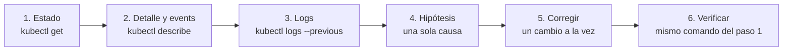

# Módulo 14 — Laboratorio de troubleshooting

## Objetivos
- Diagnosticar los fallos más habituales de Kubernetes siguiendo un método, no adivinando.
- Reconocer cada síntoma (`ImagePullBackOff`, `CrashLoopBackOff`, `Pending`, `OOMKilled`...) y su causa típica.
- Leer `describe`, `logs` y `events` con soltura.

## Definiciones clave

- **Síntoma vs causa**: el estado que ves (`CrashLoopBackOff`) no es la causa; es la consecuencia. La causa está en los logs, los events o la configuración.
- **Events**: mensajes que Kubernetes registra sobre un objeto (`FailedScheduling`, `Failed`, `BackOff`...). Aparecen al final de `kubectl describe`. Duran poco (~1 h).
- **Last State**: sección del `describe` que dice por qué terminó el contenedor anterior (`Reason`, `Exit Code`). Clave para `CrashLoopBackOff` y `OOMKilled`.
- **Exit code**: código con el que terminó el proceso. `0` = bien, `1` = error genérico, `137` = muerto por señal `SIGKILL` (suele ser `OOMKilled`), `143` = `SIGTERM`.
- **Endpoints**: lista de IPs de pods que respaldan un Service. Si está vacía, el Service no tiene a quién enviar tráfico.
- **Readiness vs Liveness**: readiness decide si el pod recibe tráfico; liveness decide si hay que reiniciarlo.

## Teoría: el método

Cuando algo falla, sigue siempre el mismo orden. Evita tocar cosas hasta saber qué pasa.



| Pregunta | Comando |
|----------|---------|
| ¿Qué estado tiene? | `kubectl get pods -n lab -o wide` |
| ¿Qué dicen los events? | `kubectl describe pod <pod> -n lab` (final) |
| ¿Qué escribió la app antes de morir? | `kubectl logs <pod> -n lab --previous` |
| ¿Todo el namespace? | `kubectl get events -n lab --sort-by=.lastTimestamp` |
| ¿Hay pods detrás del Service? | `kubectl get endpoints <svc> -n lab` |
| ¿Qué configuración tiene realmente? | `kubectl get <recurso> <nombre> -n lab -o yaml` |

Un error frecuente: leer solo el **estado**. Un pod `Running` puede estar roto (0/1 Ready) y uno en `CrashLoopBackOff` puede tener una causa trivial visible en una línea de log.

Para recordar qué mirar según el estado, tienes el [diagrama de diagnóstico](../anexos/troubleshooting.md) del anexo.

## Cómo funciona este laboratorio

Cada escenario es un YAML en `broken/` que **está roto a propósito**. Los manifiestos no tienen pistas. Tu trabajo:

1. Aplicar el escenario.
2. Describir el síntoma.
3. Encontrar la causa **solo con `kubectl`** (no abras la solución).
4. Corregirla (`kubectl edit`, `kubectl set image`, o edita el YAML y `apply`).
5. Verificar que queda sano.
6. Comparar con la solución escondida.

Prepara el namespace:

```bash
kubectl create namespace lab
cd 14-laboratorio-troubleshooting
```

Ejecuta cada escenario por separado. Al terminar uno, bórralo antes del siguiente:

```bash
kubectl delete -f broken/NN-nombre.yaml --ignore-not-found
```

---

## Escenario 1 — El pod que no arranca

```bash
kubectl apply -f broken/01-imagen.yaml
kubectl get pods -n lab -w
```

**Misión:** que el pod `web-imagen` quede `Running`.

<details><summary>Solución</summary>

- Síntoma: `ErrImagePull` y luego `ImagePullBackOff`.
- Diagnóstico: `kubectl describe pod web-imagen -n lab` → Events: `manifest for nginx:1.27.99 not found`.
- Causa: el tag `1.27.99` no existe.
- Arreglo: `kubectl set image pod/web-imagen web=nginx:1.27 -n lab` (en un Pod la imagen sí se puede cambiar; el contenedor se recrea).
- Con imágenes locales de kind, esta misma pantalla aparece cuando olvidas `kind load docker-image`.
</details>

## Escenario 2 — Se reinicia sin parar

```bash
kubectl apply -f broken/02-arranque.yaml
kubectl get pods -n lab -w
```

**Misión:** que `api-arranque` se mantenga `Running` sin reinicios. Fíjate que el mensaje de error de la app **no** dice la causa real.

<details><summary>Solución</summary>

- Síntoma: `CrashLoopBackOff`, el contador `RESTARTS` sube.
- Diagnóstico: `kubectl logs api-arranque -n lab` muestra "no se pudo conectar a la base de datos". `describe` → Last State `Terminated`, Exit Code `1`.
- Pista real: el script comprueba la variable `DB_HOST`, pero el pod define `DB_HOSTNAME`. Compara con `kubectl get pod api-arranque -n lab -o yaml`.
- Causa: nombre de variable de entorno mal escrito. El mensaje de la app es engañoso.
- Arreglo: renombra la variable a `DB_HOST`, borra el pod y reaplica.
- Lección: los logs dicen *qué* hizo la app, no siempre *por qué*; contrasta con la configuración real.
</details>

## Escenario 3 — Nunca llega a ejecutarse

```bash
kubectl apply -f broken/03-recursos.yaml
kubectl get pods -n lab
```

**Misión:** que el pod de `batch-recursos` quede `Running`.

<details><summary>Solución</summary>

- Síntoma: `Pending` indefinido; sin logs porque nunca se creó el contenedor.
- Diagnóstico: `kubectl describe pod -l app=batch -n lab` → Event `FailedScheduling: 0/3 nodes are available: Insufficient cpu, Insufficient memory`.
- Causa: pide 64 CPU y 128 GiB; ningún nodo tiene tanto.
- Arreglo: `kubectl set resources deploy/batch-recursos -n lab --requests=cpu=100m,memory=64Mi`.
- Lección: el scheduler decide con los `requests`, no con lo que el pod realmente usa. Con una ResourceQuota (módulos 05 y 12) verías `exceeded quota` en lugar de `Pending`.
</details>

## Escenario 4 — El Service no responde

```bash
kubectl apply -f broken/04-service.yaml
kubectl get pods,svc -n lab
kubectl run tmp -n lab --rm -it --restart=Never --image=curlimages/curl -- curl -sS -m 3 http://web
```

**Misión:** que `curl http://web` devuelva la página de nginx. Los pods están `Running`.

<details><summary>Solución</summary>

- Síntoma: `Connection refused` o timeout; los pods están sanos.
- Diagnóstico: `kubectl get endpoints web -n lab` → `<none>`.
- Causa: el selector del Service es `app: webapp` pero los pods tienen `app: web`.
- Comprobación: `kubectl get pods -n lab --show-labels` y `kubectl describe svc web -n lab` (campo `Selector`).
- Arreglo: `kubectl patch svc web -n lab -p '{"spec":{"selector":{"app":"web"}}}'`.
- Lección: un Service es solo un selector de labels. Endpoints vacíos = el selector no coincide con ningún pod **Ready**.
</details>

## Escenario 5 — Running, pero 0/1

```bash
kubectl apply -f broken/05-readiness.yaml
kubectl get pods -n lab -w
kubectl get endpoints tienda -n lab
```

**Misión:** que `tienda` tenga 2 pods `1/1 Ready`. Nota: no hay Service; revisa los endpoints creando uno con `kubectl expose deploy/tienda -n lab --port=80`.

<details><summary>Solución</summary>

- Síntoma: `Running` pero `READY 0/1`; los endpoints del Service están vacíos.
- Diagnóstico: `kubectl describe pod -l app=tienda -n lab` → Events `Readiness probe failed: HTTP probe failed with statuscode: 404`.
- Causa: la probe consulta `/healthz`, ruta que nginx no tiene.
- Arreglo: cambia `path: /healthz` por `/` (`kubectl edit deploy/tienda -n lab`).
- Lección: una readiness fallida **no reinicia** el pod; solo lo saca del Service. Una liveness fallida sí lo reinicia.
</details>

## Escenario 6 — Muere de golpe

```bash
kubectl apply -f broken/06-memoria.yaml
kubectl get pods -n lab -w
```

**Misión:** que `procesador` deje de reiniciarse.

<details><summary>Solución</summary>

- Síntoma: `OOMKilled` y luego `CrashLoopBackOff`.
- Diagnóstico: `kubectl describe pod procesador -n lab` → Last State: `Terminated`, Reason `OOMKilled`, Exit Code `137`. Los logs solo muestran "procesando".
- Causa: el proceso consume más memoria que el límite (32Mi) y el kernel lo mata.
- Arreglo: depende de la causa. Si la carga es legítima, sube `limits.memory`; si es una fuga, hay que corregir la app. Aquí `tail /dev/zero` consume sin parar y ningún límite basta: bórralo y reaplica con `sleep 3600`.
- Relación con Java: en el módulo 11 provocaste este mismo error con `limits.memory=200Mi` en `products-api`.
</details>

## Escenario 7 — No llega a crear el contenedor

```bash
kubectl apply -f broken/07-configuracion.yaml
kubectl get pods -n lab
```

**Misión:** que `app-config` quede `Running` y su log muestre `produccion`.

<details><summary>Solución</summary>

- Síntoma: `CreateContainerConfigError`.
- Diagnóstico: `kubectl describe pod app-config -n lab` → Event `configmap "app-settings" not found`.
- Causa: el ConfigMap referenciado no existe.
- Arreglo: `kubectl create configmap app-settings -n lab --from-literal=APP_MODE=produccion`; el pod arranca solo al aparecer (reintenta). Comprueba con `kubectl logs app-config -n lab`.
- Lección: mismo error aparece con un Secret inexistente o una clave inexistente en `secretKeyRef`. Es muy común tras desplegar a un namespace nuevo sin crear sus Secrets.
</details>

## Escenario 8 — El Ingress da 503

```bash
kubectl apply -f broken/08-ingress.yaml
kubectl get pods,svc,ingress -n lab
curl -i http://site.lab.localtest.me
```

**Misión:** que `curl` devuelva la página de bienvenida de nginx (200).

<details><summary>Solución</summary>

- Síntoma: `503 Service Temporarily Unavailable` (de nginx).
- Diagnóstico: el pod y el Service están bien. `kubectl describe ingress site -n lab` → backend `site:8080 (<error: endpoints "site" not found>)`. El Service solo expone el puerto 80.
- Causa: el Ingress apunta al puerto 8080 del Service y este no existe.
- Arreglo: `kubectl patch ingress site -n lab --type=json -p='[{"op":"replace","path":"/spec/rules/0/http/paths/0/backend/service/port/number","value":80}]'`.
- Lección: el puerto del Ingress es el del **Service** (`port`), no el del contenedor.
</details>

## Escenario 9 — Red bloqueada

Requiere Calico (módulo 01).

```bash
kubectl apply -f broken/09-red.yaml
kubectl get pods,svc,endpoints -n lab
kubectl exec -n lab cliente -- wget -T 3 -qO- http://servidor
```

**Misión:** que `cliente` pueda leer la página de `servidor`. El Service tiene endpoints y los pods están sanos.

<details><summary>Solución</summary>

- Síntoma: `wget: download timed out`, no un error inmediato. Timeout = paquetes descartados.
- Diagnóstico: `kubectl get networkpolicy -n lab` y `kubectl describe networkpolicy solo-clientes -n lab`. Solo admite `app=clientes`; el pod tiene `app=cliente`.
- Causa: typo en el label de la política (plural vs singular).
- Arreglo: `kubectl label pod cliente -n lab app=clientes --overwrite` o corrige la política.
- Lección: "connection refused" = nadie escucha; "timeout" = algo (NetworkPolicy, firewall) descarta el tráfico. Ver módulo 13.
</details>

## Escenario 10 — Un despliegue que falla en el stack real

Rompe `products-api` en `dev` sin usar `--atomic`:

```bash
helm upgrade products-api 10-helm/charts/products-api -n dev \
  --set config.DB_URL="jdbc:mysql://mysql-typo:3306/productsdb?useSSL=false"
kubectl get pods -n dev -w
```

**Misión:** ¿qué ve el usuario mientras tanto? ¿Cómo vuelves a un estado sano de dos formas distintas?

<details><summary>Solución</summary>

- Síntoma: pod nuevo en `Running 0/1` o `CrashLoopBackOff`; **los pods antiguos siguen sirviendo tráfico** (`maxUnavailable: 0`), así que `curl http://api.dev.localtest.me/api/public/ping` sigue respondiendo.
- Diagnóstico: `kubectl logs <pod-nuevo> -n dev` → `UnknownHostException: mysql-typo`. `kubectl rollout status deploy/products-api -n dev` se queda esperando.
- Arreglo 1: `helm rollback products-api -n dev` (vuelve a la revisión anterior).
- Arreglo 2: `kubectl rollout undo deploy/products-api -n dev`, aunque esto deja a Helm creyendo que la última revisión es la mala.
- Lección: una readiness bien configurada protege la producción. Con `--atomic` Helm habría hecho el rollback por ti.
</details>

---

## Limpieza

```bash
kubectl delete namespace lab
```

## Lo que debes recordar

- Orden fijo: `get` → `describe` (events) → `logs --previous` → hipótesis → un cambio → verificar.
- `ImagePullBackOff` = imagen/tag/registry; `CrashLoopBackOff` = la app muere (mira `logs --previous`); `Pending` = scheduler (mira events); `CreateContainerConfigError` = Secret/ConfigMap inexistente.
- `Running 0/1` = readiness falla; sin endpoints el Service no tiene a quién enviar tráfico.
- Exit code `137` + `OOMKilled` = memoria; sube el límite o arregla la fuga.
- `503` en Ingress = backend sin endpoints o puerto mal; `timeout` en pod a pod = NetworkPolicy.
- Un rollout con readiness bien puesta no tira producción: los pods viejos siguen vivos.

## Ejercicios

1. Combina dos fallos: aplica `04-service.yaml` y `05-readiness.yaml` y arregla solo el Service. ¿Qué sigue fallando? ¿Cuántos endpoints esperas?
2. Escribe tu propio escenario roto (por ejemplo: `securityContext.runAsNonRoot` con una imagen que corre como root) y pásaselo a un compañero.
3. Provoca `exceeded quota` creando un pod en un namespace con ResourceQuota (módulo 12) y compara con el `Pending` del escenario 3.
4. Usa `kubectl debug` para entrar en un pod sin shell (por ejemplo `nginx` con `--image=busybox --target=nginx`) y comprobar el DNS.
5. Reto: `kubectl get events -A --sort-by=.lastTimestamp` y encuentra los últimos 5 eventos de tipo `Warning` de todo el cluster.

<details><summary>Pistas</summary>

1. Con el Service arreglado, los endpoints siguen vacíos porque ningún pod está Ready (readiness 404).
4. `kubectl debug -it <pod> -n lab --image=busybox:1.36 --target=nginx -- nslookup web`.
5. Añade `--field-selector type=Warning`.
</details>

Siguiente: [Módulo 15 — Proyecto final](../15-proyecto-final/README.md)
