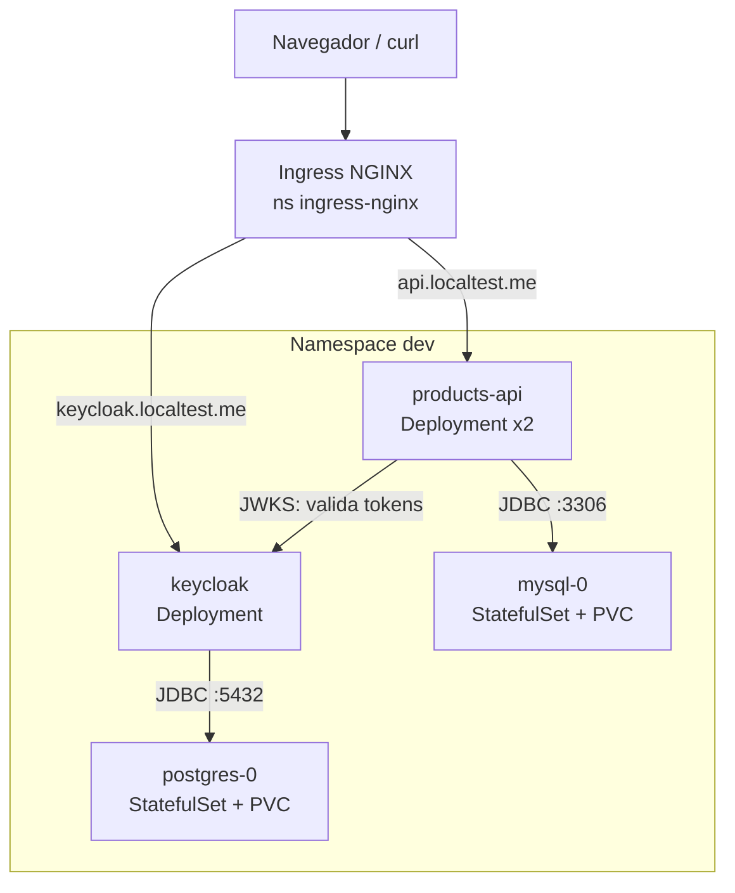
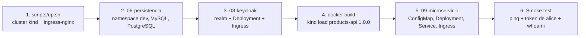

# Módulo 15 — Proyecto final
> **Perfil developer:** Esencial — niveles 1 y 2; el nivel 3 (multi-entorno y seguridad) es opcional.

## Objetivo

Levantar **todo el sistema desde cero** y demostrar que lo dominas. Hay tres niveles; haz al menos el 1 y el 2.

## Definiciones clave

- **Smoke test**: prueba mínima tras un despliegue para confirmar que lo básico responde (aquí: `/api/public/ping` y `/api/whoami` con token).
- **Orden de dependencias**: las piezas se levantan en orden (BDs → Keycloak → API) porque cada una necesita la anterior para arrancar sana.
- **PodDisruptionBudget (PDB)**: objeto que limita cuántos pods de una app pueden caer a la vez por una interrupción voluntaria (drain, upgrade de nodo).
- **Drain / cordon**: `cordon` marca un nodo como no programable; `drain` además desaloja sus pods respetando los PDB. `uncordon` lo devuelve al servicio.
- **NetworkPolicy**: reglas de firewall entre pods por labels. Solo se aplican si el CNI las implementa (Calico sí, kindnet no; módulo 13).
- **Infraestructura reproducible**: poder borrar todo y recrearlo con un script o desde Git, sin pasos manuales.

## Teoría

Hasta ahora montaste las piezas una a una. Aquí las juntas y compruebas que todo el sistema se puede **reconstruir desde cero** sin pasos a mano. Esa es la prueba real: si no puedes recrearlo, no lo controlas.

Los tres niveles suben la exigencia: **YAML** con `kubectl apply` (nivel 1), **Helm** + observabilidad (nivel 2) y **multi-entorno con seguridad** (nivel 3). La arquitectura es la misma; cambia cómo se empaqueta, cuántos entornos hay y qué controles se aplican.

El orden importa. `products-api` necesita MySQL (JDBC) y las claves públicas de Keycloak (JWKS) para validar tokens. Keycloak necesita PostgreSQL. Por eso el script espera con `kubectl rollout status` a que cada pieza esté lista antes de pasar a la siguiente. Si no lo hiciera, la API entraría en `CrashLoopBackOff` hasta que la BD estuviera lista.

## Arquitectura



## Nivel 1 — Despliegue completo con YAML

Desde la raíz del curso:

```bash
./scripts/down.sh                       # empieza limpio
./15-proyecto-final/deploy-all.sh
```

Este script recrea el cluster y ejecuta, en orden: BDs → Keycloak → build/load de imagen → microservicio → smoke test.



**Entregable:** captura de `kubectl get all,pvc,ingress -n dev` y de un `curl` autenticado.

> **¿Qué acaba de pasar?** El script repitió los módulos 01, 06, 08 y 09 en orden. Cada `rollout status` bloquea hasta que el StatefulSet o Deployment tiene sus pods Ready (pasan la readiness probe). Al final pidió un token a Keycloak con el usuario `alice` (password grant) y llamó a `/api/whoami`: la API validó la firma del JWT con las claves JWKS de Keycloak. Si eso responde, toda la cadena funciona.

## Nivel 2 — Helm + observabilidad

1. Sustituye el paso 5 por `helm upgrade --install products-api 10-helm/charts/products-api -n dev --atomic`.
2. Instala metrics-server y kube-prometheus-stack (módulo 11) y activa `serviceMonitor.enabled=true`.
3. Importa el dashboard JVM y demuestra métricas tras generar tráfico.
4. Configura un HPA de 2 a 5 réplicas y dispáralo con carga.

> **Qué cambia:** el mismo microservicio, pero empaquetado como release de Helm (con revisiones y `--atomic`: si falla, rollback automático). El chart crea el ServiceMonitor por ti; Prometheus empieza a hacer scrape y el HPA escala con la CPU.

## Nivel 3 — Multi-entorno y producción simulada

1. Levanta `qa` y `prod` con `./12-multi-entorno/env.sh` (módulo 12) y promociona una versión nueva de `dev` a `qa` y de `qa` a `prod`.
2. Aplica la seguridad del módulo 13 en `dev`: default deny + NetworkPolicies, Pod Security `baseline` en modo `enforce`, escaneo con Trivy y un secreto con Sealed Secrets.
3. Añade un `PodDisruptionBudget` (`minAvailable: 1`) y haz `kubectl drain curso-worker --ignore-daemonsets --delete-emptydir-data`. Comprueba que la API no se cae. (Después `kubectl uncordon curso-worker`.)
4. Rompe algo a propósito en `qa` (por ejemplo una readiness mal puesta) y diagnostícalo con el método del módulo 14. Comprueba que `prod` no se ve afectado.

> **Qué cambia:** tienes tres entornos con la misma imagen, cada uno con su base de datos, su quota y sus permisos, y la red entre pods ya no está abierta. El `drain` simula mantenimiento de un nodo: el PDB obliga a que siempre quede al menos 1 pod de la API vivo mientras se reprograman en otro worker. Ojo: el PVC de MySQL usa storage local del nodo; si `mysql-0` vive en el nodo drenado no podrá moverse.

## Lo que debes recordar

- Si no puedes recrear el sistema desde cero con un script o desde Git, no lo controlas.
- Despliega en orden de dependencias y espera a que cada pieza esté Ready (`rollout status`).
- YAML → Helm → multi-entorno: misma arquitectura, distinta forma de empaquetar y promocionar.
- Un smoke test con token demuestra la cadena completa: Ingress → API → Keycloak (JWKS) → MySQL.
- kind no es producción: storage local, sin LoadBalancer real y las NetworkPolicies no se aplican con kindnet (hace falta Calico, módulo 13).

## Retos extra (nivel "senior")

| Reto | Qué practicas |
|------|---------------|
| Migrar `ddl-auto: update` a **Flyway** con un Job/initContainer | Migraciones de BD en K8s |
| Cambiar el flujo a **Authorization Code + PKCE** con un frontend | OIDC real |
| Roles de Keycloak → autoridades Spring → `@PreAuthorize` | Autorización |
| Un segundo microservicio `orders-api` que llame a `products-api` con el token (propagación de JWT) | Comunicación entre servicios |
| Configurar TLS con cert-manager (CA autofirmada) | Seguridad en tránsito |
| CronJob de backup de MySQL a un PVC | Jobs y persistencia |
| Reemplazar MySQL manual por el chart Bitnami / un operador | Operadores |
| Quitar `start-dev` en Keycloak: `start --optimized` + hostname fijo | Hardening |

## Checklist de autoevaluación

- [ ] Explico la diferencia entre Pod, ReplicaSet, Deployment y StatefulSet.
- [ ] Sé depurar `CrashLoopBackOff`, `ImagePullBackOff`, `Pending` y `503` de un Ingress.
- [ ] Entiendo por qué un Secret no es cifrado.
- [ ] Sé qué ocurre con los datos al borrar un pod, un StatefulSet y un PVC.
- [ ] Puedo hacer rollback con `kubectl rollout undo` y con `helm rollback`.
- [ ] Sé dimensionar `requests/limits` para una app Java y relacionarlos con la heap.
- [ ] Explico cómo se promociona una versión entre dev, qa, pre y prod sin reconstruir la imagen.
- [ ] Sé aplicar default deny y abrir solo el tráfico necesario con NetworkPolicies.
- [ ] Explico qué hace Pod Security Standards y cuándo uso `baseline` y `restricted`.
- [ ] Sé qué cosas de kind **no** existen en un cluster real (LoadBalancer, storage local) y que las NetworkPolicies necesitan un CNI como Calico.

## ¿Y ahora qué?

- Certificaciones: **CKAD** (desarrollador) es la ideal para tu perfil; luego CKA.
- Practica con <https://killercoda.com> y <https://killer.sh>.
- Estudia: Kustomize, cert-manager, External Secrets, estrategias canary/blue-green, service mesh (Istio/Linkerd) y Gateway API.
