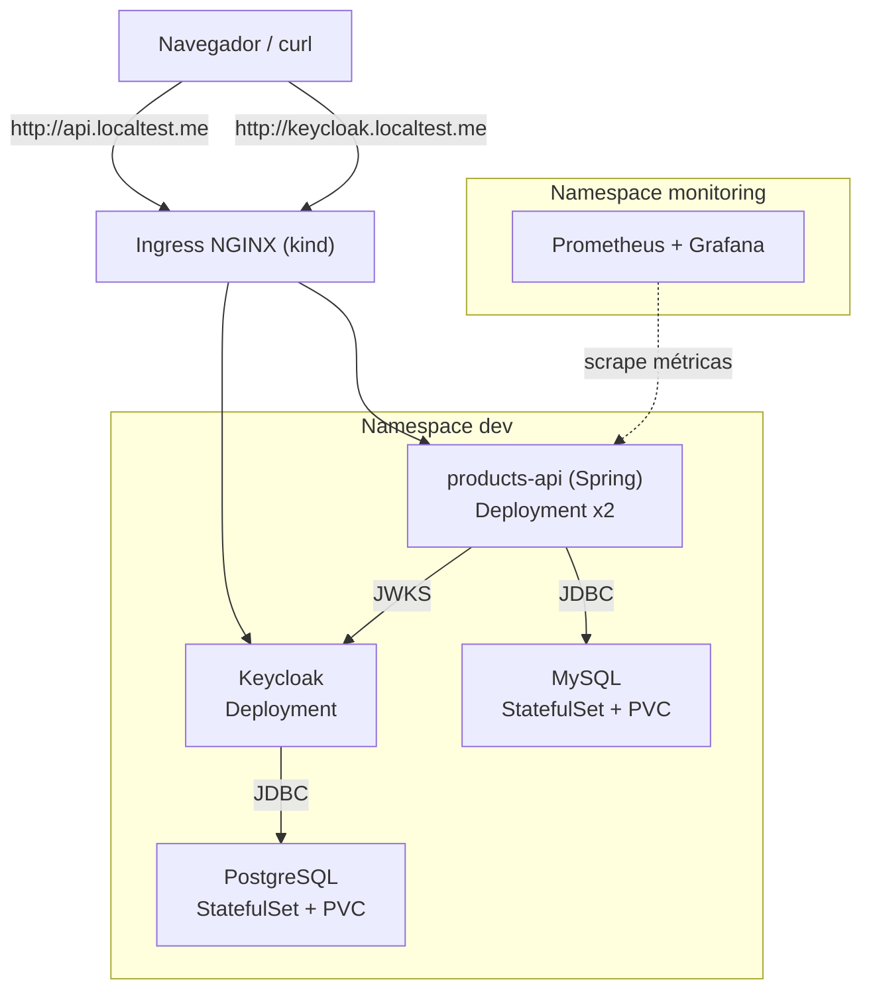
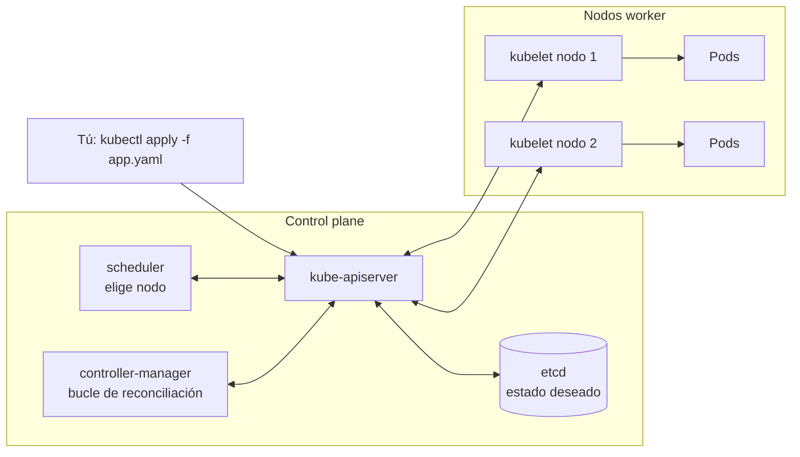
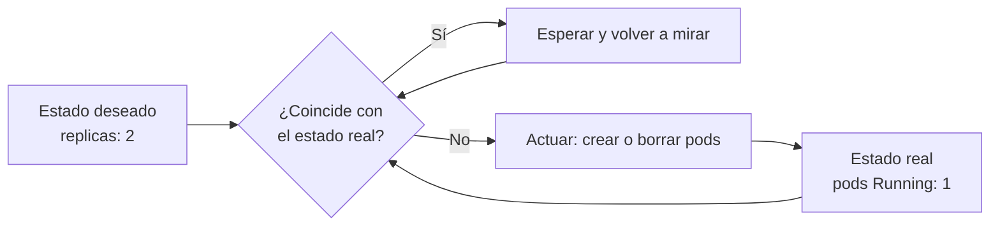

# Curso práctico de Kubernetes con kind

De cero (con Docker y conceptos básicos) hasta desplegar un **microservicio Java Spring Boot** con **MySQL**, **Keycloak + PostgreSQL**, Ingress, Helm, observabilidad, **varios entornos** (dev, qa, pre, prod) y **seguridad** (NetworkPolicies, Pod Security, Trivy, Sealed Secrets), todo en un cluster local con **kind** sobre **Windows + Docker Desktop**.

## Objetivo final

## ¿Qué es Kubernetes y por qué?

**Kubernetes** es un orquestador de contenedores: tú le declaras el **estado deseado** ("quiero 2 réplicas de esta imagen, con este puerto y esta config") y él se encarga de que el **estado real** coincida, en un conjunto de máquinas (nodos).

¿Por qué no basta Docker? Docker arranca contenedores en una máquina. Kubernetes decide **dónde** arrancarlos, los **reinicia** si fallan, los **reparte** entre nodos, les da **red y DNS** estables y permite actualizar sin cortes. Todo de forma declarativa (YAML), no con comandos sueltos.

La pieza clave es el **bucle de reconciliación**: controladores que miran sin parar el estado deseado (guardado en etcd) y el real, y actúan para acercarlos. Si un pod muere, el controlador ve "faltan 1" y crea otro. Esta idea se repite en todo el curso: Deployments, HPA y operadores.

En este curso el cluster lo crea **kind** (*Kubernetes IN Docker*): cada nodo es un contenedor Docker dentro de Docker Desktop.

## Qué ruta seguir

El curso cubre desde lo que haces a diario como developer hasta lo que suele administrar el equipo de plataforma. Cada módulo lleva una etiqueta **Perfil developer**:

- **Esencial**: lo usas o lo necesitas entender para depurar tu servicio.
- **Recomendado**: te da contexto para leer un cluster ajeno; hazlo después de lo esencial.
- **Opcional**: lo administra normalmente otro equipo; entiende qué hace y cómo se ve el error.

**Ruta developer (recomendada)**: 00 → 02 → 03 → 04 → 09 → 10 → 11 → 14 → 15 (niveles 1 y 2), con los [anexos para developers](#anexos). Después los módulos Recomendados (01, 05, 06, 07, 12). Los Opcionales (08, 13) al final o en lectura rápida.

**Ruta completa**: todos los módulos en orden numérico.

> El módulo 09 necesita Keycloak (módulo 08). Si sigues la ruta developer, usa el bloque "a copiar" del 08 sin leer todo el módulo.

## Ruta del curso

| # | Módulo | Perfil | Qué aprendes | Tiempo aprox. |
|---|--------|--------|--------------|---------------|
| 00 | [Preparación del entorno](00-preparacion-entorno/README.md) | Esencial | Docker Desktop, kubectl, kind, helm | 1 h |
| 01 | [Cluster con kind](01-cluster-kind/README.md) | Recomendado | Cómo funciona kind, multi-nodo, cargar imágenes | 1 h |
| 02 | [Workloads](02-workloads/README.md) | Esencial | Pods, Deployments, rolling updates, probes, resources | 2 h |
| 03 | [Services y DNS](03-services-dns/README.md) | Esencial | ClusterIP, headless, DNS interno, port-forward | 1.5 h |
| 04 | [ConfigMaps y Secrets](04-configmaps-secrets/README.md) | Esencial | Configuración externa, env vs volúmenes | 1.5 h |
| 05 | [Namespaces, RBAC y seguridad](05-rbac-seguridad/README.md) | Recomendado | Quotas, ServiceAccounts, Roles, securityContext | 2 h |
| 06 | [Persistencia y bases de datos](06-persistencia-bases-de-datos/README.md) | Recomendado | Cómo se conecta tu app a la BD; PV/PVC y StatefulSet | 3 h |
| 07 | [Ingress y networking](07-ingress/README.md) | Recomendado | ingress-nginx, rutas por host y path | 1.5 h |
| 08 | [Keycloak](08-keycloak/README.md) | Opcional | Qué necesita tu API del IdP; Keycloak + PostgreSQL | 2 h |
| 09 | [Microservicio Spring Boot](09-microservicio-spring/README.md) | Esencial | Dockerfile, kind load, MySQL, JWT con Keycloak | 3 h |
| 10 | [Helm](10-helm/README.md) | Esencial | Chart propio del microservicio, values, upgrade/rollback | 2 h |
| 11 | [Observabilidad](11-observabilidad/README.md) | Esencial | Logs, metrics-server, HPA, Prometheus, Grafana | 2.5 h |
| 12 | [Multi-entorno](12-multi-entorno/README.md) | Recomendado | dev, qa, pre y prod con values, quota y RBAC por entorno; promoción | 2 h |
| 13 | [Seguridad avanzada](13-seguridad-avanzada/README.md) | Opcional | NetworkPolicies, Pod Security Standards, Trivy, Sealed Secrets | 3 h |
| 14 | [Laboratorio de troubleshooting](14-laboratorio-troubleshooting/README.md) | Esencial | 10 escenarios rotos a propósito para diagnosticar | 2.5 h |
| 15 | [Proyecto final](15-proyecto-final/README.md) | Esencial | Todo de punta a punta + retos (nivel 3 opcional) | 3 h |

### Anexos

| Anexo | Para qué sirve |
|-------|----------------|
| [Ciclo de desarrollo local](anexos/ciclo-desarrollo-local.md) | Iterar sobre tu código en el cluster: build, carga, rollout, logs, port-forward y debug remoto de Java |
| [Spring en Kubernetes](anexos/spring-en-kubernetes.md) | Memoria de la JVM, probes de Actuator, graceful shutdown y configuración 12-factor |
| [CI/CD con GitLab](anexos/gitlab-ci.md) | Ejemplo de pipeline: build, imagen, escaneo y `helm upgrade` por entorno |
| [Leer el cluster de la empresa](anexos/leer-cluster-empresa.md) | Orientarte en un cluster ajeno sin ser admin y pedir ayuda con evidencia |
| [Glosario](anexos/glosario.md) | Todas las definiciones del curso, con enlace al módulo |
| [Troubleshooting](anexos/troubleshooting.md) | Diagnóstico de pods, red, kind y Docker Desktop |
| [Cheatsheet](anexos/cheatsheet.md) | Comandos más usados |

## Cómo está organizado

- Cada carpeta es un módulo con su `README.md` (teoría corta + práctica + ejercicios).
- Los YAMLs viven junto al módulo donde se explican (`manifests/` o `k8s/`).
- `scripts/` tiene atajos para levantar/destruir el cluster.
- Los ejercicios tienen solución escondida en `
`: intenta primero sin mirar.

## Convenciones

- Cluster kind llamado **`curso`** (contexto `kind-curso`).
- Módulos 02–05 usan el namespace **`demo`** (se borra al final de cada módulo).
- Del módulo 06 en adelante se usa el namespace **`dev`**. El módulo 12 añade `qa`, `pre` y `prod`.
- El cluster usa el CNI por defecto de kind (kindnet). Para el módulo 13 (NetworkPolicies) se crea con Calico: `CNI=calico ./scripts/up.sh`.
- Dominios locales con **`*.localtest.me`** (resuelve a `127.0.0.1`, no necesitas tocar el archivo hosts).
- Credenciales del curso son **solo para práctica**. Nunca las uses en un entorno real.

## Antes de empezar

- Los comandos y scripts del curso son **bash**: usa **Git Bash** (incluido con Git for Windows). PowerShell sirve para comandos simples de `kubectl`/`helm`/`kind`/`docker`.
- Docker Desktop debe estar abierto. Se recomienda darle al menos **8 GB de RAM** (ver módulo 00).
- Esta guía usa versiones recientes (Kubernetes 1.3x, Keycloak 26, Spring Boot 3.3, MySQL 8.4, PostgreSQL 16). Si alguna URL o versión cambió, revisa la documentación oficial.

## Relación con tu trabajo (Java + Spring + MySQL + microservicios)

El módulo 09 usa exactamente tu stack: Spring Boot + JPA + MySQL, con configuración por variables de entorno (12-factor), probes de Actuator y seguridad JWT. Lo que practiques aquí es muy parecido a lo que verás en un cluster real (EKS/AKS/GKE/OpenShift), cambiando lo que es específico de kind (Ingress, storage, carga de imágenes).

¡Vamos! Empieza por el [módulo 00](00-preparacion-entorno/README.md).
