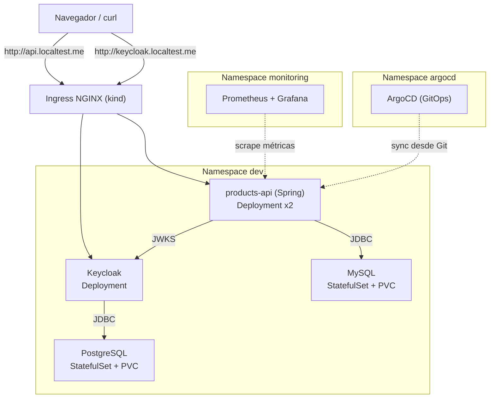
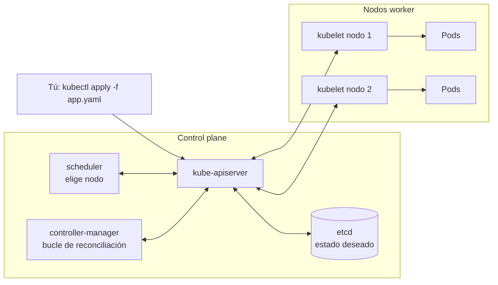
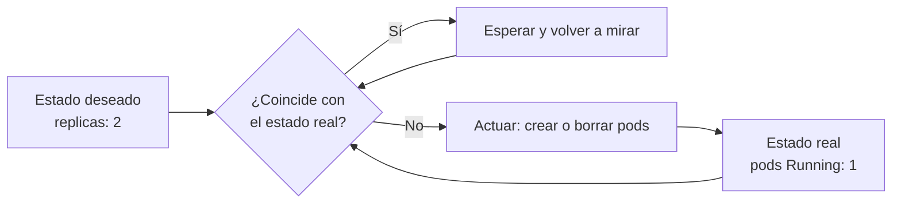

# 🚢 Curso práctico de Kubernetes con kind

De cero (con Docker y conceptos básicos) hasta desplegar un **microservicio Java Spring Boot** con **MySQL**, **Keycloak + PostgreSQL**, Ingress, Helm, observabilidad y GitOps con ArgoCD, todo en un cluster local con **kind** sobre **Windows + WSL2 (Fedora)**.

## 🎯 Objetivo final



<details><summary>Versión texto</summary>

```
                       http://api.localtest.me          http://keycloak.localtest.me
                                  │                                  │
                          ┌───────▼──────────────────────────────────▼───────┐
                          │             Ingress NGINX (kind)                  │
                          └───────┬──────────────────────────────────┬───────┘
                                  │                                  │
                      ┌───────────▼───────────┐          ┌───────────▼──────────┐
                      │ products-api (Spring) │──JWKS───▶│      Keycloak        │
                      │   Deployment x2       │          │     Deployment       │
                      └───────────┬───────────┘          └───────────┬──────────┘
                                  │ JDBC                             │ JDBC
                      ┌───────────▼───────────┐          ┌───────────▼──────────┐
                      │ MySQL (StatefulSet+PVC)│          │PostgreSQL (StatefulSet│
                      └───────────────────────┘          │        +PVC)         │
                                                          └──────────────────────┘
        Namespace: dev        │  monitoring (Prometheus/Grafana)  │  argocd (GitOps)
```
</details>

> 💡 Los diagramas del curso usan **Mermaid**: se ven directamente en GitHub, GitLab y VS Code (instala la extensión *Markdown Preview Mermaid Support*). Si tu visor no los dibuja, cada diagrama importante tiene una versión texto.

## 🤔 ¿Qué es Kubernetes y por qué?

**Kubernetes** es un orquestador de contenedores: tú le declaras el **estado deseado** ("quiero 2 réplicas de esta imagen, con este puerto y esta config") y él se encarga de que el **estado real** coincida, en un conjunto de máquinas (nodos).

¿Por qué no basta Docker? Docker arranca contenedores en una máquina. Kubernetes decide **dónde** arrancarlos, los **reinicia** si fallan, los **reparte** entre nodos, les da **red y DNS** estables y permite actualizar sin cortes. Todo de forma declarativa (YAML), no con comandos sueltos.

La pieza clave es el **bucle de reconciliación**: controladores que miran sin parar el estado deseado (guardado en etcd) y el real, y actúan para acercarlos. Si un pod muere, el controlador ve "faltan 1" y crea otro. Esta idea se repite en todo el curso: Deployments, HPA, operadores y ArgoCD.





En este curso el cluster lo crea **kind** (*Kubernetes IN Docker*): cada nodo es un contenedor Docker dentro de tu WSL2 Fedora.

## 🗺️ Ruta del curso

| # | Módulo | Qué aprendes | Tiempo aprox. |
|---|--------|--------------|---------------|
| 00 | [Preparación del entorno](00-preparacion-entorno/README.md) | WSL2, Docker, kubectl, kind, helm | 1 h |
| 01 | [Cluster con kind](01-cluster-kind/README.md) | Cómo funciona kind, multi-nodo, cargar imágenes | 1 h |
| 02 | [Workloads](02-workloads/README.md) | Pods, Deployments, rolling updates, probes, resources | 2 h |
| 03 | [Services y DNS](03-services-dns/README.md) | ClusterIP, headless, DNS interno, port-forward | 1.5 h |
| 04 | [ConfigMaps y Secrets](04-configmaps-secrets/README.md) | Configuración externa, env vs volúmenes | 1.5 h |
| 05 | [Namespaces, RBAC y seguridad](05-rbac-seguridad/README.md) | Quotas, ServiceAccounts, Roles, securityContext | 2 h |
| 06 | [Persistencia y bases de datos](06-persistencia-bases-de-datos/README.md) | PV/PVC, StorageClass, StatefulSet con MySQL y PostgreSQL | 3 h |
| 07 | [Ingress y networking](07-ingress/README.md) | ingress-nginx, rutas por host y path | 1.5 h |
| 08 | [Keycloak](08-keycloak/README.md) | Keycloak + PostgreSQL, realm importado, Ingress | 2 h |
| 09 | [Microservicio Spring Boot](09-microservicio-spring/README.md) | Dockerfile, kind load, MySQL, JWT con Keycloak | 3 h |
| 10 | [Helm](10-helm/README.md) | Chart propio del microservicio, values, upgrade/rollback | 2 h |
| 11 | [Observabilidad](11-observabilidad/README.md) | Logs, metrics-server, HPA, Prometheus, Grafana | 2.5 h |
| 12 | [GitOps con ArgoCD](12-gitops-argocd/README.md) | Despliegue declarativo desde Git, self-heal | 2 h |
| 13 | [Proyecto final](13-proyecto-final/README.md) | Todo de punta a punta + retos | 3 h |
| — | [Glosario](anexos/glosario.md) | Todas las definiciones del curso, con enlace al módulo | — |
| — | [Troubleshooting](anexos/troubleshooting.md) | Diagnóstico de pods, red, kind y WSL2 Fedora | — |
| — | [Cheatsheet](anexos/cheatsheet.md) | Comandos más usados | — |

## 📁 Cómo está organizado

- Cada carpeta es un módulo con su `README.md` (teoría corta + práctica + ejercicios).
- Los YAMLs viven junto al módulo donde se explican (`manifests/` o `k8s/`).
- `scripts/` tiene atajos para levantar/destruir el cluster.
- Los ejercicios tienen solución escondida en `<details>`: intenta primero sin mirar.

## 📌 Convenciones

- Cluster kind llamado **`curso`** (contexto `kind-curso`).
- Módulos 02–05 usan el namespace **`demo`** (se borra al final de cada módulo).
- Del módulo 06 en adelante se usa el namespace **`dev`**.
- Dominios locales con **`*.localtest.me`** (resuelve a `127.0.0.1`, no necesitas tocar el archivo hosts).
- Credenciales del curso son **solo para práctica**. Nunca las uses en un entorno real.

## ⚠️ Antes de empezar

- Trabaja **todo dentro de Fedora (WSL2)**: clona el curso en `~/cursos/kubernetes`, no en `/mnt/c/...` (es lentísimo con Docker/Maven). Los scripts son bash y así usas un solo Docker y un solo `~/.kube/config`. Windows queda para el navegador y para VS Code (`code .` desde Fedora con la extensión *WSL*).
- Se recomienda dar al menos **8 GB de RAM** a WSL2 (ver módulo 00).
- Esta guía usa versiones recientes (Kubernetes 1.3x, Keycloak 26, Spring Boot 3.3, MySQL 8.4, PostgreSQL 16). Si alguna URL o versión cambió, revisa la documentación oficial.

## 🏢 Relación con tu trabajo (Java + Spring + MySQL + microservicios)

El módulo 09 usa exactamente tu stack: Spring Boot + JPA + MySQL, con configuración por variables de entorno (12-factor), probes de Actuator y seguridad JWT. Lo que practiques aquí es muy parecido a lo que verás en un cluster real (EKS/AKS/GKE/OpenShift), cambiando lo que es específico de kind (Ingress, storage, carga de imágenes).

¡Vamos! Empieza por el [módulo 00](00-preparacion-entorno/README.md).
