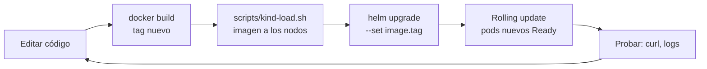

# Ciclo de desarrollo local sobre Kubernetes

## Objetivos
- Iterar sobre `products-api` dentro del cluster sin perder tiempo: cambiar código, reconstruir, recargar y verificar.
- Ver logs en vivo y llegar a un pod sin Ingress usando `port-forward`.
- Depurar la JVM dentro de un pod desde tu IDE (debug remoto).

## Definiciones clave

- **Inner loop**: el ciclo corto que repites decenas de veces al día: editar, construir, desplegar, probar.
- **Rollout**: el reemplazo gradual de pods viejos por nuevos cuando cambia el Deployment.
- **port-forward**: túnel temporal entre un puerto de tu PC y un pod o Service. No pasa por el Ingress.
- **JDWP**: protocolo de depuración de la JVM. Abre un puerto al que se conecta el IDE.
- **Tag inmutable**: tag que no se reutiliza. Cada versión nueva lleva un tag distinto (`1.0.1`, `1.0.2`...).

## Teoría

En local arrancas la app con `mvn spring-boot:run` y ves el cambio en segundos. En Kubernetes hay más pasos, pero son siempre los mismos. Entenderlos evita el clásico "cambié el código y sigue igual".



Cada paso tiene una razón:

| Paso | Por qué existe |
|------|----------------|
| `docker build` | Los nodos ejecutan imágenes, no código fuente |
| `kind-load.sh` | Los nodos kind no ven tu Docker local; hay que copiarles la imagen |
| Tag nuevo | Si reutilizas el tag, el nodo ya tiene una imagen con ese nombre y el pod arranca con la vieja (con `imagePullPolicy: IfNotPresent`) |
| `helm upgrade` | Cambia el Deployment; eso dispara el rolling update |

## Prerrequisitos

1. Cluster `curso` con `products-api` desplegado en `dev` (módulos 09 y 10).
2. Imagen `products-api:1.0.0` ya cargada.

## 1. Un ciclo completo

Supón que cambias algo en `ProductController.java`. Desde la raíz del curso:

```bash
docker build -t products-api:1.0.1 09-microservicio-spring/app
./scripts/kind-load.sh products-api:1.0.1
helm upgrade products-api 10-helm/charts/products-api -n dev \
  --set image.tag=1.0.1 --atomic
kubectl rollout status deploy/products-api -n dev
curl http://api.localtest.me/api/public/ping
```

> **¿Qué acaba de pasar?** Construiste una imagen con tag nuevo, la copiaste a los tres nodos y Helm cambió `image.tag` en el Deployment. Kubernetes creó un pod con la imagen nueva, esperó a que su readiness probe pasara y solo entonces retiró uno de los viejos (`maxUnavailable: 0`). `--atomic` hace rollback solo si la versión nueva no llega a estar sana.

Si usaste los YAML del módulo 09 en lugar de Helm, el equivalente del tercer paso es:

```bash
kubectl set image deploy/products-api products-api=products-api:1.0.1 -n dev
```

### Por qué no reutilizar el tag

Prueba qué pasa si lo haces. Reconstruye con el mismo tag y reinicia:

```bash
docker build -t products-api:1.0.1 09-microservicio-spring/app
./scripts/kind-load.sh products-api:1.0.1
kubectl rollout restart deploy/products-api -n dev
```

> **¿Qué acaba de pasar?** Puede funcionar o no según el estado de cada nodo: con `IfNotPresent`, un nodo que ya tenía `products-api:1.0.1` puede quedarse con la imagen anterior. En un registry real pasa lo mismo con la caché del nodo. Un tag nuevo por cada versión elimina la duda: un tag identifica siempre el mismo contenido.

## 2. Logs en vivo

```bash
kubectl logs -f deploy/products-api -n dev                # un pod cualquiera del Deployment
kubectl logs -f -l app=products-api -n dev --tail=20      # todos los pods, mezclados
kubectl logs deploy/products-api -n dev --since=5m        # últimos 5 minutos
kubectl logs <pod> -n dev --previous                      # el contenedor anterior (si reinició)
```

> **¿Qué acaba de pasar?** `kubectl logs` lee lo que tu app escribe en **stdout/stderr**. Spring Boot ya lo hace por defecto, por eso no hay que configurar archivos de log. Con `-l app=products-api` seleccionas pods por label, no por nombre, que cambia en cada rollout.

## 3. Llegar a un pod sin Ingress

```bash
kubectl port-forward svc/products-api 8080:8080 -n dev
# en otra terminal
curl http://localhost:8080/api/public/ping
```

Para hablar con un pod concreto (por ejemplo, el que está fallando):

```bash
kubectl get pods -n dev -l app=products-api
kubectl port-forward pod/<nombre-del-pod> 8080:8080 -n dev
```

> **¿Qué acaba de pasar?** `port-forward` abre un túnel desde tu PC al pod a través del API server. Sirve para descartar problemas de Ingress: si por `localhost:8080` responde y por `api.localtest.me` no, el fallo está en el Ingress o el Service. Con `svc/` te conecta a **un** pod elegido al abrir el túnel, no balancea.

## 4. Depurar Java dentro del pod

La JVM acepta un agente de depuración mediante `JAVA_TOOL_OPTIONS`. El Dockerfile no lo trae: se añade solo mientras depuras.

Con Helm (el valor `config` se convierte en variables del pod mediante el ConfigMap):

```bash
helm upgrade products-api 10-helm/charts/products-api -n dev \
  --set image.tag=1.0.1 \
  --set 'config.JAVA_TOOL_OPTIONS=-agentlib:jdwp=transport=dt_socket\,server=y\,suspend=n\,address=*:5005'
kubectl rollout status deploy/products-api -n dev
```

Abre el túnel hacia el puerto de depuración:

```bash
kubectl port-forward deploy/products-api 5005:5005 -n dev
```

En tu IDE crea una configuración **Remote JVM Debug** (IntelliJ: *Run > Edit Configurations > Remote JVM Debug*; VS Code: tipo `java` con `request: attach`) con host `localhost` y puerto `5005`. Pon un breakpoint en `ProductController.ping()` y llama a `curl http://api.localtest.me/api/public/ping`.

> **¿Qué acaba de pasar?** `address=*:5005` hace que la JVM escuche conexiones de depuración en ese puerto, y `suspend=n` evita que espere al IDE para arrancar. El pod no expone el 5005 en ningún Service; solo el túnel de `port-forward` lo alcanza, así que nadie más puede conectarse. Al conectar el IDE, un breakpoint detiene el hilo que atiende la petición.

Al terminar, quita la opción para no dejar el puerto abierto:

```bash
helm upgrade products-api 10-helm/charts/products-api -n dev --set image.tag=1.0.1
```

Con réplicas > 1, el túnel apunta a un solo pod y la petición puede caer en otro: reduce a una réplica mientras depuras (`--set replicaCount=1`).

> No uses esta técnica en un cluster compartido sin acordarlo: un breakpoint pausa el hilo de la app para todos los usuarios de ese pod.

## 5. Entrar a un pod

```bash
kubectl exec -it deploy/products-api -n dev -- sh
env | grep -E "DB_|JWK"         # ¿qué configuración recibió realmente?
exit
```

La imagen de runtime es un JRE sin muchas herramientas; para tener `curl` o `nslookup` crea un pod efímero:

```bash
kubectl run tmp -n dev --rm -it --restart=Never --image=curlimages/curl -- sh
```

## Problemas frecuentes

| Síntoma | Causa |
|---------|-------|
| El cambio no se ve tras el rollout | Reutilizaste el tag o no hiciste `kind-load.sh` del tag nuevo |
| `ErrImagePull` en el pod nuevo | Tag mal escrito o imagen no cargada en los nodos |
| El rollout no termina | La readiness del pod nuevo falla: `kubectl logs` del pod nuevo |
| `port-forward` se corta solo | El pod se reinició; vuelve a abrirlo |
| El IDE no conecta al 5005 | Falta el `port-forward`, o la JVM no arrancó con el agente (`kubectl logs` muestra `Listening for transport dt_socket`) |

## Lo que debes recordar

- El ciclo es siempre: build con tag nuevo, cargar en los nodos, desplegar, verificar.
- Un tag nuevo por versión. Reutilizarlo produce comportamientos que parecen aleatorios.
- `kubectl logs -f -l app=...` y `port-forward` son tus herramientas diarias.
- `port-forward` sirve para separar problemas de la app de problemas del Ingress.
- El debug remoto usa un agente en la JVM y un túnel; no se deja activado.

## Ejercicios

1. Cambia el mensaje de `ping()` para añadir un campo `version`, haz el ciclo completo y comprueba que el JSON lo muestra.
2. Mide cuánto tarda el ciclo. ¿Qué paso es el más lento? ¿Cómo lo acortarías (cache de Maven, capas del Dockerfile)?
3. Haz `kubectl port-forward` al pod y a `svc/products-api` con 2 réplicas y compara a qué pod llegan tus peticiones (`/api/public/ping` devuelve el nombre del pod).
4. Depura con un breakpoint en `list()` y llama a `GET /api/products` con un token de Keycloak. Inspecciona el objeto `Jwt`.

<details><summary>Pistas</summary>

2. La etapa `dependency:go-offline` del Dockerfile ya cachea las dependencias si `pom.xml` no cambia; lo lento suele ser `kind-load.sh` con imágenes grandes.
3. Con `svc/`, el túnel queda fijo en un pod mientras dure; abre y cierra el túnel varias veces para ver cambios.
4. Pide el token como en el smoke test de `15-proyecto-final/deploy-all.sh`.
</details>
