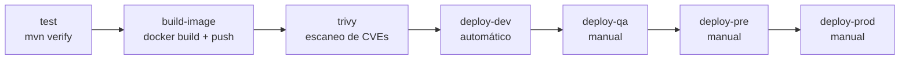

# CI/CD con GitLab: del commit al cluster

> Anexo conceptual. El curso corre sobre kind y GitHub, así que **no ejecutas este pipeline** contra un GitLab real. Sirve para ver cómo encajan las piezas del curso (Docker, Trivy, Helm, values por entorno) en un pipeline, y entender qué hace cada paso cuando lo veas en tu trabajo.

## Objetivos
- Leer un `.gitlab-ci.yml` de despliegue con Helm y saber qué hace cada job.
- Relacionar cada job con lo que hiciste a mano en los módulos 09, 10, 12 y 13.
- Saber dónde van las credenciales y por qué nunca en el repositorio.

## Definiciones clave

- **Pipeline**: conjunto de jobs que GitLab ejecuta tras un commit o merge request.
- **Stage**: fase del pipeline. Los jobs de un stage corren en paralelo; los stages, en orden.
- **Job**: unidad de trabajo, ejecutada por un **runner** dentro de un contenedor.
- **Runner**: proceso que ejecuta los jobs. Puede ser compartido o del proyecto.
- **Registry**: almacén de imágenes de contenedor. GitLab trae uno por proyecto (`$CI_REGISTRY`).
- **Variable CI/CD**: valor configurado en GitLab (*Settings > CI/CD > Variables*), disponible en los jobs. Puede estar enmascarada y ser de tipo *File*.
- **Environment**: nombre lógico del destino (`dev`, `qa`, `pre`, `prod`). GitLab guarda el historial de despliegues por entorno.
- **`when: manual`**: el job espera a que una persona lo lance con un botón.

## Teoría

El pipeline automatiza exactamente los pasos que ya hiciste con comandos. Cada job es un comando del curso:



| Job | Equivale en el curso a | Módulo |
|-----|------------------------|--------|
| `test` | `mvn verify` | 09 |
| `build-image` | `docker build` y subir al registry (en el curso: `kind-load.sh`) | 09 |
| `trivy` | `trivy image --severity HIGH,CRITICAL` | 13 |
| `deploy-*` | `helm upgrade --install --atomic -f values-<env>.yaml` | 10 y 12 |

Dos ideas clave:

- **La imagen se construye una sola vez** y se promociona. Cada entorno despliega el mismo tag (`$CI_COMMIT_SHORT_SHA`) con distintos values. Es la promoción del módulo 12.
- **Producción nunca se despliega sola.** Los entornos más altos esperan una aprobación manual, de modo que alguien confirma antes de tocar usuarios reales.

## Un `.gitlab-ci.yml` de ejemplo

Está pensado para este repositorio: usa el chart `10-helm/charts/products-api` y los `values-dev/qa/pre/prod.yaml` del módulo 12. Para un proyecto real, el `pom.xml` y el `Dockerfile` estarían en la raíz y las rutas cambiarían.

```yaml
stages: [test, build, scan, deploy]

variables:
  APP_DIR: 09-microservicio-spring/app
  CHART_DIR: 10-helm/charts/products-api
  IMAGE: $CI_REGISTRY_IMAGE/products-api
  TAG: $CI_COMMIT_SHORT_SHA
  MAVEN_OPTS: -Dmaven.repo.local=$CI_PROJECT_DIR/.m2/repository

# ---------- test ----------
test:
  stage: test
  image: maven:3.9-eclipse-temurin-21
  cache:
    key: maven
    paths: [.m2/repository]
  script:
    - mvn -B -f $APP_DIR/pom.xml verify

# ---------- imagen ----------
build-image:
  stage: build
  image: docker:27
  services: [docker:27-dind]
  variables:
    DOCKER_TLS_CERTDIR: /certs
  before_script:
    - echo "$CI_REGISTRY_PASSWORD" | docker login -u "$CI_REGISTRY_USER" --password-stdin "$CI_REGISTRY"
  script:
    - docker build -t $IMAGE:$TAG $APP_DIR
    - docker push $IMAGE:$TAG
  rules:
    - if: $CI_COMMIT_BRANCH == $CI_DEFAULT_BRANCH

# ---------- escaneo ----------
trivy:
  stage: scan
  image:
    name: aquasec/trivy:latest
    entrypoint: [""]
  variables:
    TRIVY_USERNAME: $CI_REGISTRY_USER
    TRIVY_PASSWORD: $CI_REGISTRY_PASSWORD
  script:
    - trivy image --exit-code 1 --severity HIGH,CRITICAL $IMAGE:$TAG
  rules:
    - if: $CI_COMMIT_BRANCH == $CI_DEFAULT_BRANCH

# ---------- despliegue (plantilla) ----------
.deploy:
  stage: deploy
  image:
    name: alpine/k8s:1.30.4
    entrypoint: [""]
  script:
    - kubectl get ns $NAMESPACE
    - >
      helm upgrade --install products-api $CHART_DIR
      -n $NAMESPACE
      -f $CHART_DIR/values-$NAMESPACE.yaml
      --set image.repository=$IMAGE
      --set image.tag=$TAG
      --atomic --timeout 5m
    - kubectl rollout status deploy/products-api -n $NAMESPACE
  rules:
    - if: $CI_COMMIT_BRANCH == $CI_DEFAULT_BRANCH

deploy-dev:
  extends: .deploy
  variables:
    NAMESPACE: dev
    KUBECONFIG: $KUBECONFIG_DEV
  environment:
    name: dev

deploy-qa:
  extends: .deploy
  needs: [deploy-dev]
  variables:
    NAMESPACE: qa
    KUBECONFIG: $KUBECONFIG_QA
  environment:
    name: qa
  when: manual

deploy-pre:
  extends: .deploy
  needs: [deploy-qa]
  variables:
    NAMESPACE: pre
    KUBECONFIG: $KUBECONFIG_PRE
  environment:
    name: pre
  when: manual

deploy-prod:
  extends: .deploy
  needs: [deploy-pre]
  variables:
    NAMESPACE: prod
    KUBECONFIG: $KUBECONFIG_PROD
  environment:
    name: prod
  when: manual
```

> **¿Qué acaba de pasar?** Es un pipeline en cuatro fases. `test` compila y prueba con Maven (la caché de `.m2` evita bajar dependencias cada vez). `build-image` construye y sube la imagen etiquetada con el hash corto del commit, así cada commit tiene un tag único e inmutable. `trivy` falla el pipeline si encuentra vulnerabilidades altas o críticas. Los `deploy-*` heredan de una plantilla oculta (`.deploy`, empieza por punto) y solo cambian el namespace y el kubeconfig. El `values-$NAMESPACE.yaml` elige el archivo del entorno: ahí está el trabajo del módulo 12.

## Credenciales: nunca en el repositorio

| Dato | Dónde va | Cómo llega al job |
|------|----------|-------------------|
| Usuario y contraseña del registry | Las pone GitLab solo | `$CI_REGISTRY_USER`, `$CI_REGISTRY_PASSWORD` |
| Acceso al cluster de cada entorno | Variable CI/CD de tipo **File**: `KUBECONFIG_DEV`, `KUBECONFIG_QA`, `KUBECONFIG_PRE`, `KUBECONFIG_PROD` | `KUBECONFIG: $KUBECONFIG_DEV` apunta al archivo temporal |
| Contraseñas de la app (BD, etc.) | Secrets del cluster (módulo 04) o un gestor de secretos | El chart solo las **referencia** (`db.secretName`) |

Configura las variables en *Settings > CI/CD > Variables* y márcalas como **Masked**. Para las de producción, marca además **Protected** (solo se exponen en ramas protegidas) y limita el entorno (*Environment scope*). Con eso un merge request de un compañero no puede leer el kubeconfig de producción.

> **¿Qué acaba de pasar?** Las variables de tipo File se escriben como un archivo temporal en el runner y la variable contiene su **ruta**. Por eso `KUBECONFIG` puede apuntar a ellas directamente. Una credencial en el repositorio queda en el historial de Git para siempre aunque la borres después.

## Limitaciones de este ejemplo

- **El chart no sabe tirar de un registry privado.** El chart del curso no tiene `imagePullSecrets`: en un entorno real habría que añadir ese valor al chart y a los values, o que el cluster ya tenga permisos de lectura sobre el registry.
- **`kubectl get ns` solo comprueba que el kubeconfig funciona.** Si tu equipo no te deja crear namespaces, es lo esperado: el namespace ya existe y lo gestiona plataforma.
- **`alpine/k8s` es una imagen de conveniencia** (trae `kubectl` y `helm`). Muchas empresas tienen su propia imagen de despliegue, ya auditada.
- **Docker-in-Docker necesita un runner con modo privilegiado.** Si tu runner no lo permite, la alternativa es un constructor de imágenes sin demonio (por ejemplo, BuildKit rootless).
- **No hay `helm lint` ni `helm template`.** En un pipeline serio es bueno añadir un job que valide el chart antes de desplegar.

## Cómo leer un pipeline que falla

| Falla en | Causa típica | Qué mirar |
|----------|--------------|-----------|
| `test` | Una prueba rota | El log del job de Maven |
| `build-image` | Login al registry o error del Dockerfile | `docker login` y el paso que falló |
| `trivy` | Hay una CVE alta o crítica | La tabla de salida; muchas tienen `Fixed Version` |
| `deploy-*` con `--atomic` | La versión nueva no llegó a estar Ready y Helm revirtió | Eventos y logs del pod nuevo (módulo 14) |
| `deploy-*` con `Unauthorized` o `forbidden` | El kubeconfig caducó o no tiene permisos en ese namespace | `kubectl auth can-i` (módulo 05) |

El job de despliegue falla con `--atomic` justo cuando el pod nuevo no pasa su readiness. El diagnóstico es el mismo que en el [laboratorio](../14-laboratorio-troubleshooting/README.md): `describe`, `logs --previous` y events.

## Lo que debes recordar

- Cada job del pipeline es un comando que ya conoces: Maven, Docker, Trivy, Helm.
- Se construye una imagen por commit y se promociona; no se vuelve a construir por entorno.
- Los entornos altos esperan aprobación manual (`when: manual`).
- Las credenciales viven en variables de GitLab (Masked y Protected), nunca en Git.
- Un `--atomic` fallido es un problema de la app nueva, no del pipeline: diagnostícalo como cualquier pod que no arranca.

## Ejercicios

1. Añade un job `lint` en el stage `test` que ejecute `helm lint $CHART_DIR -f $CHART_DIR/values-prod.yaml`.
2. Haz que `deploy-dev` solo corra si cambian archivos de `09-microservicio-spring/app/**` (pista: `rules:changes`).
3. Añade un job que se ejecute en merge requests, construya la imagen pero no la despliegue. ¿Qué `rules` necesitas?
4. Propón cómo evitarías el kubeconfig de larga duración (pista: el agente de GitLab para Kubernetes o credenciales efímeras).
5. Reto: dibuja con mermaid el flujo completo de una corrección urgente en producción (hotfix) con este pipeline.

<details><summary>Pistas</summary>

1. `script: - helm lint ...` con `image: alpine/k8s:1.30.4` y `entrypoint: [""]`.
2. `rules: - if: ... changes: - 09-microservicio-spring/app/**/*`.
3. `rules: - if: $CI_PIPELINE_SOURCE == "merge_request_event"` en el job de build, sin el push.
</details>
