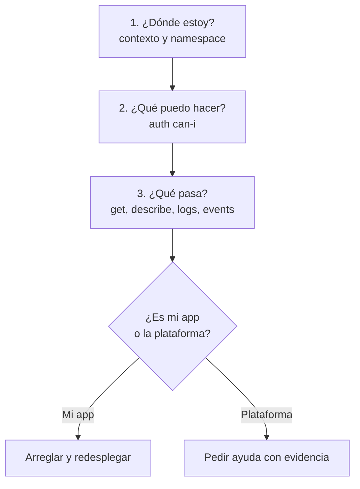

# Leer el cluster de la empresa

## Objetivos
- Orientarte en un cluster que administra otro equipo, sin ser administrador.
- Saber qué mirar cuando tu despliegue falla y qué comandos son seguros (solo lectura).
- Pedir ayuda al equipo de plataforma con evidencia, no con "no funciona".

## Definiciones clave

- **Contexto**: combinación cluster + usuario + namespace en tu `~/.kube/config`. Cambiar de contexto cambia contra qué cluster hablas.
- **Namespace por defecto**: el que `kubectl` usa si no pones `-n`. Es fácil olvidar cuál tienes activo.
- **Solo lectura**: comandos que consultan y no modifican (`get`, `describe`, `logs`, `top`, `auth can-i`).
- **Equipo de plataforma**: quien administra el cluster, sus políticas (quotas, NetworkPolicies, Pod Security) y su acceso.
- **Evidencia**: la salida exacta de un comando, que permite a otra persona diagnosticar sin preguntarte nada.

## Teoría

En el curso eres administrador de tu propio cluster kind. En el trabajo casi nunca: tu cuenta tiene permisos en tus namespaces y poco más. Eso cambia la forma de trabajar:

- No puedes ver todo (`forbidden` es normal en `kube-system` o en otros equipos).
- Un error puede venir de una política que no controlas.
- Tu primera obligación es **no romper nada**: antes de actuar, confirma dónde estás.



## 1. ¿Dónde estoy?

Antes de cualquier comando que modifique algo, comprueba contra qué cluster y namespace estás:

```bash
kubectl config get-contexts                   # lista; el actual lleva un asterisco
kubectl config current-context
kubectl config view --minify | grep -E "cluster:|namespace:|user:"
```

Cambia de contexto y fija un namespace por defecto:

```bash
kubectl config use-context <nombre-del-contexto>
kubectl config set-context --current --namespace=dev
```

> **¿Qué acaba de pasar?** `kubectl` no está "conectado" a nada: cada comando lee el contexto actual de tu `kubeconfig` y hace una petición HTTPS a ese cluster. Un `kubectl delete` con el contexto de producción activo borra en producción. Por eso, antes de modificar, confirma el contexto; y con muchos entornos conviene indicar siempre el namespace: `-n qa`.

Hábitos que evitan accidentes:

- Pon `-n <namespace>` en cada comando, aunque tengas uno por defecto.
- Muestra el contexto y namespace en el prompt de tu terminal.
- Usa contextos distintos (y nombres claros) para dev y prod.
- Para probar un `apply`, ejecuta antes `kubectl diff -f archivo.yaml` y `--dry-run=server`.

## 2. ¿Qué puedo hacer?

RBAC decide qué te dejan hacer. Pregúntale al cluster:

```bash
kubectl auth can-i get pods -n dev
kubectl auth can-i create deployments -n dev
kubectl auth can-i delete pods -n prod
kubectl auth can-i --list -n dev                 # todo lo que tu usuario puede hacer en el namespace
kubectl auth whoami                              # quién eres para el cluster (si tu versión lo soporta)
```

> **¿Qué acaba de pasar?** `can-i` envía la pregunta al autorizador RBAC del API server, que responde `yes` o `no` sin ejecutar la acción. `--list` te muestra el inventario completo, útil para entender por qué algo te da `forbidden`. Es el mismo mecanismo que practicaste en el módulo 05, ahora con tu propio usuario en lugar de una ServiceAccount de práctica.

Un `forbidden` se lee así:

```
Error from server (Forbidden): pods is forbidden:
User "brayan" cannot list resource "pods" in API group "" in the namespace "kube-system"
```

Dice **quién**, **qué verbo**, **sobre qué recurso** y **en qué namespace**. Con eso el equipo de plataforma sabe qué permiso falta, o por qué no deberías tenerlo.

## 3. Mirar sin tocar

Comandos de solo lectura para orientarte:

```bash
kubectl get ns                                   # puede estar restringido
kubectl get all -n dev
kubectl get pods -n dev -o wide --show-labels
kubectl get deploy,svc,ingress,hpa -n dev
kubectl describe deploy/<nombre> -n dev
kubectl get events -n dev --sort-by=.lastTimestamp
kubectl top pods -n dev                          # si hay metrics-server
kubectl get resourcequota,limitrange -n dev      # ¿cuánto me dejan usar?
kubectl get networkpolicy -n dev                 # ¿qué tráfico me limitan?
```

Para ver lo que hay desplegado con Helm:

```bash
helm list -n dev
helm status <release> -n dev
helm get values <release> -n dev                 # los values aplicados
helm history <release> -n dev                    # revisiones y cuáles fallaron
```

Para ver los límites que te impone el namespace, mira el estado de la quota:

```bash
kubectl describe resourcequota -n dev
```

La columna `Used` frente a `Hard` te dice si tu despliegue falla por falta de cupo. Es el mismo caso que el escenario 3 del [laboratorio de troubleshooting](../14-laboratorio-troubleshooting/README.md), pero con `exceeded quota` en vez de `Pending`.

## 4. Cuando tu despliegue falla

El orden es siempre el del [módulo 14](../14-laboratorio-troubleshooting/README.md):

```bash
kubectl get pods -n dev                          # 1. estado
kubectl describe pod <pod> -n dev                # 2. events al final
kubectl logs <pod> -n dev --previous             # 3. logs del intento anterior
kubectl rollout status deploy/<nombre> -n dev    # 4. ¿el rollout avanza?
helm history <release> -n dev                    # 5. ¿Helm revirtió (--atomic)?
```

Ahora decide de quién es el problema:

| Evidencia | Suele ser | Qué hacer |
|-----------|-----------|-----------|
| Logs con excepción de Java o `UnknownHostException` | Tu app o su configuración | Arréglalo tú |
| `ImagePullBackOff` con tag correcto | Registry sin acceso desde el cluster | Pedir a plataforma |
| `exceeded quota` | Cupo del namespace | Reducir réplicas o pedir más cupo |
| `forbidden` al crear algo | Falta un permiso | Pedir el permiso con el mensaje exacto |
| `violates PodSecurity "baseline"` o `"restricted"` | Política del namespace | Ajustar tu `securityContext` (módulo 13) |
| Conexión con timeout entre pods | Posible NetworkPolicy | Revisar `kubectl get networkpolicy`; pedir regla |
| `Pending` con `Insufficient cpu/memory` | Cluster sin capacidad | Pedir a plataforma |
| Ingress con `503` y endpoints vacíos | Tu Service o tu readiness | Arréglalo tú (escenarios 4, 5 y 8) |

## 5. Pedir ayuda con evidencia

Un mensaje útil para el equipo de plataforma incluye:

1. **Qué intentabas** (desplegar `products-api` 1.0.2 en `qa`).
2. **Contexto y namespace** (`kubectl config current-context`, namespace).
3. **El error exacto**, copiado, no parafraseado.
4. **Lo que ya probaste** (`describe`, logs, `can-i`).
5. **Qué pides** (un permiso concreto, más cupo, una regla de red).

Ejemplo:

> Intento desplegar `products-api:1.0.2` en `qa` con `helm upgrade --atomic`. El pod queda en `Pending` y los events dicen `0/6 nodes are available: Insufficient memory`. Mi namespace usa 1.8Gi de 2Gi (`kubectl describe resourcequota -n qa`). ¿Podéis subir el cupo a 3Gi o indicar si hay otro límite?

Recoge la evidencia de una vez:

```bash
kubectl config current-context
kubectl describe pod <pod> -n qa | tail -30
kubectl get events -n qa --sort-by=.lastTimestamp | tail -15
kubectl describe resourcequota -n qa
helm history products-api -n qa
```

> No pegues Secrets en un chat o ticket. `kubectl get secret -o yaml` muestra los valores en base64, que no es cifrado.

## Problemas frecuentes

| Síntoma | Causa |
|---------|-------|
| `The connection to the server localhost:8080 was refused` | No hay contexto activo o el `kubeconfig` está vacío |
| `Unauthorized` | Credenciales caducadas; renueva el login con tu proveedor (SSO) |
| `error: You must be logged in to the server` | Mismo caso: token expirado |
| Todo sale vacío | Namespace equivocado; revisa `kubectl config view --minify` |
| `forbidden` al listar namespaces | Normal: solo ves los tuyos |

## Lo que debes recordar

- Antes de modificar, confirma contexto y namespace. Usa siempre `-n`.
- `kubectl auth can-i --list` te dice qué puedes hacer.
- `get`, `describe`, `logs`, `events` y `helm history` son seguros y suelen bastar para diagnosticar.
- Decide si el problema es tu app (logs, config) o la plataforma (quota, permisos, políticas).
- Un buen mensaje de ayuda lleva el error exacto, el contexto y lo que ya probaste.

## Ejercicios

1. En tu cluster kind, crea el usuario de práctica del módulo 05 (`app-reader`) y ejecuta `kubectl auth can-i --list -n demo --as=system:serviceaccount:demo:app-reader`. ¿Qué puede hacer?
2. Provoca un `exceeded quota` en `qa` o `prod` (módulo 12) y escribe el mensaje de ayuda al equipo de plataforma siguiendo la plantilla.
3. Con el escenario 9 del laboratorio (NetworkPolicy), identifica qué comando te habría dicho que hay una política en el namespace.
4. Escribe un alias o función de tu shell que muestre el contexto y namespace actuales antes de ejecutar `kubectl delete`.

<details><summary>Pistas</summary>

1. Necesitas `kubectl apply -f 05-rbac-seguridad/manifests/rbac.yaml` con el namespace `demo` creado.
3. `kubectl get networkpolicy -n lab`.
4. Por ejemplo, una función `kdel() { kubectl config current-context; kubectl delete "$@"; }`.
</details>
