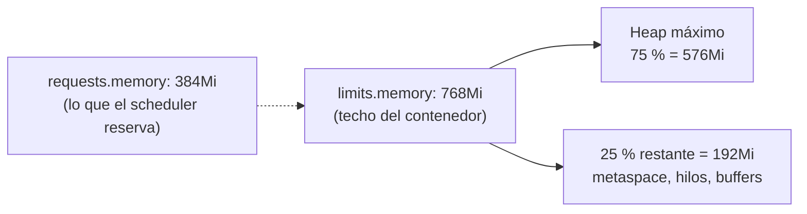
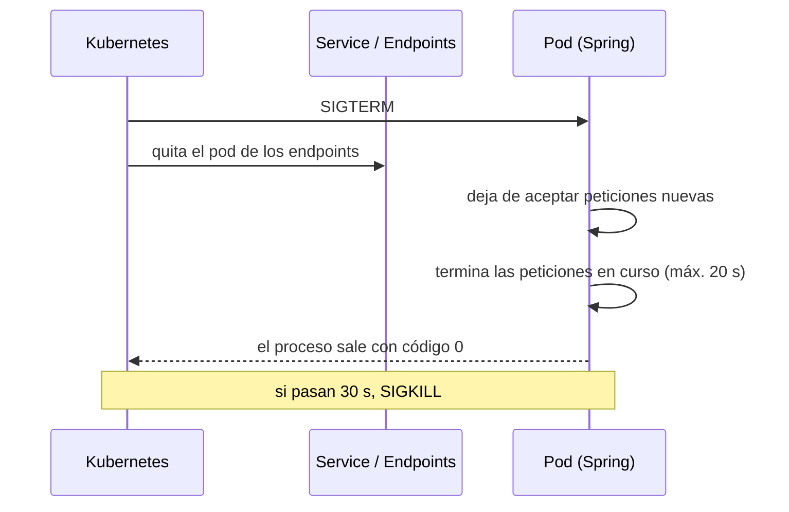

# Spring Boot en Kubernetes

## Objetivos
- Dimensionar memoria y CPU de una app Spring en un contenedor sin provocar `OOMKilled`.
- Configurar las probes de Actuator para que Kubernetes sepa cuándo la app está viva y lista.
- Apagar la app sin cortar peticiones en vuelo (graceful shutdown).
- Pasar configuración y credenciales sin tocar la imagen.

Todo el anexo usa `products-api` del módulo 09 y su chart del módulo 10; los nombres de archivos y valores son los reales del repositorio.

## Definiciones clave

- **12-factor app**: conjunto de reglas para apps desplegables en la nube. Aquí importan tres: configuración en el entorno, logs a stdout y procesos desechables (arrancan rápido y se apagan limpio).
- **Heap**: memoria de objetos de la JVM. Es solo una parte de la memoria total del proceso.
- **`MaxRAMPercentage`**: porcentaje de la memoria del contenedor que la JVM puede usar para el heap.
- **Startup / readiness / liveness**: las tres probes. Startup: ¿ya arrancó? Readiness: ¿puede recibir tráfico? Liveness: ¿sigue viva o hay que reiniciarla?
- **Graceful shutdown**: al recibir la señal de parada, la app deja de aceptar peticiones nuevas y termina las que tiene en curso antes de salir.
- **`SIGTERM`**: señal con la que Kubernetes pide a un contenedor que termine. Pasado `terminationGracePeriodSeconds` envía `SIGKILL`.

## 1. Memoria: heap, límites y `OOMKilled`

La JVM no usa solo heap: añade metaspace, hilos, buffers nativos y código compilado. Si `limits.memory` es 768Mi y el heap puede crecer hasta 768Mi, el proceso superará el límite y el kernel lo matará (`OOMKilled`, exit code 137).

Así está resuelto en el repositorio:

```bash
grep -n "MaxRAMPercentage" 09-microservicio-spring/app/Dockerfile
grep -n -A6 "resources:" 10-helm/charts/products-api/values.yaml
```

- El `Dockerfile` arranca con `-XX:MaxRAMPercentage=75`: el heap máximo es el 75 % de la memoria del contenedor.
- `values.yaml` declara `requests.memory: 384Mi` y `limits.memory: 768Mi`.



> **¿Qué acaba de pasar?** La JVM lee el límite del cgroup (768Mi) y calcula el heap a partir de él. Dejar el 25 % libre cubre la memoria que el heap no incluye. Si subes el porcentaje a 90 %, ganas heap pero te acercas al `OOMKilled` en cuanto la app abra más hilos o buffers.

Cómo dimensionar en la práctica:

| Decisión | Regla práctica |
|----------|----------------|
| `limits.memory` | Medida real (`kubectl top pod --containers`) más margen; no el heap objetivo |
| `requests.memory` | Cercano al consumo normal; el scheduler reserva esa cantidad |
| `MaxRAMPercentage` | 70 a 75 % para apps típicas; más solo si lo has medido |
| CPU | `requests.cpu` razonable y **sin `limits.cpu`**: un límite de CPU estrangula el arranque y el GC |

Comprobar el consumo real:

```bash
kubectl top pods -n dev --containers
```

(requiere `metrics-server`, módulo 11).

Cuando `OOMKilled` aparece de verdad, el diagnóstico está en `kubectl describe pod` (Last State: `OOMKilled`, exit code 137). Practícalo en el escenario 6 del [laboratorio de troubleshooting](../14-laboratorio-troubleshooting/README.md).

## 2. Probes con Actuator

`application.yml` activa los grupos de salud de Actuator pensados para Kubernetes:

```bash
grep -n -B1 -A3 "probes" 09-microservicio-spring/app/src/main/resources/application.yml
```

Y el Deployment las usa así (extracto de `09-microservicio-spring/k8s/20-deployment.yaml`):

| Probe | Ruta | Para qué |
|-------|------|----------|
| `startupProbe` | `/actuator/health/liveness` | Da hasta 3 minutos (`periodSeconds: 5` x `failureThreshold: 36`) a que Spring arranque; mientras tanto liveness y readiness no corren |
| `readinessProbe` | `/actuator/health/readiness` | Saca el pod del Service si no está listo (por ejemplo, durante el apagado) |
| `livenessProbe` | `/actuator/health/liveness` | Reinicia el contenedor si la app queda bloqueada |

```bash
kubectl port-forward deploy/products-api 8080:8080 -n dev
curl localhost:8080/actuator/health/liveness
curl localhost:8080/actuator/health/readiness
```

> **¿Qué acaba de pasar?** Spring Boot mantiene dos estados internos: *liveness* (la app puede seguir funcionando) y *readiness* (la app acepta tráfico). Son distintos a propósito: si la base de datos cae, conviene que el pod deje de recibir tráfico (readiness falla) pero no que se reinicie en bucle (liveness sigue bien). Reiniciar no arregla una BD caída.

Errores clásicos:

- Apuntar la liveness a un endpoint que depende de la BD: una caída de MySQL reinicia todos los pods a la vez.
- No usar `startupProbe`: una liveness con `initialDelaySeconds` corto mata a Spring mientras arranca y entra en `CrashLoopBackOff`.
- Una readiness que tarda más que su `timeoutSeconds` (1 s por defecto): el pod parpadea entre Ready y NotReady bajo carga.

## 3. Graceful shutdown

Cuando Kubernetes borra un pod (rolling update, escalado, `drain`), envía `SIGTERM`. Dos piezas deben coincidir:

1. Spring debe tratar `SIGTERM` con calma. En `application.yml`:

   ```yaml
   server:
     shutdown: graceful
   spring:
     lifecycle:
       timeout-per-shutdown-phase: 20s
   ```

2. Kubernetes debe esperar lo suficiente antes del `SIGKILL`. Por defecto son 30 s (`terminationGracePeriodSeconds`), mayor que los 20 s de Spring, así que encaja.



> **¿Qué acaba de pasar?** La retirada del pod de los endpoints y el `SIGTERM` ocurren casi a la vez, pero la propagación a los proxies (kube-proxy, ingress-nginx) tarda un poco. Con `graceful`, Spring sigue atendiendo lo que ya tiene en curso y las peticiones rezagadas no se pierden. Si la regla fuera `timeout-per-shutdown-phase` mayor que `terminationGracePeriodSeconds`, Kubernetes mataría el proceso antes de que termine su fase de apagado.

Comprobarlo en vivo: lanza peticiones continuas y haz un rolling update.

```bash
# terminal 1: peticiones continuas
while true; do curl -s -o /dev/null -w "%{http_code}\n" http://api.localtest.me/api/public/ping; sleep 0.2; done

# terminal 2: rolling update
kubectl rollout restart deploy/products-api -n dev
```

Con `maxUnavailable: 0`, readiness bien puesta y graceful shutdown, la terminal 1 debería mostrar solo `200`.

## 4. Configuración: ConfigMap, Secret y variables de entorno

Spring lee `${DB_URL}` del entorno. El mismo JAR sirve para todos los entornos; cambia lo que le inyectas.

```bash
grep -n "\${" 09-microservicio-spring/app/src/main/resources/application.yml
```

| Dato | Dónde vive | Ejemplo real |
|------|-----------|--------------|
| No sensible | ConfigMap (`envFrom`) | `DB_URL`, `JWK_SET_URI` |
| Sensible | Secret (`secretKeyRef`) | `DB_USER`, `DB_PASSWORD` desde `mysql-secret` |
| Valor por entorno | `values-<env>.yaml` del chart | `config.JWK_SET_URI` distinto en qa/pre/prod |

```bash
kubectl exec deploy/products-api -n dev -- env | grep -E "DB_|JWK"
```

> **¿Qué acaba de pasar?** Spring aplica relaxed binding: la variable `DB_URL` se resuelve en el placeholder `${DB_URL}` de `application.yml`. Los valores por defecto después de `:` (`${DB_USER:root}`) solo valen para desarrollo local; en el cluster siempre llegan valores reales. Lo que no debes hacer es incluir credenciales en la imagen ni en `application.yml`: cualquiera con acceso a la imagen las vería.

Cambiar un ConfigMap no reinicia los pods por sí solo. El chart lo resuelve con la anotación `checksum/config` en el Deployment (módulo 10).

## 5. Logs a stdout

Spring Boot escribe a la consola por defecto, que es justo lo que Kubernetes espera. No configures archivos de log dentro del contenedor: se perderían al reiniciar el pod y llenarían su disco efímero.

```bash
kubectl logs -f deploy/products-api -n dev
```

Si necesitas logs en JSON para que el sistema de logs de la empresa los indexe, se hace con configuración de logging (por ejemplo, formato estructurado de Spring Boot 3.4+ o el encoder de Logback), siempre hacia la consola.

## Problemas frecuentes

| Síntoma | Causa probable |
|---------|----------------|
| `OOMKilled`, exit code 137 | Límite de memoria bajo o heap demasiado alto respecto al límite |
| `CrashLoopBackOff` solo al arrancar | Falta `startupProbe` o el tiempo de arranque supera su margen |
| Errores 502/503 durante un rollout | Sin graceful shutdown o readiness mal configurada |
| Pods reiniciando todos a la vez al caer la BD | La liveness depende de la BD |
| La app usa valores "por defecto" de `application.yml` | El ConfigMap o Secret no se inyectó (`kubectl exec ... env`) |

## Lo que debes recordar

- El heap no es toda la memoria: deja margen entre `MaxRAMPercentage` y `limits.memory`.
- No pongas `limits.cpu` salvo que sepas por qué; ahogan el arranque de la JVM.
- Liveness y readiness responden preguntas distintas. La liveness no debe depender de servicios externos.
- `startupProbe` protege el arranque lento de Spring.
- Graceful shutdown: `timeout-per-shutdown-phase` menor que `terminationGracePeriodSeconds`.
- Configuración en el entorno, credenciales en Secrets, logs a stdout.

## Ejercicios

1. Con `kubectl top pod --containers`, calcula el porcentaje de `limits.memory` que usa `products-api` en reposo y bajo carga (un bucle de `curl`).
2. Baja `limits.memory` a `400Mi` con Helm y observa si el pod llega a arrancar. ¿Con qué valor mínimo estable te quedarías?
3. Quita la `startupProbe` del Deployment y reduce `initialDelaySeconds` de la liveness a 5. ¿Qué ocurre con una imagen que tarda 30 s en arrancar?
4. Cambia `timeout-per-shutdown-phase` a `60s` sin tocar `terminationGracePeriodSeconds`. ¿Qué pasa si una petición tarda 45 s durante un rolling update?
5. Añade una variable `GREETING` al `config` del chart y haz que `ping()` la devuelva. ¿Se reinician los pods al cambiar su valor?

<details><summary>Pistas</summary>

1. `kubectl top` necesita `metrics-server` (módulo 11).
2. `helm upgrade ... --set resources.limits.memory=400Mi`.
4. A los 30 s Kubernetes envía `SIGKILL` y la petición se corta.
5. Sí: el `checksum/config` cambia al cambiar el ConfigMap.
</details>
