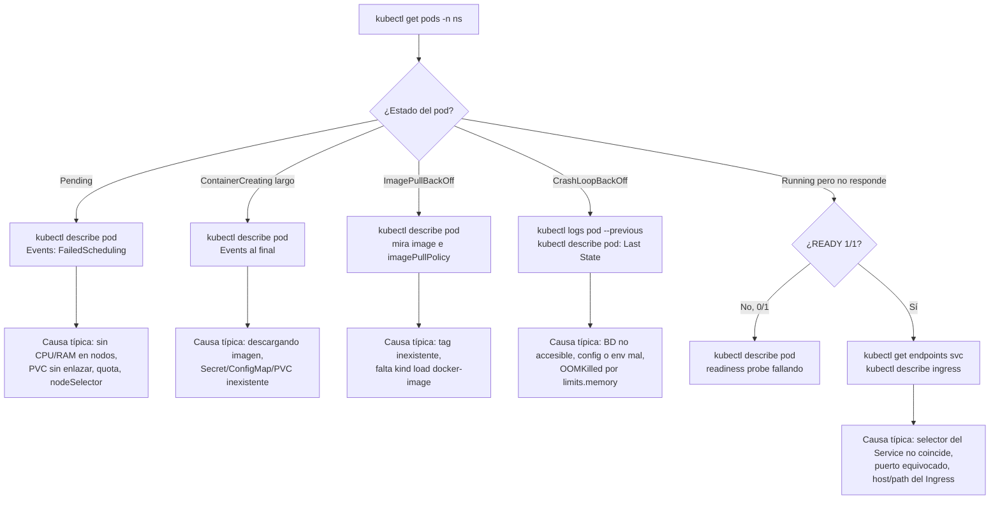

# Troubleshooting: guía rápida

## Diagrama de diagnóstico

Empieza siempre por `kubectl get pods -n <ns>` y sigue la rama del estado que veas. Para practicarlo con fallos reales, usa el [módulo 14 — Laboratorio de troubleshooting](../14-laboratorio-troubleshooting/README.md).



## Método general

```bash
kubectl get pods -n <ns>                         # ¿estado?
kubectl describe pod <pod> -n <ns>               # Events al final = oro
kubectl logs <pod> -n <ns> [--previous]          # logs
kubectl get events -n <ns> --sort-by=.lastTimestamp
kubectl get endpoints <svc> -n <ns>              # ¿hay pods detrás del Service?
```

## Por estado del pod

| Estado | Causas típicas | Qué mirar |
|--------|----------------|-----------|
| `Pending` | Sin recursos, PVC sin enlazar, nodeSelector/affinity imposible, quota | `describe pod` → Events (`FailedScheduling`) |
| `ContainerCreating` (largo) | Descargando imagen, volumen/secret/configmap inexistente | `describe pod` |
| `ImagePullBackOff` / `ErrImagePull` | Tag inexistente, falta `kind load`, registry privado | `describe`; ¿`imagePullPolicy`? |
| `CrashLoopBackOff` | La app falla al arrancar (BD, config, puerto) | `logs --previous` |
| `OOMKilled` | Límite de memoria bajo (o heap Java mal ajustada) | `describe` → Last State |
| `Running 0/1` | Readiness probe fallando | `describe` → Events; probar el endpoint |
| `Error` / `Completed` | Job terminado / comando acabó | `logs` |
| `Terminating` eterno | Finalizers, nodo caído | `kubectl delete pod --force --grace-period=0` (último recurso) |

## Red / Ingress

| Síntoma | Qué hacer |
|---------|-----------|
| `curl: (7) Failed to connect localhost:80` | ¿Cluster creado con `extraPortMappings`? ¿Puerto ocupado en Windows? `docker ps` |
| `404` de nginx | Host/path no coincide: `kubectl describe ingress` |
| `503` | Service sin endpoints (selector/readiness) |
| `502` | Puerto equivocado o la app cierra conexión |
| `Could not resolve host: *.localtest.me` | DNS rebinding bloqueado → usar hosts file (abajo) |

### Alternativa al DNS: archivo hosts

**Windows** (para el navegador) — editar como administrador `C:\Windows\System32\drivers\etc\hosts`:

```
127.0.0.1 keycloak.localtest.me api.localtest.me a.localtest.me b.localtest.me apps.localtest.me
```

## Kind

| Problema | Solución |
|----------|----------|
| Nodos `NotReady` / CoreDNS `Pending` tras crear el cluster con `kind-config-calico.yaml` | Falta instalar Calico: usa `CNI=calico ./scripts/up.sh` (o aplica el manifiesto de Calico, ver `scripts/up.sh`) |
| `kind create cluster` falla por puerto 80/443 | Cambia `hostPort` (p. ej. 8080/8443) y usa `http://api.localtest.me:8080` |
| Mucha RAM / Docker lento | Docker Desktop → *Settings → Resources* (o `.wslconfig`: `memory=8GB`); baja réplicas; apaga monitoring |
| Los datos desaparecen | Recrear el cluster borra los volúmenes (viven en los contenedores de los nodos) |
| `kind load docker-image` falla con `ctr: content digest ... not found` | Docker Desktop usa el almacén de imágenes de containerd. Usa `./scripts/kind-load.sh imagen:tag` (ver módulo 01) |
| Imagen "no se actualiza" | Cambia el tag y repite `kind load docker-image` |
| Docker Desktop reiniciado → cluster raro | `docker ps -a`; `docker start curso-control-plane curso-worker curso-worker2` o recrea |

## Docker Desktop en Windows

| Problema | Causa | Solución |
|----------|-------|----------|
| `Cannot connect to the Docker daemon` | Docker Desktop cerrado o arrancando | Ábrelo y espera a *Engine running* |
| kind multi-nodo: pods `CrashLoopBackOff` con `too many open files` o kube-proxy fallando | Límites de inotify bajos en la VM de Docker | Sube memoria/CPU en Docker Desktop y reinícialo; si persiste: `docker run --rm --privileged alpine sysctl -w fs.inotify.max_user_watches=524288 fs.inotify.max_user_instances=512` |
| Desde el navegador no abre `http://api.localtest.me` | Puerto 80/443 ocupado en Windows (IIS, otro proxy) | `netstat -ano \| findstr :80` en PowerShell; o cambia `hostPort` a 8080/8443 |
| `./scripts/up.sh` no funciona en PowerShell | Los scripts son bash | Ejecútalos desde Git Bash |
| Errores TLS/JWT `token expired` o `certificate not yet valid` tras suspender el PC | El reloj de la VM de Docker se desfasa tras la suspensión | Reinicia Docker Desktop; comprueba con `docker run --rm alpine date` |

## Comandos que debes dominar

```bash
kubectl config get-contexts / use-context / set-context --current --namespace=dev
kubectl get all -n dev
kubectl get pods -o wide --show-labels
kubectl describe <recurso>
kubectl explain deployment.spec.strategy --recursive
kubectl api-resources
kubectl diff -f archivo.yaml
kubectl apply -f archivo.yaml --dry-run=server
kubectl rollout status|history|undo|restart deploy/<x>
kubectl port-forward svc/<x> 8080:80
kubectl exec -it <pod> -- sh
kubectl cp <pod>:/ruta ./local
kubectl run tmp --rm -it --image=curlimages/curl --restart=Never -- sh
kubectl debug -it <pod> --image=busybox --target=<container>
kubectl top pods
```
